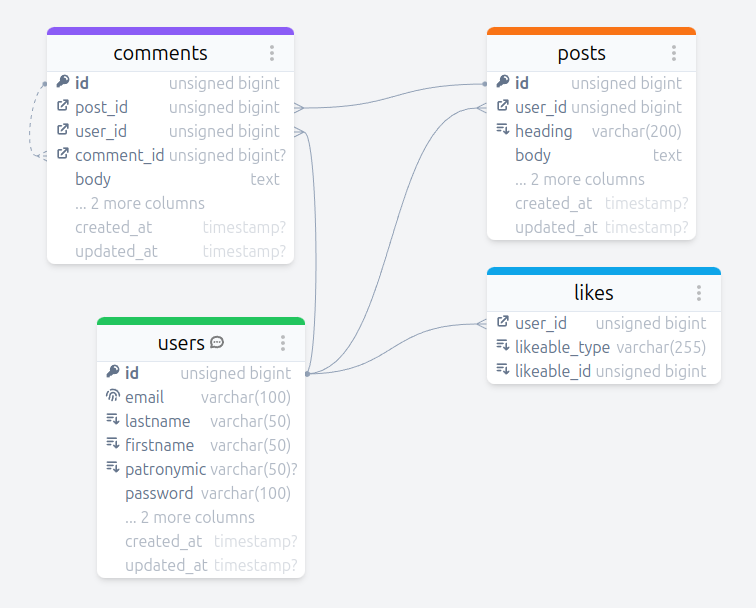
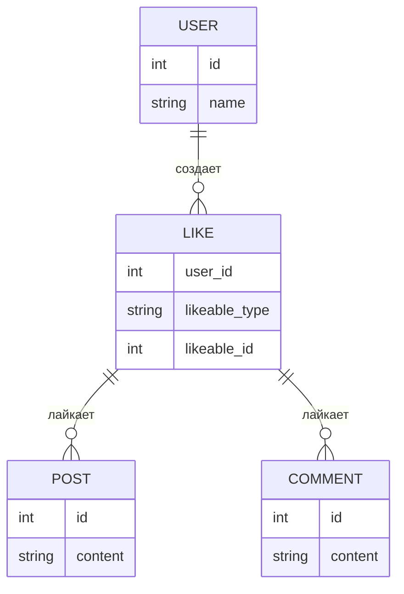

# Работа с базой данных

## Предисловие

Для работы и отработки данной лабораторной работы, вам необходимо настроить базу данных MySQL или MariaDB, настроить пользователя и базу данных. Если вы использованил первичные настройки с введения в данную книгу, то данные для подключения к базе данных следующие:

| Определение | Значение |
| -- | -- |
| Логин | `student` |
| Пароль | `student` |
| Хост | `localhost` |
| Имя базы данных | `st` |

Если вы работаете в сети ГАПОУ СО "Нижнетагильский торгово-экономический колледж", то вам нужно предварительно на сервере базы данных, через [панель управления PHPMyAdmin](http://pma.has.bik) добавить новую базу данных и работать с ней.

**При создании базы данных, используйте преффикс.** Например, если в задании будет написано: "*создайте базу данных с именем `blog`*", а вас зовут *Иванов Иван Иванович*, то имя базы данных, которое вы создаете будет названо как: `ivanov_ii_blog`.

Данные для входа в сети ГАПОУ СО "Нижнетагильский торгово-экономический колледж":

| Определение | Значение |
| -- | -- |
| Логин | `student` |
| Пароль | `student` |
| Хост | `pma.has.bik` |
| Имя базы данных | *Та база, которую вы создали* |

## Описание работы

В ходе выполнения лабораторной работы будут применятся все навыки, полученные в предыдущих работах. Вам предстоит создать пошагово полноценный и рабочий вариант сайта, который реализует работу блога. На сайте будут реализованы возможности:

1. Действия неавторизованного пользователя
   1. Авторизация
   2. Регистрация
   3. Просмотр ленты постов
   4. Просмотр постов
   5. Просмотр комментариев
2. Действие авторизованного пользователя
   1. Возможность размещать посты
   2. Возможность управлять размещенными постами
   3. Возможность опубликовывать комментарии
   4. Возможность отвечать на опубликованные комментарии
   5. Возможность ставить лайки на посты
   6. Возможность ставить лайки на комментарии

Для реализации данного проекта, вам [предоставлен SQL-файл со всеми запросами для создания необходимых таблиц](./../../assets/files/blog.sql) и связей между ними. Схема данных данного SQL-запроса представлена ниже.



### Шаг 1: создание файловой структуры проекта

Перед тем, как приступить к разработке блога, вам необходимо создать файловую структуру проекта, как представлено ниже:

```
.
├── App
│   ├── Config
│   │   └── Database.php
│   ├── Middleware
│   │   └── Auth.php
│   └── Models
│       ├── Comment.php
│       ├── Like.php
│       ├── Model.php
│       ├── Post.php
│       └── User.php
├── autoload.php
└── public
    ├── account
    │   ├── index.php
    │   ├── login.php
    │   ├── logout.php
    │   ├── post.php
    │   └── register.php
    ├── assets
    │   └── css
    │       └── style.css
    ├── blog.php
    ├── feed.php
    ├── index.php
    └── post.php
```

#### Описание каждой файловой единицы

1. Приложение (`./app/`)
- `./Config/`:
  - `Database.php`: Класс для работы с базой данных, управляет подключением
- `./Middleware/`:
  - `Auth.php`: Класс для аутентификации пользователей, обрабатывает вход/выход
- `./Models/`:
  - `Model.php`: Базовый класс для всех моделей, содержит общую функциональность
  - `User.php`: Модель для работы с пользователями, управляет данными пользователей
  - `Post.php`: Модель для работы с постами, управляет контентом блога
  - `Comment.php`: Модель для комментариев, управляет иерархией комментариев
  - `Like.php`: Модель для лайков, управляет системой оценок
1. Автозагрузчик
   - `autoload.php`: Файл для автоматической загрузки классов, реализует работу с namespace'ами 
2. Публичная часть (`./public/`)
- `./account/`:
  - `index.php`: Главная страница аккаунта
  - `login.php`: Форма входа
  - `logout.php`: Файл для выхода пользователя
  - `register.php`: Форма регистрации
  - `post.php`: Страница создания/редактирования поста
- `./assets/`:
  - `./css/`: Стили проекта
    - `style.css`: Основной CSS-файл
- Основные маршруты:
  - `blog.php`: Список постов
  - `feed.php`: Лента контента
  - `index.php`: Главная страница
  - `post.php`: Просмотр отдельного поста

### Шаг 2: создание конфигурационных файлов

Перед тем, как начинать проект, необходимо наполнить основные скрипты исходным кодом. Начнем со скрипта, который будет отвечать за автоматическое подтягивание классов из файлов, в которых они прописаны. За это отвечает файл `autoload.php`:

```php
<?php

// spl_autoload_register - регистрирует функцию автозагрузки классов
spl_autoload_register(function ($class) {
    $path = str_replace('\\', DIRECTORY_SEPARATOR, $class);

    /**
     * Создаем из имени namespace'а абсолютный путь до файла.
     * Например, при вызове namespace'а с именем "App\Models\User"
     * будет получен путь /path/to/server/app/Models/User.php
     */
    $full_path = __DIR__ . "/{$path}.php";

    if (file_exists($full_path)) {
        require_once $full_path;
    }
});
```

Распишем код модуля подключения к базе данных в файле `Database.php`. В данном файле будет реализован класс подключения к базе данных, через который мы будем взаимодействовать с базой данных.

В данном файле будет реализован класс с именем `Database`, в котором будут реализованы методы для работы с базой данных без прямого ввода SQL, а через определение базовых операций CRUD:

- **Приватные методы**
  - Метод `get_type`. Определяет тип переданного аргумента для подготовленного запроса.
  - Метод `prepared_query`. Выполняет подготовленный запрос в базе данных.
  - Метод `where_condition`. Создает из двумерного массива выборок SQL-строку выборки.
- **Публичные методы**
  - Метод `create`. Реализует добавление данных в указанную таблицу.
  - Метод `read`. Считывает данные из указанной таблицы.
  - Метод `update`. Реализует изменение данных по условию (или без условия).
  - Метод `delete`. Удаляет записи по заданной выборке.

```php
<?php

namespace App\Config;

class Database {
    public $raw_connection;
    public $dbase_name = 'repiev_ed_blog';

    private $dbase_host = 'pma.has.bik';
    private $dbase_login = 'student';
    private $dbase_password = 'student';
    
    /**
     * Функция-конструктор класса Database.
     *
     * @return void
     */
    public function __construct()
    {
        $this -> raw_connection = new \mysqli(
            $this -> dbase_host,
            $this -> dbase_login,
            $this -> dbase_password,
            $this -> dbase_name,
        );
        $this -> raw_connection -> set_charset('utf8mb4');
    }
    
    /**
     * Приватная функция, которая определяет тип переданного аргумента для подготовленного запроса.
     *
     * @param mixed $key аргумент, у которого необходимо определить тип.
     * @return string функция возвращает i, s или d.
     */
    private function get_type(mixed $key): string
    {
        return match (gettype($key)) {
            'boolean', 'integer' => 'i',
            'string' => 's',
            'double' => 'd',
        };
    }
    
    /**
     * Приватная функция, которая выполняет подготовленный запрос в базе данных.
     *
     * @param string $query подготовленный SQL-запрос.
     * @param string $types типы, которые присутствуют в подготовленном запросе.
     * @param array $values передаваемые значения в подготовленный запрос.
     * @return array возвращается массив в котором первый аргумент - это объект запроса, а второй - булевое значение из метода execute().
     */
    private function prepared_query(string $query, string $types = '', array $values = []): array
    {
        $stmt = $this
            -> raw_connection
            -> prepare($query);
        if ($types) {
            $values = array_map(fn($item) => htmlspecialchars($item), $values);
            $stmt -> bind_param($types, ... $values);
        }
        $status = $stmt -> execute();
        
        return [$stmt -> get_result(), $status];
    }
    
    /**
     * Функция, которая создает из двумерного массива выборок SQL-строку выборки.
     *
     * @param array $where массив массивов, где в каждом элементе находятся значения выборки.
     * @return array возвращаемый массив, где первый элемент - подготовленная строка, второй элемент - строка с типами для подготовленного запроса, третий элемент - массив значений.
     */
    private function where_condition(array $where): array
    {
        $where_merged = '';
        $types = '';
        $vals = [];
        $end = end($where);
        
        foreach ($where as $cond) {
            if ($cond[2] !== 'NULL') {
                $where_merged .= "{$cond[0]} {$cond[1]} ?" . ($end != $cond ? (isset($cond[3]) ? " {$cond[3]} " : ' AND ') : '');
                $types .= $this -> get_type($cond[2]);
                $vals[] = $cond[2];
            } else {
                $where_merged .= "{$cond[0]} {$cond[1]} NULL";
            }
            
        }

        return [
            " WHERE {$where_merged}",
            $types,
            $vals,
        ];
    }
    
    /**
     * Функция, которая реализует добавление данных в указанную таблицу.
     *
     * @param string $table строка, которая принимает в себя имя таблицы, в которую нужно добавить данные.
     * @param mixed $data ассоциативный массив, который принимает в себя элементы, у которых ключи - это имена колонок в таблице.
     * @return bool функция возвращает true если данные были добавлены в базу данных 
     */
    public function create(string $table, array $data): bool
    {
        $sql = "INSERT INTO {$table} (";
        $keys = array_keys($data);
        $vals = array_values($data);
        $end = end($keys);
        $types = '';
        foreach($keys as $key) {
            $sql .= $end != $key ? "{$key}, " : "{$key}) VALUES (" . substr(str_repeat('?, ', count($keys)), 0, -2) . ');';
            $types .= $this -> get_type($data[$key]);
        }

        unset($keys, $end);

        $result = $this -> prepared_query($sql, $types, $vals);
        return $result[1];
    }
    
    /**
     * Функция, которая считывает данные из указанной таблицы.
     *
     * @param string $table строка, которая принимает в себя имя таблицы, из которой нужно получить данные.
     * @param ?array $where массив указателей выборки данных.
     * @param ?array $cols массив получаемых колонок из выборки.
     * @param ?int $limit целое число - указатель на ограничение выборки элементов.
     * @param ?int $offset целое число - указатель на шаг выборки элементов.
     * @return array функция возвращает определенное количество строк из выборки.
     */
    public function read(string $table, ?array $cols = null, ?array $where = null, ?int $limit = null, ?int $offset = null): array
    {
        $sql = 'SELECT ' . ($cols === null ? '*' : implode(', ', $cols)) . " FROM {$table}";
        $types = '';
        $vals = [];

        if ($where) {
            $cond = $this -> where_condition($where);
            
            $sql .= $cond[0];
            $types .= $cond[1];
            $vals = $cond[2];

            unset($cond);
        }

        if ($limit) {
            $sql .= " LIMIT {$limit}";

            if ($offset) {
                $sql .= " OFFSET {$offset}";
            }
        }

        unset($table, $cols, $where, $limit, $offset);

        $query = $this -> prepared_query($sql, $types, $vals);
        if ($query[1]) {
            $query = $query[0];
            $returned = [];
            while ($row = $query -> fetch_assoc()) {
                $returned[] = $row;
            }

            return $returned;
            // Комментарий тут для снижения оценки... если вы его увидели, то не пишите его.
        } else return [];
    }
    
    /**
     * Функция, которая реализует изменение данных по условию (или без условия)
     *
     * @param string $table строка, которая принимает в себя имя таблицы, в которой нужно изменить данные. 
     * @param  array $data ассоциативный массив, который принимает в себя элементы, у которых ключи - это имена колонок в таблице.
     * @param  ?array $where массив указателей выборки данных.
     * @return bool функция возвращает true если изменение данных произошло (или нет, исходя из выборки) или возвращает false если данные были не изменены или произошла ошибка.
     */
    public function update(string $table, array $data, ?array $where = null): bool
    {
        $sql = "UPDATE {$table} SET ";
        $keys = array_keys($data);
        $vals = array_values($data);
        $end = end($keys);
        $types = '';
        foreach($keys as $key) {
            $sql .= "{$key} = ?" . ($end != $key ? ', ' : ' ');
            $types .= $this -> get_type($data[$key]);
        }

        unset($keys, $end);

        if ($where) {
            $where_result = $this -> where_condition($where);
            $sql .= $where_result[0];
            $types .= $where_result[1];
            $vals = array_merge($vals, $where_result[2]);

            unset($where_result);
        }

        $result = $this -> prepared_query($sql, $types, $vals);

        return $result[1];
    }
    
    /**
     * Функция, которая удаляет записи по заданной выборке.
     *
     * @param  string $table строка, которая принимает в себя имя таблицы, в которой нужно удалить данные.
     * @param  mixed $where ассоциативный массив, который принимает в себя элементы, у которых ключи - это имена колонок в таблице.
     * @return bool функция возвращает true если изменение данных произошло (или нет, исходя из выборки) или возвращает false если данные были не изменены или произошла ошибка.
     */
    public function delete(string $table, array $where = null): bool
    {
        $sql = "DELETE FROM {$table} ";
        $where_cond = [];

        if ($where) {
            $where_cond = $this -> where_condition($where);
            $sql .= $where_cond[0];
        }

        return $this -> prepared_query($sql, $where_cond[1] ?? '', $where_cond[2] ?? [])[1];
    }
}
```

Необходимо также создать файл для посредника, который будет отрабатывать и проверять авторизацию пользователя с использованием сессий PHP. Код будет расположен в файле: `./App/Middleware/Auth.php`. Данный класс представляет собой реализацию `middleware` для аутентификации пользователей в приложении. Давайте разберем его основные компоненты и функциональность.

##### Основные характеристики

- Хранит текущего аутентифицированного пользователя в свойстве `$user`
- Использует сессии PHP для хранения данных аутентификации
- Работает с моделью `User` для взаимодействия с базой данных

##### Конструктор и инициализация

```php
public function __construct()
{
    session_start();
    if (isset($_SESSION['user_id'])) {
        $this -> user = new User($_SESSION['user_id']);
    }
}
```

Конструктор автоматически:
- Запускает сессию PHP
- Проверяет наличие ID пользователя в сессии
- При наличии ID загружает данные пользователя из базы данных

##### Методы аутентификации

```php
public function login(string $email, string $password): bool
{
    $user = (new User()) -> getByEmail($email);
    if ($user && password_verify($password, $user -> getAttribute('password_hash'))) {
        $_SESSION['user_id'] = $user -> getAttribute('id');
        $this -> user = $user;
        return true;
    }
    return false;
}
```

###### Метод `login()`:

- Принимает `email` и пароль для аутентификации
- Использует безопасное хеширование паролей через `password_verify()`
- При успешной аутентификации сохраняет ID пользователя в сессию
- Обновляет свойство `$user` текущего экземпляра

###### Проверка аутентификации

```php
public function check(): bool
{
    return $this -> user !== null;
}

public function user(): ?User
{
    return $this -> user;
}
```

Методы для работы с аутентификацией:

- `check()` - проверяет, аутентифицирован ли пользователь
- `user()` - возвращает объект текущего пользователя или `null`

##### Выход из системы

```php
public function logout(): void
{
    unset($_SESSION['user_id']);
    $this -> user = null;
}
```

###### Метод `logout()`:

- Удаляет ID пользователя из сессии
- Очищает свойство `$user` текущего экземпляра

**Пример использования**

```php
// Создание экземпляра аутентификатора
$auth = new Auth();

// Проверка аутентификации
if ($auth -> check()) {
    $currentUser = $auth -> user();
    // Пользователь аутентифицирован
} else {
    // Пользователь не аутентифицирован
}

// Аутентификация пользователя
if ($auth -> login('user@example.com', 'password123')) {
    // Успешная аутентификация
} else {
    // Ошибка аутентификации
}

// Выход из системы
$auth -> logout();
```

Этот класс предоставляет базовую функциональность для аутентификации пользователей, используя безопасные методы хранения данных и проверки паролей. Он легко интегрируется в существующую систему и может быть расширен дополнительной функциональностью при необходимости.

```php
<?php

namespace App\Middleware;

use App\Models\User;

/**
 * Класс-посредник для аутентификации.
 */
class Auth {
    protected ?User $user = null;
    
    /**
     * Создает новый экземпляр класса.
     *
     * @return void
     */
    public function __construct()
    {
        session_start();

        if (isset($_SESSION['user_id'])) {
            $this -> user = new User($_SESSION['user_id']);
        }
    }
    
    /**
     * Метод проверяет, аутентифицирован ли пользователь.
     *
     * @return bool Возвращает true, если пользователь аутентифицирован, иначе false.
     */
    public function check(): bool
    {
        return $this -> user !== null;
    }
    
    /**
     * Метод возвращает экземпляр класса User, представляющий аутентифицированного пользователя.
     *
     * @return ?User Возвращает экземпляр класса User, представляющий аутентифицированного пользователя, или null, если пользователь не аутентифицирован.
     */
    public function user(): ?User
    {
        return $this -> user;
    }
    
    /**
     * Метод аутентифицирует пользователя по электронной почте и паролю.
     *
     * @param string $email Электронная почта пользователя. 
     * @param string $password Пароль пользователя.
     * @return bool Возвращает true, если аутентификация прошла успешно, иначе false.
     */
    public function login(string $email, string $password): bool
    {
        $user = (new User()) -> getByEmail($email);
        if ($user && password_verify($password, $user -> getAttribute('password_hash'))) {
            $_SESSION['user_id'] = $user -> getAttribute('id');
            $this -> user = $user;
            
            return true;
        }

        return false;
    }
    
    /**
     * Метод разлогинивает пользователя.
     *
     * @return void
     */
    public function logout(): void
    {
        unset($_SESSION['user_id']);

        $this -> user = null;
    }
}
```

Также, для того, чтобы визуально проект выглядил... нормально, вам предоставляется уже готовый CSS-файл. Вы можете получить код CSS-файла [по данной ссылке](./../../assets/files/style.css). **Вам необходимо данный CSS-код импортировать к себе в проект по маршруту `./public/assets/css/style.css`**.

### Шаг 3: создание базовой модели, а также производных моделей

Для реализации упрощенной работы с моделями из базы данных, мы реализуем базовый файл модели, а затем наследуем от него все свойства в дочерних моделях (в контексте объектно-ориентированного программирования). Данный файл будет называться `Model.php`.

```php
<?php

namespace App\Models;

use App\Config\Database;

abstract class Model {
    protected Database $database;
    protected string $table;
    protected string $key = 'id';
    protected array $fillable = [];
    protected array $hidden = [];
    protected ?array $current_record = null;
    
        
    /**
     * Метод-конструктор абстрактного класса модели.
     *
     * @return void
     */
    public function __construct()
    {
        $this -> database = new Database();
    }
    
    /**
     * Получение массива атрибутов модели, которые являются открытыми для просмотра.
     *
     * @return array возвращается массив с атрибутами модели.
     */
    protected function getVisibleColumns(): array
    {
        return array_filter(array_diff($this -> fillable, $this -> hidden));
    }
    
    /**
     * Метод, который устанавливает в модель запись по ее идентификатору
     *
     * @param  string|int $id идентификатор искомой записи.
     * @return Model метод возвращает модель.
     */
    public function getById(string|int $id): Model
    {
        $record = $this -> database
            -> read($this -> table, where: [[$this -> key, '=', $id]]);

        if (!empty($record)) {
            $this -> current_record = $record[0];
        }

        return $this;
    }
    
    /**
     * Метод, который устанавливает в модель запись по условию.
     *
     * @param array $where массив условий для поиска записи.
     * @return Model метод возвращает модель.
     */
    public function getByWhere(array $where): Model
    {
        $database = new Database();
        $record = $this -> database
            -> read($this -> table, where: $where);

        if (!empty($record)) {
            $this -> current_record = $record[0];
        }

        return $this;
    }
    
    /**
     * Метод, который обновляет атрибуты модели, сохраняет их в базу данных, а также сохраняет значения в модель.
     *
     * @param  array $data массив атрибутов, которые нужно заполнить.
     * @return Model метод возвращает модель.
     */
    public function fillAndSave(array $data): Model
    {
        if (!empty($this -> current_record)) {
            $id = $this -> current_record[$this -> key];
            $data = array_intersect_key($data, array_flip($this -> fillable));
            if ($this -> database -> update($this -> table, $data, [[$this -> key, '=', $id]])) {
                $this -> current_record = array_merge($this -> current_record, $data);
                // Комментарий тут для снижения оценки... если вы его увидели, то не пишите его.
            }
        }

        return $this;
    }
    
    /**
     * Метод, который удаляет запись из базы данных, а также запись из модели. Удаление происходит при условии, что модель имеет ссылку на запись.
     *
     * @return Model метод возвращает модель.
     */
    public function delete(): Model
    {
        if (!empty($this -> current_record)) {
            $id = $this -> current_record[$this -> key];
            if ($this -> database -> delete($this -> table, [[$this -> key, '=', $id]])) {
                $this -> current_record = null;
            }
        }

        return $this;
    }
    
    /**
     * Метод, который создает новую запись в базе данных, а также сохраняет сведения в модель.
     *
     * @param  array $data данные, которые необходимо внести.
     * @return Model метод возвращает модель.
     */
    public function createAndSet(array $data): Model
    {
        $data = array_intersect_key($data, array_flip($this -> fillable));
        if ($this -> database -> create($this -> table, $data)) {
            $this -> current_record = array_merge([
                $this -> key => $this -> database -> raw_connection -> insert_id,
            ], $data);
        }

        return $this;
    }
    
    /**
     * Метод, реализующий получение данных атрибутов прибинденной модели.
     *
     * @param string $attribute ключ атрибута.
     * @return mixed возвращается любое значение, которое присутствует в атрибуте. Если происходит обращение к несуществующему атрибуту, то возвращается null.
     */
    public function getAttribute(string $attribute): mixed
    {
        return $this -> current_record[$attribute] ?? null;
    }
}
```

Далее, нам необходимо создать дочерние файлы, в которых будут реализованы дейсвтия над моделями из базы данных.

#### `User.php`

```php
<?php

namespace App\Models;

class User extends Model {
    protected string $table = 'users';
    
    protected array $fillable = [
        'firstname',
        'lastname',
        'patronymic',
        'email',
        'password_hash',
    ];

    protected array $hidden = [
        'password_hash',
        'created_at',
        'updated_at',
    ];

    
    /**
     * Переопределение конструктора. Если передан id, то вызывается метод getById.
     *
     * @param ?int $id id пользователя.
     * @return void
     */
    public function __construct(?int $id = null)
    {
        parent::__construct();
        if ($id) {
            $this -> getById($id);
        }
    }
    
    /**
     * Метод для получения пользователя по email.
     *
     * @param  string $email email пользователя.
     * @return User пользователь.
     */
    public function getByEmail(string $email): User
    {
        return $this -> getByWhere([['email', '=', $email]]);
    }
    
    /**
     * Приватный метод для хэширования пароля.
     *
     * @param array $data данные пользователя. 
     * @return void
     */
    private function setPassword(array &$data): void
    {
        $data['password_hash'] = password_hash($data['password'], PASSWORD_DEFAULT);
        unset($data['password']);
    }
    
    /**
     * Переопределение метода fillAndSave. Перед сохранением пароль хэшируется.
     *
     * @param array $data данные пользователя.
     * @return Model сохраненный пользователь.
     */
    public function fillAndSave(array $data): Model
    {
        $this -> setPassword($data);
        return parent::fillAndSave($data);
    }
    
    /**
     * Переопределение метода createAndSet. Перед сохранением пароль хэшируется.
     *
     * @param array $data данные пользователя.
     * @return Model сохраненный пользователь.
     */
    public function createAndSet(array $data): Model
    {
        $this -> setPassword($data);
        return parent::createAndSet($data);
    }
    
    /**
     * Метод, который возвращает посты пользователя. Если к модели не прибинден пользователь, то вернет null.
     *
     * @return array|null
     */
    public function posts(): array|null
    {
        if ($this -> current_record['id'] !== null) {
            return $this -> database -> read('posts', where: [['user_id', '=', $this -> current_record['id']]]);
        } else return null;
    }
}
```

##### Основные характеристики модели

- Хранит данные в таблице `users`
- Поддерживает массовое заполнение полей:
  - `firstname` 
  - `lastname`
  - `patronymic`
  - `email`
  - `password_hash`
- Скрывает чувствительные поля:
  - `password_hash`
  - `created_at`
  - `updated_at`

##### Безопасная работа с паролями

Модель реализует два ключевых метода для обработки паролей:

```php
private function setPassword(array &$data): void
{
    $data['password_hash'] = password_hash($data['password'], PASSWORD_DEFAULT);
    unset($data['password']);
}

public function fillAndSave(array $data): Model
{
    $this -> setPassword($data);
    return parent::fillAndSave($data);
}

public function createAndSet(array $data): Model
{
    $this -> setPassword($data);
    return parent::createAndSet($data);
}
```

Эти методы обеспечивают автоматическое хэширование паролей перед сохранением в базу данных, используя стандартный алгоритм PHP `PASSWORD_DEFAULT`. При этом исходный пароль удаляется из массива данных для дополнительной безопасности.

##### Работа с пользователями

Модель предоставляет удобные методы для работы с пользователями:

```php
public function getByEmail(string $email): User
{
    return $this -> getByWhere([['email', '=', $email]]);
}
```

Этот метод позволяет находить пользователя по его email-адресу.

##### Работа с постами

```php
public function posts(): array|null
{
    if ($this -> current_record['id'] !== null) {
        return $this -> database -> read('posts', where: [['user_id', '=', $this -> current_record['id']]]);
    } else return null;
}
```

Метод возвращает массив постов пользователя или null, если пользователь не найден.

##### Конструктор модели

```php
public function __construct(?int $id = null)
{
    parent::__construct();
    if ($id) {
        $this -> getById($id);
    }
}
```

Конструктор позволяет создавать объекты модели двумя способами:

- Создание нового пустого пользователя
- Создание объекта с автоматической загрузкой существующего пользователя по ID

**Пример использования**

```php
// Создание нового пользователя
$user = (new User()) -> createAndSet([
    'firstname' => 'Иван',
    'lastname' => 'Петров',
    'email' => 'ivan@example.com',
    'password' => 'secret123'
]);

// Поиск пользователя по email
$existingUser = (new User()) -> getByEmail('ivan@example.com');

// Получение постов пользователя
$posts = $user -> posts();
```

Эта модель обеспечивает безопасное хранение данных пользователей и удобную работу с их профилями и контентом. Особое внимание уделяется безопасности при работе с паролями, используя стандартные механизмы PHP для их хэширования.

#### `Comment.php`

##### Основные характеристики модели

- Модель использует таблицу `comments` в базе данных.
- Поддерживает массовое заполнение полей:
  - `body` (текст комментария);
  - `post_id` (ID поста);
  - `user_id` (ID пользователя);
  - `parent_id` (ID родительского комментария).
- Скрывает поля `created_at` и `updated_at` от прямого доступа.

##### Конструктор модели

```php
public function __construct(?int $id = null)
{
    parent::__construct();
    if ($id) {
        $this -> getById($id);
    }
}
```

Конструктор позволяет создавать объекты модели двумя способами:

- Создание нового пустого комментария без параметров
- Создание объекта с автоматической загрузкой существующего комментария по его ID

##### Отношения между моделями

Модель реализует три основных типа связей:

**Автор комментария:**

```php
public function author(): ?User
{
    return new User($this -> getAttribute('user_id'));
}
```

- Возвращает объект пользователя, который создал комментарий
- Использует значение поля `user_id` для создания объекта модели `User`

**Родительский пост:**

```php
public function post(): ?Post
{
    return new Post($this -> getAttribute('post_id'));
}
```

- Указывает на пост, к которому относится комментарий
- Создает объект модели `Post` используя значение `post_id`

**Иерархия комментариев:**

```php
public function parentComment(): ?Comment
{
    return new Comment($this -> getAttribute('parent_id'));
}

public function haveChildren(): bool
{
    if ($this -> current_record !== null) {
        return !empty($this -> database -> read(
            $this -> table,
            ['id'],
            [['parent_id', '=', $this -> getAttribute('id')]],
            1
        ));
    }
    return false;
}
```

- Позволяет создавать древовидную структуру комментариев
- Метод `parentComment` возвращает родительский комментарий
- Метод `haveChildren` проверяет наличие ответов на текущий комментарий

##### Пример использования

```php
// Создание нового комментария
$comment = new Comment();

// Получение существующего комментария
$existingComment = new Comment(1);

// Работа со связями
$author = $comment -> author();
$post = $comment -> post();

// Проверка наличия ответов
$hasResponses = $comment -> haveChildren();
```

Данная  модель предоставляет удобный интерфейс для работы с системой комментариев, поддерживая иерархическую структуру и связи между пользователями, постами и самими комментариями.

```php
<?php

namespace App\Models;

class Comment extends Model {
    protected string $table = 'comments';

    protected array $fillable = [
        'body',
        'post_id',
        'user_id',
        'parent_id',
    ];
    protected array $hidden = [
        'created_at',
        'updated_at'
    ];
    
    /**
     * Переопределенный метод конструктора модели Comment. Данное переопределение позволяет создавать объекты модели Comment по идентификатору если он передан.
     *
     * @param ?int $id идентификатор комментария.
     * @return void
     */
    public function __construct(?int $id = null)
    {
        parent::__construct();

        if ($id) {
            $this -> getById($id);
        }
    }
    
    /**
     * Метод возвращает автора комментария.
     *
     * @return ?User автор комментария.
     */
    public function author(): ?User
    {
        return new User($this -> getAttribute('user_id'));
    }
    
    /**
     * Метод возвращает пост к которому относится комментарий.
     *
     * @return ?Post пост к которому относится комментарий.
     */
    public function post(): ?Post
    {
        return new Post($this -> getAttribute('post_id'));
    }
    
    /**
     * Метод возвращает родительский комментарий.
     *
     * @return ?Comment родительский комментарий.
     */
    public function parentComment(): ?Comment
    {
        return new Comment($this -> getAttribute('parent_id'));
    }
    
    /**
     * Функция, которая проверяет, есть и у комментария ответы.
     *
     * @return bool возвращается true если присутствуют связанные комментарии и false если нет.
     */
    public function haveChildren(): bool
    {
        if ($this -> current_record !== null) {
            return !empty($this -> database -> read($this -> table, ['id'], [['parent_id', '=', $this -> getAttribute('id')]], 1));
        } else return false;
    }
}
```

#### `Like.php`

##### Основные характеристики модели

- Поддерживает массовое заполнение полей:
  - `user_id`
  - `likeable_type`
  - `likeable_id`
- Скрывает поле `created_at` от прямого доступа
- Использует полиморфные отношения для связи с различными типами контента

##### Структура полиморфных отношений

Модель использует полиморфные отношения для связи с различными типами контента. Давайте визуализируем эту структуру:



На диаграмме показаны основные связи в системе:

- Модель `Like` связана с пользователями (`User`) через поле `user_id`
- `Like` может быть связана с постами (`Post`) или комментариями (`Comment`) через полиморфные поля `likeable_type` и `likeable_id`
- Поле `likeable_type` хранит тип связанной модели ('`post`' или '`comment`')
- Поле `likeable_id` хранит `ID` конкретной модели

##### Методы модели

Модель предоставляет два основных метода для работы с лайками:

```php
public function author(): User
{
    return new User($this -> getAttribute('user_id'));
}

public function getRelated(): Model|\Exception
{
    $type = $this -> getAttribute('likeable_type');
    $id = $this -> getAttribute('likeable_id');
    return match ($type) {
        'post' => new Post($id),
        'comment' => new Comment($id),
        default => throw new \Exception("Unknown likeable type: {$type}"),
    };
}
```

- Метод `author()` возвращает пользователя, который поставил лайк, создавая новый объект модели `User` с соответствующим `ID`.
- Метод `getRelated()` возвращает связанный объект (пост или комментарий), используя полиморфные поля для определения типа модели. Если тип неизвестен, выбрасывает исключение.

**Пример использования**

```php
// Получение лайка
$like = new Like(1);

// Получение автора лайка
$user = $like -> author();

// Получение связанного объекта (поста или комментария)
try {
    $related = $like -> getRelated();
    if ($related instanceof Post) {
        // Работа с постом
    } elseif ($related instanceof Comment) {
        // Работа с комментарием
    }
} catch (\Exception $e) {
    // Обработка неизвестного типа
}
```

Эта модель обеспечивает гибкую систему лайков, позволяющую легко добавлять новые типы контента для лайков в будущем, при этом сохраняя чистоту и безопасность кода.

```php
<?php

namespace App\Models;

class Like extends Model {
    protected $fillable = [
        'user_id', 
        'likeable_type', 
        'likeable_id'
    ];

    protected $hidden = [
        'created_at'
    ];
    
    /**
     * Метод для получения автора лайка.
     *
     * @return User Автор лайка.
     */
    public function author(): User
    {
        return new User($this->getAttribute('user_id'));
    }
    
    /**
     * Метод для получения связанной модели.
     *
     * @return Model Связанная модель.
     */
    public function getRelated(): Model|\Exception
    {
        $type = $this -> getAttribute('likeable_type');
        $id = $this -> getAttribute('likeable_id');

        return match ($type) {
            'post' => new Post($id),
            'comment' => new Comment($id),
            default => throw new \Exception("Unknown likeable type: {$type}"),
        };
    }
}
```

#### `Post.php`

##### Основные характеристики модели

- Хранит данные в таблице `posts`
- Поддерживает массовое заполнение полей:
  - `heading` (заголовок)
  - `body` (содержимое)
  - `user_id` (ID автора)

##### Конструктор модели

```php
public function __construct(?int $id = null)
{
    parent::__construct();
    if ($id) {
        $this -> getById($id);
    }
}
```

Конструктор имеет следующие особенности:

- Принимает необязательный параметр `$id` типа `?int`
- Вызывает родительский конструктор через `parent::__construct()`
- Если передан `$id`, автоматически загружает данные поста из базы данных
- Позволяет создавать объекты двумя способами:
  - Создание нового пустого поста: `$post = new Post();`
  - Создание объекта с данными из БД: `$post = new Post(1);`

##### Работа с автором поста

```php
public function author(): User
{
    return new User($this -> getAttribute('user_id'));
}
```

**Метод `author()`:**

- Возвращает объект автора поста
- Создает новый объект модели `User`, используя значение поля `user_id`
- Позволяет получить доступ ко всем свойствам и методам модели `User`

**Пример использования**

```php
// Создание нового поста
$post = new Post();

// Создание поста с данными из БД
$existingPost = new Post(1);

// Получение автора поста
$author = $post -> author();
```

Эта модель обеспечивает базовую функциональность для работы с постами, включая автоматическую загрузку данных при создании объекта и удобный доступ к информации об авторе.

```php
<?php

namespace App\Models;

class Post extends Model {
    protected string $table = 'posts';

    protected array $fillable = [
        'heading',
        'body',
        'user_id',
    ];
    
    /**
     * Переопределение конструктора. При создании объекта класса Post сразу загружаем данные из БД по id если он передан.
     *
     * @param ?int $id id поста.
     * @return void
     */
    public function __construct(?int $id = null)
    {
        parent::__construct();

        if ($id) {
            $this -> getById($id);
        }
    }
    
    /**
     * Метод для получения автора поста.
     *
     * @return User Автор поста.
     */
    public function author(): User
    {
        return new User($this -> getAttribute('user_id'));
    }
}
```

### Шаг 4: создание эндпойнтов и маршрутов.

На данном шагу мы будем создавать файлы-маршруты в папке `./public`. Папка `./public` являяется основной точкой запуска сервера. Маршруты, которые будут реализованы в системе будут выглядить следующим образом:

```
.
├── account
│   ├── index.php
│   ├── login.php
│   ├── logout.php
│   ├── post.php
│   └── register.php
├── assets
│   └── css
│       └── style.css
├── blog.php
├── feed.php
├── index.php
└── post.php
```

Только файл `style.css` вам дан, чтобы его можно было скопировать. Верстка, а также дизайн создан при использовании фреймворка [TailwindCSS](https://tailwindcss.com).

#### Файл `./index.php`

##### Действия и функциональность кода

**PHP-часть**

1. **Инициализация:**
   - Подключает автозагрузчик классов через `require_once`
   - Импортирует необходимые классы: `Database` и `Auth`
   - Создает экземпляр класса `Auth` для работы с аутентификацией
2. **Работа с базой данных:**
   - Создает объект `Database` для взаимодействия с БД
   - Получает список пользователей с ограничением в 5 записей
   - Для каждого пользователя загружает его посты (ограничение в 5 постов)
3. **HTML-структура**
   1. **Заголовок страницы:**
      - Устанавливает кодировку UTF-8
      - Определяет `viewport` для корректного отображения на мобильных устройствах
      - Подключает внешний CSS-файл `style.css`
   2. **Шапка сайта:**
      - Создает навигационное меню с двумя секциями
      - Левая секция: ссылки "Главная" и "Лента"
      - Правая секция: зависит от статуса аутентификации пользователя
   3. **Основной контент:**
      - Отображает список пользователей с их блогами
      - Для каждого пользователя показывает:
        - Имя и фамилию
        - Список его последних 5 постов

```php
<?php

require_once __DIR__ . '/../autoload.php';

use App\Config\Database;
use App\Middleware\Auth;

$auth = new Auth();

?>

<!DOCTYPE html>
<html lang="ru">
<head>
    <meta charset="UTF-8">
    <meta name="viewport" content="width=device-width, initial-scale=1.0">
    <title>Блог</title>
    <link rel="stylesheet" href="/assets/css/style.css" />
</head>
<body class="max-w-6xl xl:mx-auto md:mx-10">
    <header class="flex md:my-5 flex-col md:flex-row justify-between">
        <ul class="flex md:space-x-2 flex-col md:flex-row">
            <li><a class="block px-4 py-2 bg-cyan-700 text-cyan-50 hover:bg-cyan-900 md:rounded-xl" href="/">Главная</a></li>
            <li><a class="block px-4 py-2 bg-cyan-600 text-cyan-50 hover:bg-cyan-900 md:rounded-xl" href="/feed.php">Лента</a></li>
        </ul>
        <ul class="flex md:space-x-2 flex-col md:flex-row">
            <?php if ($auth -> check()) { ?>
                <li><a class="block px-4 py-2 bg-cyan-600 text-cyan-50 hover:bg-cyan-900 md:rounded-xl" href="/account">Кабинет</a></li>
                <li><a class="block px-4 py-2 bg-cyan-600 text-cyan-50 hover:bg-cyan-900 md:rounded-xl" href="/account/logout.php">Выйти</a></li>
            <?php } else { ?>
                <li><a class="block px-4 py-2 bg-cyan-600 text-cyan-50 hover:bg-cyan-900 md:rounded-xl" href="/account/login.php">Войти</a></li>
                <li><a class="block px-4 py-2 bg-cyan-600 text-cyan-50 hover:bg-cyan-900 md:rounded-xl" href="/account/register.php">Регистрация</a></li>
            <?php } ?>
        </ul>
    </header>
    <main>
        <?php
            $dbase = new Database();
            $users = $dbase -> read('users', ['lastname', 'firstname', 'id'], limit: 5);
            foreach($users as $user) { ?>
                <section class="my-8 md:m-0 mx-8">
                    <h1 class="text-3xl font-bold my-8">
                        <a class="hover:underline" href="/blog.php?id=<?php print($user['id']); ?>">Блог пользователя - <?php print("{$user['lastname']} {$user['firstname']}"); ?></a></h1>
                    <div class="grid grid-cols-1 md:grid-cols-3 md:gap-4 gap-y-2">
                        <?php 
                            $posts = $dbase -> read('posts', ['id', 'heading', 'SUBSTRING(body, 1, 50) AS body'], [['user_id', '=', $user['id']]], limit: 5);
                            foreach($posts as $post) { ?>
                                <div class="max-w-sm p-6 bg-white border border-gray-200 rounded-lg shadow-sm">
                                    <a href="#">
                                        <h5 class="mb-2 text-2xl font-bold tracking-tight text-gray-900"><?php print($post['heading']); ?></h5>
                                    </a>
                                    <p class="mb-3 font-normal text-gray-700"><?php print($post['body']); ?>...</p>
                                    <a href="/post.php?id=<?php print($post['id']); ?>" class="inline-flex items-center px-3 py-2 text-sm font-medium textr-center text-white bg-cyan-700 rounded-lg hover:bg-cyan-800 focus:ring-4 focus:outline-none focus-within:ring-cyan-300">
                                        Подробнее
                                        <svg class="rtl:rotate-180 w-3.5 h-3.5 ms-2" aria-hidden="true" xmlns="http://www.w3.org/2000/svg" fill="none" viewBox="0 0 14 10">
                                            <path stroke="currentColor" stroke-linecap="round" stroke-linejoin="round" stroke-width="2" d="M1 5h12m0 0L9 1m4 4L9 9"/>
                                        </svg>
                                    </a>
                                </div>
                            <?php } ?>
                    </div>
                </section>
            <?php } ?>
    </main>
</body>
</html>
```

#### Файл `./feed.php`

```php
<?php

require_once __DIR__ . '/../autoload.php';

use App\Config\Database;
use App\Middleware\Auth;

$auth = new Auth();

?>

<!DOCTYPE html>
<html lang="ru">
<head>
    <meta charset="UTF-8">
    <meta name="viewport" content="width=device-width, initial-scale=1.0">
    <title>Блог</title>
    <link rel="stylesheet" href="/assets/css/style.css" />
</head>
<body class="max-w-6xl xl:mx-auto md:mx-10">
    <header class="flex md:my-5 flex-col md:flex-row justify-between">
        <ul class="flex md:space-x-2 flex-col md:flex-row">
            <li><a class="block px-4 py-2 bg-cyan-600 text-cyan-50 hover:bg-cyan-900 md:rounded-xl" href="/">Главная</a></li>
            <li><a class="block px-4 py-2 bg-cyan-700 text-cyan-50 hover:bg-cyan-900 md:rounded-xl" href="/feed.php">Лента</a></li>
        </ul>
        <ul class="flex md:space-x-2 flex-col md:flex-row">
            <?php if ($auth -> check()) { ?>
                <li><a class="block px-4 py-2 bg-cyan-600 text-cyan-50 hover:bg-cyan-900 md:rounded-xl" href="/account">Кабинет</a></li>
                <li><a class="block px-4 py-2 bg-cyan-600 text-cyan-50 hover:bg-cyan-900 md:rounded-xl" href="/account/logout.php">Выйти</a></li>
            <?php } else { ?>
                <li><a class="block px-4 py-2 bg-cyan-600 text-cyan-50 hover:bg-cyan-900 md:rounded-xl" href="/account/login.php">Войти</a></li>
                <li><a class="block px-4 py-2 bg-cyan-600 text-cyan-50 hover:bg-cyan-900 md:rounded-xl" href="/account/register.php">Регистрация</a></li>
            <?php } ?>
        </ul>
    </header>
    <main class="mt-10 my-8 md:m-0 mx-8">
        <div class="mt-16 grid grid-cols-1 md:grid-cols-3 md:gap-4 gap-y-2">
        <?php
            $dbase = new Database();
            $posts = $dbase -> read('posts', ['id', 'heading', 'SUBSTRING(body, 1, 50) AS body'], limit: 12);
            
            foreach ($posts as $post) { ?>
                <div class="max-w-sm p-6 bg-white border border-gray-200 rounded-lg shadow-sm">
                    <a href="#">
                        <h5 class="mb-2 text-2xl font-bold tracking-tight text-gray-900"><?php print($post['heading']); ?></h5>
                    </a>
                    <p class="mb-3 font-normal text-gray-700"><?php print($post['body']); ?>...</p>
                    <a href="/post.php?id=<?php print($post['id']); ?>" class="inline-flex items-center px-3 py-2 text-sm font-medium textr-center text-white bg-cyan-700 rounded-lg hover:bg-cyan-800 focus:ring-4 focus:outline-none focus-within:ring-cyan-300">
                        Подробнее
                        <svg class="rtl:rotate-180 w-3.5 h-3.5 ms-2" aria-hidden="true" xmlns="http://www.w3.org/2000/svg" fill="none" viewBox="0 0 14 10">
                            <path stroke="currentColor" stroke-linecap="round" stroke-linejoin="round" stroke-width="2" d="M1 5h12m0 0L9 1m4 4L9 9"/>
                        </svg>
                    </a>
                </div>
            <?php } ?>
        </div>
    </main>
</body>
</html>
```

#### Файл `./blog.php`

```php
<?php

require_once __DIR__ . '/../autoload.php';

use App\Config\Database;
use App\Middleware\Auth;
use App\Models\User;

$auth = new Auth();
$user = new User((int) $_GET['id']);


if (!$user -> getAttribute('id')) {
    header('Location: /');
    exit();
}

?>

<!DOCTYPE html>
<html lang="ru">
<head>
    <meta charset="UTF-8">
    <meta name="viewport" content="width=device-width, initial-scale=1.0">
    <title>Блог</title>
    <link rel="stylesheet" href="/assets/css/style.css" />
</head>
<body class="max-w-6xl xl:mx-auto md:mx-10">
    <header class="flex md:my-5 flex-col md:flex-row justify-between">
        <ul class="flex md:space-x-2 flex-col md:flex-row">
            <li><a class="block px-4 py-2 bg-cyan-600 text-cyan-50 hover:bg-cyan-900 md:rounded-xl" href="/">Главная</a></li>
            <li><a class="block px-4 py-2 bg-cyan-600 text-cyan-50 hover:bg-cyan-900 md:rounded-xl" href="/feed.php">Лента</a></li>
        </ul>
        <ul class="flex md:space-x-2 flex-col md:flex-row">
            <?php if ($auth -> check()) { ?>
                <li><a class="block px-4 py-2 bg-cyan-600 text-cyan-50 hover:bg-cyan-900 md:rounded-xl" href="/account">Кабинет</a></li>
                <li><a class="block px-4 py-2 bg-cyan-600 text-cyan-50 hover:bg-cyan-900 md:rounded-xl" href="/account/logout.php">Выйти</a></li>
            <?php } else { ?>
                <li><a class="block px-4 py-2 bg-cyan-600 text-cyan-50 hover:bg-cyan-900 md:rounded-xl" href="/account/login.php">Войти</a></li>
                <li><a class="block px-4 py-2 bg-cyan-600 text-cyan-50 hover:bg-cyan-900 md:rounded-xl" href="/account/register.php">Регистрация</a></li>
            <?php } ?>
        </ul>
    </header>
    <main>
            <section class="my-8 md:m-0 mx-8">
                <h1 class="text-3xl font-bold my-8">
                    <a class="hover:underline" href="/blog.php?id=<?php print($user -> getAttribute('id')); ?>">Блог пользователя - <?php print("{$user -> getAttribute('lastname')} {$user -> getAttribute('firstname')}"); ?></a>
                </h1>
                <div class="grid grid-cols-1 md:grid-cols-3 md:gap-4 gap-y-2">
                    <?php
                        $dbase = new Database();
                        $posts = $dbase -> read('posts', ['id', 'heading', 'SUBSTRING(body, 1, 50) AS body'], [['user_id', '=', $user -> getAttribute('id')]]);
                        foreach($posts as $post) { ?>
                            <div class="max-w-sm p-6 bg-white border border-gray-200 rounded-lg shadow-sm">
                                <a href="#">
                                    <h5 class="mb-2 text-2xl font-bold tracking-tight text-gray-900"><?php print($post['heading']); ?></h5>
                                </a>
                                <p class="mb-3 font-normal text-gray-700"><?php print($post['body']); ?>...</p>
                                <a href="/post.php?id=<?php print($post['id']); ?>" class="inline-flex items-center px-3 py-2 text-sm font-medium textr-center text-white bg-cyan-700 rounded-lg hover:bg-cyan-800 focus:ring-4 focus:outline-none focus-within:ring-cyan-300">
                                    Подробнее
                                    <svg class="rtl:rotate-180 w-3.5 h-3.5 ms-2" aria-hidden="true" xmlns="http://www.w3.org/2000/svg" fill="none" viewBox="0 0 14 10">
                                        <path stroke="currentColor" stroke-linecap="round" stroke-linejoin="round" stroke-width="2" d="M1 5h12m0 0L9 1m4 4L9 9"/>
                                    </svg>
                                </a>
                            </div>
                        <?php } ?>
                </div>
            </section>
    </main>
</body>
</html>
```

#### Файл `./post.php`

```php
<?php

require_once __DIR__ . '/../autoload.php';

use App\Config\Database;
use App\Middleware\Auth;
use App\Models\Comment;
use App\Models\Post;
use App\Models\User;

$auth = new Auth();
$post = new Post((int) $_GET['id']);

if (!$post -> getAttribute('id')) {
    header('Location: /');
    exit();
}

if ($auth -> check() && $_SERVER['REQUEST_METHOD'] === 'POST' && isset($_GET['where'])) {
    $_SESSION['errors'] = [];

    if (empty($_POST['body'])) {
        $_SESSION['errors']['body'][] = 'Тело комментария обязательно для заполнения.';
    }

    switch ($_GET['where']) {
        case 'root':
            if (empty($_SESSION['errors'])) {
                (new Comment())
                    -> createAndSet([
                        'user_id' => $auth -> user() -> getAttribute('id'),
                        'post_id' => $post -> getAttribute('id'),
                        'body' => $_POST['body'],
                    ]);
            }
        break;
        case 'answer':
            if (empty($_GET['comment_id'])) {
                $_SESSION['errors']['comment_id'][] = 'Непонятно, куда отправлять комментарий...';
            }

            if (empty($_SESSION['errors'])) {
                (new Comment())
                    -> createAndSet([
                        'user_id' => $auth -> user() -> getAttribute('id'),
                        'post_id' => $post -> getAttribute('id'),
                        'parent_id' => (int) $_GET['comment_id'],
                        'body' => $_POST['body'],
                    ]);
            }
        break;
    }
}

?>

<!DOCTYPE html>
<html lang="ru">
<head>
    <meta charset="UTF-8">
    <meta name="viewport" content="width=device-width, initial-scale=1.0">
    <title>Блог</title>
    <link rel="stylesheet" href="/assets/css/style.css" />
</head>
<body class="max-w-6xl xl:mx-auto md:mx-10">
    <header class="flex md:my-5 flex-col md:flex-row justify-between">
        <ul class="flex md:space-x-2 flex-col md:flex-row">
            <li><a class="block px-4 py-2 bg-cyan-600 text-cyan-50 hover:bg-cyan-900 md:rounded-xl" href="/">Главная</a></li>
            <li><a class="block px-4 py-2 bg-cyan-600 text-cyan-50 hover:bg-cyan-900 md:rounded-xl" href="/feed.php">Лента</a></li>
        </ul>
        <ul class="flex md:space-x-2 flex-col md:flex-row">
            <?php if ($auth -> check()) { ?>
                <li><a class="block px-4 py-2 bg-cyan-600 text-cyan-50 hover:bg-cyan-900 md:rounded-xl" href="/account">Кабинет</a></li>
                <li><a class="block px-4 py-2 bg-cyan-600 text-cyan-50 hover:bg-cyan-900 md:rounded-xl" href="/account/logout.php">Выйти</a></li>
            <?php } else { ?>
                <li><a class="block px-4 py-2 bg-cyan-600 text-cyan-50 hover:bg-cyan-900 md:rounded-xl" href="/account/login.php">Войти</a></li>
                <li><a class="block px-4 py-2 bg-cyan-600 text-cyan-50 hover:bg-cyan-900 md:rounded-xl" href="/account/register.php">Регистрация</a></li>
            <?php } ?>
        </ul>
    </header>
    <main class="mt-10 my-8 md:m-0 mx-8">
        <h1 class="text-3xl font-bold my-16"><?php print($post -> getAttribute('heading')); ?></h1>
        <?php if ($auth -> user() ?-> getAttribute('id') === $post -> getAttribute('user_id')) { ?>
            <a class="inline-flex items-center mb-16 px-4 py-2 bg-cyan-600 text-cyan-50 hover:bg-cyan-900 md:rounded-xl" href="/account/post.php?id=<?php print($post -> getAttribute('id')); ?>">
                <svg xmlns="http://www.w3.org/2000/svg" width="1rem" height="1rem" viewBox="0 0 24 24" fill="none" stroke="currentColor" stroke-width="2" stroke-linecap="round" stroke-linejoin="round" class="me-2">
                    <path d="M21.174 6.812a1 1 0 0 0-3.986-3.987L3.842 16.174a2 2 0 0 0-.5.83l-1.321 4.352a.5.5 0 0 0 .623.622l4.353-1.32a2 2 0 0 0 .83-.497z"/>
                    <path d="m15 5 4 4"/>
                </svg>
                Редактировать
            </a>
        <?php } ?>
        <a class="inline-flex items-center mb-16 px-4 py-2 bg-cyan-600 text-cyan-50 hover:bg-cyan-900 md:rounded-xl" href="/post.php?id=<?php print($post -> getAttribute('id')); ?>&where=like">
            <svg xmlns="http://www.w3.org/2000/svg" width="1rem" height="1rem" viewBox="0 0 24 24" fill="none" stroke="currentColor" stroke-width="2" stroke-linecap="round" stroke-linejoin="round" class="me-2">
                <path d="M19 14c1.49-1.46 3-3.21 3-5.5A5.5 5.5 0 0 0 16.5 3c-1.76 0-3 .5-4.5 2-1.5-1.5-2.74-2-4.5-2A5.5 5.5 0 0 0 2 8.5c0 2.3 1.5 4.05 3 5.5l7 7Z"/>
            </svg>
            Лайк!
        </a>
        <article>
            <?php print(nl2br($post -> getAttribute('body'))); ?>
        </article>
        <div class="flex flex-col">
            <p class="mt-16 mb-2 inline-flex items-center text-gray-400 italic">
                <svg xmlns="http://www.w3.org/2000/svg" width="1rem" height="1rem" viewBox="0 0 24 24" fill="none" stroke="currentColor" stroke-width="2" stroke-linecap="round" stroke-linejoin="round" class="me-1">
                    <path d="M8 2v4"/>
                    <path d="M16 2v4"/>
                    <rect width="18" height="18" x="3" y="4" rx="2"/>
                    <path d="M3 10h18"/>
                </svg>
                <?php print(date('d.m.Y', strtotime($post -> getAttribute('created_at')))); ?>
            </p>
            <p class="mb-8 inline-flex items-center text-gray-400 italic">
                <svg xmlns="http://www.w3.org/2000/svg" width="1rem" height="1rem" viewBox="0 0 24 24" fill="none" stroke="currentColor" stroke-width="2" stroke-linecap="round" stroke-linejoin="round" class="me-1">
                    <path d="M11.5 15H7a4 4 0 0 0-4 4v2"/>
                    <path d="M21.378 16.626a1 1 0 0 0-3.004-3.004l-4.01 4.012a2 2 0 0 0-.506.854l-.837 2.87a.5.5 0 0 0 .62.62l2.87-.837a2 2 0 0 0 .854-.506z"/>
                    <circle cx="10" cy="7" r="4"/>
                </svg>
                <a class="hover:underline" href="/blog.php?id=<?php print($post -> getAttribute('user_id')); ?>">
                    <?php
                        $author = $post -> author();
                        print("{$author -> getAttribute('lastname')} {$author -> getAttribute('firstname')} {$author -> getAttribute('patronymic')}");
                    ?>
                </a>
            </p>
        </div>
        <section class="bg-white py-8 lg:py-16 antialiased">
            <div class="max-w-2xl mx-auto px-4">
                <div class="flex justify-between items-center mb-6">
                    <h2 class="text-lg lg:text-2xl font-bold">Комментарии</h2>
                </div>
                <?php if ($auth -> check()) { ?>
                    <form class="mb-6" method="post" action="/post.php?id=<?php print($post -> getAttribute('id')); ?>&where=root">
                        <div class="py-2 px-4 mb-4 bg-white rounded-lg rounded-t-lg border border-gray-200">
                            <label for="own_comment" class="sr-only">Ваш комментарий</label>
                            <textarea id="own_comment" name="body" required rows="6" class="px-0 w-full text-sm text-gray-900 border-0 focus:ring-0 focus:outline-none" placeholder="Опишите ваши мысли..."></textarea>
                            <?php if (isset($_SESSION['errors']['body'])) { ?>
                            <p class="text-red-500 text-sm italic">
                                <?php foreach ($_SESSION['errors']['body'] as $error) { ?>
                                    <span><?php echo $error; ?></span> 
                                <?php } ?>
                            </p>
                        <?php } ?>
                        </div>
                        <button type="submit" class="inline-flex items-center py-2.5 px-4 text-xs font-medium text-center text-white bg-cyan-700 rounded-lg focus:ring-4 focus:ring-cyan-200 hover:bg-cyan-800 cursor-pointer">
                            Прокомментировать
                        </button>
                    </form>
                <?php } else { ?>
                    <p class="text-gray-500 italic">Чтобы оставить комментарий, вам нужно авторизоваться.</p>
                <?php }
                    $dbase = new Database();
                    $comments = $dbase
                        -> read('comments', where: [['post_id', '=', $post -> getAttribute('id')], ['parent_id', 'IS', 'NULL']]);
                    foreach ($comments as $comment) {
                        $author = new User($comment['user_id']); ?>
                            <article class="p-6 text-base">
                                <section class="flex justify-between items-center mb-2">
                                    <div class="flex items-center">
                                        <p class="mr-3 text-sm text-gray-900 font-semibold"><?php print("{$author -> getAttribute('lastname')} {$author -> getAttribute('firstname')} {$author -> getAttribute('patronymic')}"); ?></p>
                                        <p class="text-sm text-gray-600"><?php print(date('d.m.Y', strtotime($comment['created_at']))); ?></p>
                                    </div>
                                </section>
                                <p class="text-gray-500"><?php print(nl2br($comment['body'])); ?></p>
                                <?php if ($auth -> check()) { ?>
                                    <div>
                                        <div class="peer flex justify-between mt-4 space-x-4">
                                            <label for="comment-<?php print($comment['id']); ?>" class="cursor-pointer flex items-center text-sm text-gray-500 hover:underline font-medium">
                                                <input type="checkbox" id="comment-<?php print($comment['id']); ?>" class="hidden">
                                                <svg class="mr-1.5 w-3.5 h-3.5" aria-hidden="true" xmlns="http://www.w3.org/2000/svg" fill="none" viewBox="0 0 20 18">
                                                    <path stroke="currentColor" stroke-linecap="round" stroke-linejoin="round" stroke-width="2" d="M5 5h5M5 8h2m6-3h2m-5 3h6m2-7H2a1 1 0 0 0-1 1v9a1 1 0 0 0 1 1h3v5l5-5h8a1 1 0 0 0 1-1V2a1 1 0 0 0-1-1Z"/>
                                                </svg>
                                                Ответить
                                            </label>
                                            <a href="/post.php?id=<?php print($post -> getAttribute('id')) ?>&where=like_comment&comment_id=<?php print($comment['id']); ?>" class="cursor-pointer flex items-center text-sm text-gray-500 hover:underline font-medium">Лайк</a>
                                        </div>
                                        <form method="post" action="/post.php?id=<?php print($post -> getAttribute('id')); ?>&where=answer&comment_id=<?php print($comment['id']); ?>" class="peer-has-checked:block mt-4 hidden">
                                            <label for="answer-<?php print($comment['id']); ?>" class="sr-only">Ваш ответ</label>
                                            <div class="flex items-center px-3 py-2 rounded-lg bg-gray-50">
                                                <textarea name="body" id="answer-<?php print($comment['id']); ?>" rows="1" class="block mx-4 p-2.5 w-full text-sm text-gray-900 bg-white rounded-lg border border-gray-300 focus:ring-cyan-500 focus:border-cyan-500 " placeholder="Ваш ответ..."></textarea>
                                                <button type="submit" class="inline-flex justify-center p-2 text-cyan-600 rounded-full cursor-pointer hover:bg-cyan-100 ">
                                                    <svg class="w-5 h-5 rotate-90 rtl:-rotate-90" aria-hidden="true" xmlns="http://www.w3.org/2000/svg" fill="currentColor" viewBox="0 0 18 20">
                                                        <path d="m17.914 18.594-8-18a1 1 0 0 0-1.828 0l-8 18a1 1 0 0 0 1.157 1.376L8 18.281V9a1 1 0 0 1 2 0v9.281l6.758 1.689a1 1 0 0 0 1.156-1.376Z"/>
                                                    </svg>
                                                    <span class="sr-only">Ответить</span>
                                                </button>
                                            </div>
                                        </form>
                                    </div>
                                <?php } ?>
                            </article>
                    <?php 
                        $inner_comments = $dbase -> read('comments', where: [['post_id', '=', $post -> getAttribute('id')], ['parent_id', '=', $comment['id']]]);
                        foreach ($inner_comments as $inner_comment) {
                            $author = new User($inner_comment['user_id']); ?>
                            <article class="p-6 mb-3 lg:ml-12 text-base">
                                <section class="flex justify-between items-center mb-2">
                                    <div class="flex items-center">
                                    <p class="mr-3 text-sm text-gray-900 font-semibold"><?php print("{$author -> getAttribute('lastname')} {$author -> getAttribute('firstname')} {$author -> getAttribute('patronymic')}"); ?></p>
                                    <p class="text-sm text-gray-600"><?php print(date('d.m.Y', strtotime($inner_comment['created_at']))); ?></p>
                                    </div>
                                </section>
                                <p class="text-gray-500"><?php print(nl2br($inner_comment['body'])); ?></p>
                                <div class="peer flex justify-end mt-4 space-x-4">
                                    <a href="/post.php?id=<?php print($post -> getAttribute('id')) ?>&where=like_comment&comment_id=<?php print($inner_comment['id']); ?>" class="cursor-pointer flex items-center text-sm text-gray-500 hover:underline font-medium">Лайк</a>
                                </div>
                            </article>
                        <?php }
                    } ?>
                </div>
            </div>
        </section>
    </main>
</body>
</html>

<?php unset($_SESSION['errors']); ?>
```

#### Файл `./account/index.php`

```php
<?php

require_once __DIR__ . '/../../autoload.php';

use App\Middleware\Auth;

$auth = new Auth();

if (!$auth -> check()) {
    header('Location: /');
    exit();
}

if ($_SERVER['REQUEST_METHOD'] === 'POST') {
    $_SESSION['errors'] = [];
    switch ($_GET['type']) {
        case 'personal':
            if (empty($_POST['lastname'])) {
                $_SESSION['errors']['lastname'][] = 'Фамилия обязательна к заполнению';
            }
            if (empty($_POST['firstname'])) {
                $_SESSION['errors']['firstname'][] = 'Имя обязательно к заполнению';
            }
            if (empty($_POST['email'])) {
                $_SESSION['errors']['email'][] = 'Почта обязательна к заполнению';
            }

            if (empty($_SESSION['errors'])) {
                $auth -> user() -> fillAndSave([
                    'lastname' => $_POST['lastname'],
                    'firstname' => $_POST['firstname'],
                    'patronymic' => $_POST['patronymic'],
                    'email' => $_POST['email'],
                ]);
            }
        break;
        case 'password':
            if (empty($_POST['password'])) {
                $_SESSION['errors']['password'][] = 'Пароль обязателен к заполнению';
            }
            if (empty($_POST['password_confirmation'])) {
                $_SESSION['errors']['password_confirmation'][] = 'Подтверждение пароля обязательно к заполнению';
            }
            if ($_POST['password'] !== $_POST['password_confirmation']) {
                $_SESSION['errors']['password_confirmation'][] = 'Пароли не совпадают';
            }

            if (empty($_SESSION['errors'])) {
                $auth -> user() -> fillAndSave([
                    'password' => $_POST['password'],
                ]);
            }
        break;
    }
}

?>

<!DOCTYPE html>
<html lang="ru">
<head>
    <meta charset="UTF-8">
    <meta name="viewport" content="width=device-width, initial-scale=1.0">
    <title>Блог</title>
    <link rel="stylesheet" href="/assets/css/style.css" />
</head>
<body class="max-w-6xl xl:mx-auto md:mx-10">
    <header class="flex md:my-5 flex-col md:flex-row justify-between">
        <ul class="flex md:space-x-2 flex-col md:flex-row">
            <li><a class="block px-4 py-2 bg-cyan-600 text-cyan-50 hover:bg-cyan-900 md:rounded-xl" href="/">Главная</a></li>
            <li><a class="block px-4 py-2 bg-cyan-600 text-cyan-50 hover:bg-cyan-900 md:rounded-xl" href="/feed.php">Лента</a></li>
        </ul>
        <ul class="flex md:space-x-2 flex-col md:flex-row">
            <?php if ($auth -> check()) { ?>
                <li><a class="block px-4 py-2 bg-cyan-700 text-cyan-50 hover:bg-cyan-900 md:rounded-xl" href="/account">Кабинет</a></li>
                <li><a class="block px-4 py-2 bg-cyan-600 text-cyan-50 hover:bg-cyan-900 md:rounded-xl" href="/account/logout.php">Выйти</a></li>
            <?php } else { ?>
                <li><a class="block px-4 py-2 bg-cyan-600 text-cyan-50 hover:bg-cyan-900 md:rounded-xl" href="/account/login.php">Войти</a></li>
                <li><a class="block px-4 py-2 bg-cyan-600 text-cyan-50 hover:bg-cyan-900 md:rounded-xl" href="/account/register.php">Регистрация</a></li>
            <?php } ?>
        </ul>
    </header>
    <main class="mt-10 my-8 md:m-0 mx-8">
        <h1 class="text-3xl font-bold my-10">Личный кабинет</h1>
        <h2 class="text-2xl font-bold my-8">Данные о вас</h2>
        <form method="post" action="/account?type=personal">
            <div class="grid grid-cols-1 md:grid-cols-3 gap-3">
                <div class="mb-5">
                    <label for="lastname" class="block mb-2 text-sm font-medium text-gray-900">Фамилия<span class="text-red-600">*</span></label>
                    <input value="<?php print($auth -> user() -> getAttribute('lastname')); ?>" type="text" id="lastname" name="lastname" class="bg-gray-50 border border-gray-300 text-gray-900 text-sm rounded-lg focus:ring-blue-500 focus:border-blue-500 block w-full p-2.5" placeholder="Иванов" required />
                    <?php if (isset($_SESSION['errors']['lastname'])) { ?>
                        <p class="text-red-500 text-sm italic">
                            <?php foreach ($_SESSION['errors']['lastname'] as $error) { ?>
                                <span><?php echo $error; ?></span> 
                            <?php } ?>
                        </p>
                    <?php } ?>
                </div>
                <div class="mb-5">
                    <label for="firstname" class="block mb-2 text-sm font-medium text-gray-900">Имя<span class="text-red-600">*</span></label>
                    <input value="<?php print($auth -> user() -> getAttribute('firstname')); ?>" type="text" id="firstname" name="firstname" class="bg-gray-50 border border-gray-300 text-gray-900 text-sm rounded-lg focus:ring-blue-500 focus:border-blue-500 block w-full p-2.5" placeholder="Иван" required />
                    <?php if (isset($_SESSION['errors']['firstname'])) { ?>
                        <p class="text-red-500 text-sm italic">
                            <?php foreach ($_SESSION['errors']['firstname'] as $error) { ?>
                                <span><?php echo $error; ?></span> 
                            <?php } ?>
                        </p>
                    <?php } ?>
                </div>
                <div class="mb-5">
                    <label for="patronymic" class="block mb-2 text-sm font-medium text-gray-900">Отчество (при наличии)</label>
                    <input value="<?php print($auth -> user() -> getAttribute('patronymic')); ?>" type="text" id="patronymic" name="patronymic" class="bg-gray-50 border border-gray-300 text-gray-900 text-sm rounded-lg focus:ring-blue-500 focus:border-blue-500 block w-full p-2.5" placeholder="Иванович" />
                    <?php if (isset($_SESSION['errors']['patronymic'])) { ?>
                        <p class="text-red-500 text-sm italic">
                            <?php foreach ($_SESSION['errors']['patronymic'] as $error) { ?>
                                <span><?php echo $error; ?></span> 
                            <?php } ?>
                        </p>
                    <?php } ?>
                </div>
                <div class="mb-5">
                    <label for="email" class="block mb-2 text-sm font-medium text-gray-900">Почта<span class="text-red-600">*</span></label>
                    <input value="<?php print($auth -> user() -> getAttribute('email')); ?>" type="email" id="email" name="email" class="bg-gray-50 border border-gray-300 text-gray-900 text-sm rounded-lg focus:ring-blue-500 focus:border-blue-500 block w-full p-2.5" placeholder="ivan@ivanov.ru" required />
                    <?php if (isset($_SESSION['errors']['email'])) { ?>
                        <p class="text-red-500 text-sm italic">
                            <?php foreach ($_SESSION['errors']['email'] as $error) { ?>
                                <span><?php echo $error; ?></span> 
                            <?php } ?>
                        </p>
                    <?php } ?>
                </div>
            </div>
            <button type="submit" class="text-white bg-cyan-600 hover:bg-cyan-800 focus:ring-4 focus:outline-none focus:ring-cyan-300 font-medium rounded-lg text-sm px-5 py-2.5 text-center cursor-pointer">Изменить данные</button>
        </form>
        <h2 class="text-2xl font-bold my-8">Пароль</h2>
        <form method="post" action="/account?type=password">
            <div class="grid grid-cols-1 md:grid-cols-2 gap-3">
                    <div class="mb-5">
                        <label for="password" class="block mb-2 text-sm font-medium text-gray-900">Пароль<span class="text-red-600">*</span></label>
                        <input class="bg-gray-50 border border-gray-300 text-gray-900 text-sm rounded-lg focus:ring-cyan-600 focus:border-cyan-600 block w-full p-2.5" type="password" name="password" id="password" placeholder="Тс-с-с! Тут что-то хитрое..." required>
                        <?php if (isset($_SESSION['errors']['password'])) { ?>isset
                            <p class="text-red-500 text-sm italic">
                                <?php foreach ($_SESSION['errors']['password'] as $error) { ?>
                                    <span><?php echo $error; ?></span> 
                                <?php } ?>
                            </p>
                        <?php } ?>
                    </div>
                    <div class="mb-5">
                        <label for="password_confirmation" class="block mb-2 text-sm font-medium text-gray-900">Повторите пароль<span class="text-red-600">*</span></label>
                        <input class="bg-gray-50 border border-gray-300 text-gray-900 text-sm rounded-lg focus:ring-cyan-600 focus:border-cyan-600 block w-full p-2.5" type="password" name="password_confirmation" id="password_confirmation" placeholder="Тс-с-с! Тут что-то хитрое... опять..." required>
                        <?php if (isset($_SESSION['errors']['password_confirmation'])) { ?>
                            <p class="text-red-500 text-sm italic">
                                <?php foreach ($_SESSION['errors']['password_confirmation'] as $error) { ?>
                                    <span><?php echo $error; ?></span> 
                                <?php } ?>
                            </p>
                        <?php } ?>
                    </div>
            </div>
            <button type="submit" class="text-white bg-cyan-600 hover:bg-cyan-800 focus:ring-4 focus:outline-none focus:ring-cyan-300 font-medium rounded-lg text-sm px-5 py-2.5 text-center cursor-pointer">Изменить пароль</button>
        </form>
        <hr class="my-4 border-gray-300">
        <h2 class="text-2xl font-bold my-8">Посты</h2>
        <ul class="list-disc ms-5">
            <li><a class="text-blue-500 hover:underline" href="/account/post.php">Создать новый пост!</a></li>
            <?php foreach ($auth -> user() -> posts() as $post) { ?>
                <li><?php print($post['heading']); ?>. <a class="text-blue-500 hover:underline" href="/post.php?id=<?php print($post['id']); ?>">Просмотреть</a>. <a class="text-blue-500 hover:underline" href="/account/post.php?id=<?php print($post['id']); ?>">Редактировать</a>. <a class="text-blue-500 hover:underline" href="/account/post.php?id=<?php print($post['id']); ?>&method=delete">Удалить</a>.</li>
            <?php } ?>
        </ul>
    </main>
</body>
</html>

<?php unset($_SESSION['errors']); ?>
```

#### Файл `./account/login.php`

```php
<?php

require_once __DIR__ . '/../../autoload.php';

use App\Middleware\Auth;
use App\Models\User;

$auth = new Auth();

if ($auth -> check()) {
    header('Location: /');
    exit();
}

if ($_SERVER['REQUEST_METHOD'] === 'POST') {
    $_SESSION['errors'] = [];

    if (empty($_POST['email'])) {
        $_SESSION['errors']['email'][] = 'Почта обязательна к заполнению';
    }
    if (empty($_POST['password'])) {
        $_SESSION['errors']['password'][] = 'Пароль обязателен к заполнению';
    }

    if (empty($_SESSION['errors'])) {
        if ($auth -> login($_POST['email'], $_POST['password'])) {
            header('Location: /');
            exit();
        } else {
            $_SESSION['errors']['email'][] = 'Не удалось войти. Проверьте почту и пароль';
        }
    }
}

?>

<!DOCTYPE html>
<html lang="ru">
<head>
    <meta charset="UTF-8">
    <meta name="viewport" content="width=device-width, initial-scale=1.0">
    <title>Блог</title>
    <link rel="stylesheet" href="/assets/css/style.css" />
</head>
<body class="max-w-6xl xl:mx-auto md:mx-10">
    <header class="flex md:my-5 flex-col md:flex-row justify-between">
        <ul class="flex md:space-x-2 flex-col md:flex-row">
            <li><a class="block px-4 py-2 bg-cyan-600 text-cyan-50 hover:bg-cyan-900 md:rounded-xl" href="/">Главная</a></li>
            <li><a class="block px-4 py-2 bg-cyan-600 text-cyan-50 hover:bg-cyan-900 md:rounded-xl" href="/feed.php">Лента</a></li>
        </ul>
        <ul class="flex md:space-x-2 flex-col md:flex-row">
            <li><a class="block px-4 py-2 bg-cyan-700 text-cyan-50 hover:bg-cyan-900 md:rounded-xl" href="/account/login.php">Войти</a></li>
            <li><a class="block px-4 py-2 bg-cyan-600 text-cyan-50 hover:bg-cyan-900 md:rounded-xl" href="/account/register.php">Регистрация</a></li>
        </ul>
    </header>
    <section class="flex justify-center md:mt-10">
        <div class="w-full bg-white rounded-lg shadow md:mt-0 sm:max-w-md xl:p-0">
            <div class="p-6 space-y-4 md:space-y-6 sm:p-8">
                <h1 class="text-xl font-bold leading-tight tracking-tight text-gray-900 md:text-2xl">
                    Войти в <span class="animate-pulse">блоги</span>
                </h1>
                <form class="space-y-4 md:space-y-6" method="post">
                    <div>
                        <label for="email" class="block mb-2 text-sm font-medium text-gray-900">Почта</label>
                        <input value="<?php print(htmlspecialchars($_POST['email'] ?? '')); ?>" class="bg-gray-50 border border-gray-300 text-gray-900 text-sm rounded-lg focus:ring-cyan-600 focus:border-cyan-600 block w-full p-2.5" type="email" name="email" id="email" placeholder="ivan@ivanov.com" required>
                        <?php if (isset($_SESSION['errors']['email'])) { ?>
                            <p class="text-red-500 text-sm italic">
                                <?php foreach ($_SESSION['errors']['email'] as $error) { ?>
                                    <span><?php echo $error; ?></span> 
                                <?php } ?>
                            </p>
                        <?php } ?>
                    </div>
                    <div>
                        <label for="password" class="block mb-2 text-sm font-medium text-gray-900">Пароль</label>
                        <input class="bg-gray-50 border border-gray-300 text-gray-900 text-sm rounded-lg focus:ring-cyan-600 focus:border-cyan-600 block w-full p-2.5" type="password" name="password" id="password" placeholder="Тс-с-с! Тут что-то хитрое..." required>
                        <?php if (isset($_SESSION['errors']['password'])) { ?>
                            <p class="text-red-500 text-sm italic">
                                <?php foreach ($_SESSION['errors']['password'] as $error) { ?>
                                    <span><?php echo $error; ?></span> 
                                <?php } ?>
                            </p>
                        <?php } ?>
                    </div>
                    <button type="submit" class="w-full text-white bg-cyan-600 hover:bg-cyan-800 focus:ring-4 focus:outline-none focus:ring-cyan-300 font-medium rounded-lg text-sm px-5 py-2.5 text-center cursor-pointer">Войти</button>
                </form>
            </div>
        </div>
    </section>
</body>
</html>

<?php unset($_SESSION['errors']); ?>
```

#### Файл `./account/logout.php`

```php
<?php

require_once __DIR__ . '/../../autoload.php';

use App\Middleware\Auth;

(new Auth())
    -> logout();

header('Location: /');
```

#### Файл `./account/post.php`

```php
<?php

require_once __DIR__ . '/../../autoload.php';

use App\Middleware\Auth;
use App\Models\Post;

$auth = new Auth();

if (!$auth -> check()) {
    header('Location: /');
    exit();
}

$post = new Post((int) $_GET['id'] ?? null);

if ($post -> getAttribute('id') !== null && $auth -> user() -> getAttribute('id') !== $post -> getAttribute('user_id')) {
    header('Location: /');
    exit();
} elseif (isset($_GET['method']) && isset($_GET['id']) && $_GET['method'] == 'delete') {
    $post -> delete();
    header('Location: /account');
    exit();
}

if ($_SERVER['REQUEST_METHOD'] === 'POST') {
    $_SESSION['errors'] = [];

    if (empty($_POST['heading'])) {
        $_SESSION['errors']['heading'][] = 'Заголовок поста обязателен к заполнению';
    }
    if (empty($_POST['body'])) {
        $_SESSION['errors']['body'][] = 'Основной текст поста обязателен к заполнению';
    }

    if (empty($_SESSION['errors'])) {
        if ($post -> getAttribute('id') === null) {
            $post -> createAndSet([
                'heading' => $_POST['heading'],
                'body' => $_POST['body'],
                'user_id' => $auth -> user() -> getAttribute('id'),
            ]);
            
            header("Location: /account/post.php?id={$post -> getAttribute('id')}");
            exit();
        } else {
            $post -> fillAndSave([
                'heading' => $_POST['heading'],
                'body' => $_POST['body'],
            ]);
        }
    }
}

?>

<!DOCTYPE html>
<html lang="ru">
<head>
    <meta charset="UTF-8">
    <meta name="viewport" content="width=device-width, initial-scale=1.0">
    <title>Блог</title>
    <link rel="stylesheet" href="/assets/css/style.css" />
</head>
<body class="max-w-6xl xl:mx-auto md:mx-10">
    <header class="flex md:my-5 flex-col md:flex-row justify-between">
        <ul class="flex md:space-x-2 flex-col md:flex-row">
            <li><a class="block px-4 py-2 bg-cyan-600 text-cyan-50 hover:bg-cyan-900 md:rounded-xl" href="/">Главная</a></li>
            <li><a class="block px-4 py-2 bg-cyan-600 text-cyan-50 hover:bg-cyan-900 md:rounded-xl" href="/feed.php">Лента</a></li>
        </ul>
        <ul class="flex md:space-x-2 flex-col md:flex-row">
            <?php if ($auth -> check()) { ?>
                <li><a class="block px-4 py-2 bg-cyan-600 text-cyan-50 hover:bg-cyan-900 md:rounded-xl" href="/account">Кабинет</a></li>
                <li><a class="block px-4 py-2 bg-cyan-600 text-cyan-50 hover:bg-cyan-900 md:rounded-xl" href="/account/logout.php">Выйти</a></li>
            <?php } else { ?>
                <li><a class="block px-4 py-2 bg-cyan-600 text-cyan-50 hover:bg-cyan-900 md:rounded-xl" href="/account/login.php">Войти</a></li>
                <li><a class="block px-4 py-2 bg-cyan-600 text-cyan-50 hover:bg-cyan-900 md:rounded-xl" href="/account/register.php">Регистрация</a></li>
            <?php } ?>
        </ul>
    </header>
    <main class="mt-10 my-8 md:m-0 mx-8">
        <h1 class="text-3xl font-bold my-10"><?php print($post -> getAttribute('id') !== null ? 'Редактировать' : 'Создать'); ?> пост</h1>
        <form method="post">
            <div class="mb-5">
                <label for="heading" class="block mb-2 text-sm font-medium text-gray-900">Заголовок<span class="text-red-600">*</span></label>
                <input value="<?php print($post -> getAttribute('heading')); ?>" type="text" id="heading" name="heading" class="bg-gray-50 border border-gray-300 text-gray-900 text-sm rounded-lg focus:ring-blue-500 focus:border-blue-500 block w-full p-2.5" placeholder="На сколько быстро студенты справятся с копипастой? Разъясняем..." required />
                <?php if (isset($_SESSION['errors']['heading'])) { ?>
                    <p class="text-red-500 text-sm italic">
                        <?php foreach ($_SESSION['errors']['heading'] as $error) { ?>
                            <span><?php echo $error; ?></span> 
                        <?php } ?>
                    </p>
                <?php } ?>
            </div>
            <div class="mb-5">
                <label for="body" class="block mb-2 text-sm font-medium text-gray-900">Основной текст<span class="text-red-600">*</span></label>
                <textarea id="body" name="body" rows="10" class="block p-2.5 w-full text-sm text-gray-900 bg-gray-50 rounded-lg border border-gray-300 focus:ring-blue-500 focus:border-blue-500" placeholder="Студенты решили, что они умные и решили самостоятельно что-то выполнить!"><?php print($post -> getAttribute('body')); ?></textarea>
                <?php if (isset($_SESSION['errors']['body'])) { ?>
                    <p class="text-red-500 text-sm italic">
                        <?php foreach ($_SESSION['errors']['body'] as $error) { ?>
                            <span><?php echo $error; ?></span> 
                        <?php } ?>
                    </p>
                <?php } ?>
            </div>
            <button type="submit" class="text-white bg-cyan-600 hover:bg-cyan-800 focus:ring-4 focus:outline-none focus:ring-cyan-300 font-medium rounded-lg text-sm px-5 py-2.5 text-center cursor-pointer"><?php print($post -> getAttribute('id') !== null ? 'Редактировать' : 'Создать'); ?> пост</button>
        </form>
    </main>
</body>
</html>

<?php unset($_SESSION['errors']); ?>
```

#### Файл `./account/register.php`

```php
<?php

require_once __DIR__ . '/../../autoload.php';

use App\Middleware\Auth;
use App\Models\User;

$auth = new Auth();

if ($auth -> check()) {
    header('Location: /');
    exit();
}

if ($_SERVER['REQUEST_METHOD'] === 'POST') {
    $_SESSION['errors'] = [];

    if (empty($_POST['lastname'])) {
        $_SESSION['errors']['lastname'][] = 'Фамилия обязательна к заполнению';
    }
    if (empty($_POST['firstname'])) {
        $_SESSION['errors']['firstname'][] = 'Имя обязательно к заполнению';
    }
    if (empty($_POST['email'])) {
        $_SESSION['errors']['email'][] = 'Почта обязательна к заполнению';
    }
    if (empty($_POST['password'])) {
        $_SESSION['errors']['password'][] = 'Пароль обязателен к заполнению';
    }
    if (empty($_POST['password_confirmation'])) {
        $_SESSION['errors']['password_confirmation'][] = 'Подтверждение пароля обязательно к заполнению';
    }
    if ($_POST['password'] !== $_POST['password_confirmation']) {
        $_SESSION['errors']['password_confirmation'][] = 'Пароли не совпадают';
    }

    if (empty($_SESSION['errors'])) {
        $user = new User();
        if ($user -> getByEmail($_POST['email']) -> getAttribute('email')) {
            $_SESSION['errors']['email'][] = 'Пользователь с такой почтой уже существует';
        } else {
            $user -> createAndSet([
                'lastname' => $_POST['lastname'],
                'firstname' => $_POST['firstname'],
                'patronymic' => $_POST['patronymic'],
                'email' => $_POST['email'],
                'password' => $_POST['password'],
            ]);

            header('Location: /account/login.php');
            exit();
        }
    }
}

?>

<!DOCTYPE html>
<html lang="ru">
<head>
    <meta charset="UTF-8">
    <meta name="viewport" content="width=device-width, initial-scale=1.0">
    <title>Блог</title>
    <link rel="stylesheet" href="/assets/css/style.css" />
</head>
<body class="max-w-6xl xl:mx-auto md:mx-10">
    <header class="flex md:my-5 flex-col md:flex-row justify-between">
        <ul class="flex md:space-x-2 flex-col md:flex-row">
            <li><a class="block px-4 py-2 bg-cyan-600 text-cyan-50 hover:bg-cyan-900 md:rounded-xl" href="/">Главная</a></li>
            <li><a class="block px-4 py-2 bg-cyan-600 text-cyan-50 hover:bg-cyan-900 md:rounded-xl" href="/feed.php">Лента</a></li>
        </ul>
        <ul class="flex md:space-x-2 flex-col md:flex-row">
            <li><a class="block px-4 py-2 bg-cyan-600 text-cyan-50 hover:bg-cyan-900 md:rounded-xl" href="/account/login.php">Войти</a></li>
            <li><a class="block px-4 py-2 bg-cyan-700 text-cyan-50 hover:bg-cyan-900 md:rounded-xl" href="/account/register.php">Регистрация</a></li>
        </ul>
    </header>
    <section class="flex justify-center md:mt-10">
        <div class="w-full bg-white rounded-lg shadow md:mt-0 sm:max-w-md xl:p-0">
            <div class="p-6 space-y-4 md:space-y-6 sm:p-8">
                <h1 class="text-xl font-bold leading-tight tracking-tight text-gray-900 md:text-2xl">
                    Регистрация в <span class="animate-pulse">блогах</span>
                </h1>
                <form class="space-y-4 md:space-y-6" method="post">
                    <div>
                        <label for="lastname" class="block mb-2 text-sm font-medium text-gray-900">Фамилия</label>
                        <input value="<?php print(htmlspecialchars($_POST['lastname'] ?? '')); ?>" class="bg-gray-50 border border-gray-300 text-gray-900 text-sm rounded-lg focus:ring-cyan-600 focus:border-cyan-600 block w-full p-2.5" type="text" name="lastname" id="lastname" placeholder="Иванов" required>
                        <?php if (isset($_SESSION['errors']['lastname'])) { ?>
                            <p class="text-red-500 text-sm italic">
                                <?php foreach ($_SESSION['errors']['lastname'] as $error) { ?>
                                    <span><?php echo $error; ?></span> 
                                <?php } ?>
                            </p>
                        <?php } ?>
                    </div>
                    <div>
                        <label for="firstname" class="block mb-2 text-sm font-medium text-gray-900">Имя</label>
                        <input value="<?php print(htmlspecialchars($_POST['firstname'] ?? '')); ?>" class="bg-gray-50 border border-gray-300 text-gray-900 text-sm rounded-lg focus:ring-cyan-600 focus:border-cyan-600 block w-full p-2.5" type="text" name="firstname" id="firstname" placeholder="Иван" required>
                        <?php if (isset($_SESSION['errors']['firstname'])) { ?>
                            <p class="text-red-500 text-sm italic">
                                <?php foreach ($_SESSION['errors']['firstname'] as $error) { ?>
                                    <span><?php echo $error; ?></span> 
                                <?php } ?>
                            </p>
                        <?php } ?>
                    </div>
                    <div>
                        <label for="patronymic" class="block mb-2 text-sm font-medium text-gray-900">Отчество (при наличии)</label>
                        <input value="<?php print(htmlspecialchars($_POST['patronymic'] ?? '')); ?>" class="bg-gray-50 border border-gray-300 text-gray-900 text-sm rounded-lg focus:ring-cyan-600 focus:border-cyan-600 block w-full p-2.5" type="text" name="patronymic" id="patronymic" placeholder="Иванович">
                        <?php if (isset($_SESSION['errors']['patronymic'])) { ?>
                            <p class="text-red-500 text-sm italic">
                                <?php foreach ($_SESSION['errors']['patronymic'] as $error) { ?>
                                    <span><?php echo $error; ?></span> 
                                <?php } ?>
                            </p>
                        <?php } ?>
                    </div>
                    <div>
                        <label for="email" class="block mb-2 text-sm font-medium text-gray-900">Почта</label>
                        <input value="<?php print(htmlspecialchars($_POST['email'] ?? '')); ?>" class="bg-gray-50 border border-gray-300 text-gray-900 text-sm rounded-lg focus:ring-cyan-600 focus:border-cyan-600 block w-full p-2.5" type="email" name="email" id="email" placeholder="ivan@ivanov.com" required>
                        <?php if (isset($_SESSION['errors']['email'])) { ?>
                            <p class="text-red-500 text-sm italic">
                                <?php foreach ($_SESSION['errors']['email'] as $error) { ?>
                                    <span><?php echo $error; ?></span> 
                                <?php } ?>
                            </p>
                        <?php } ?>
                    </div>
                    <div>
                        <label for="password" class="block mb-2 text-sm font-medium text-gray-900">Пароль</label>
                        <input class="bg-gray-50 border border-gray-300 text-gray-900 text-sm rounded-lg focus:ring-cyan-600 focus:border-cyan-600 block w-full p-2.5" type="password" name="password" id="password" placeholder="Тс-с-с! Тут что-то хитрое..." required>
                        <?php if (isset($_SESSION['errors']['password'])) { ?>isset
                            <p class="text-red-500 text-sm italic">
                                <?php foreach ($_SESSION['errors']['password'] as $error) { ?>
                                    <span><?php echo $error; ?></span> 
                                <?php } ?>
                            </p>
                        <?php } ?>
                    </div>
                    <div>
                        <label for="password_confirmation" class="block mb-2 text-sm font-medium text-gray-900">Повторите пароль</label>
                        <input class="bg-gray-50 border border-gray-300 text-gray-900 text-sm rounded-lg focus:ring-cyan-600 focus:border-cyan-600 block w-full p-2.5" type="password" name="password_confirmation" id="password_confirmation" placeholder="Тс-с-с! Тут что-то хитрое... опять..." required>
                        <?php if (isset($_SESSION['errors']['password_confirmation'])) { ?>
                            <p class="text-red-500 text-sm italic">
                                <?php foreach ($_SESSION['errors']['password_confirmation'] as $error) { ?>
                                    <span><?php echo $error; ?></span> 
                                <?php } ?>
                            </p>
                        <?php } ?>
                    </div>
                    <button type="submit" class="w-full text-white bg-cyan-600 hover:bg-cyan-800 focus:ring-4 focus:outline-none focus:ring-cyan-300 font-medium rounded-lg text-sm px-5 py-2.5 text-center cursor-pointer">Зарегистрироваться</button>
                </form>
            </div>
        </div>
    </section>
</body>
</html>

<?php unset($_SESSION['errors']); ?>
```

### Шаг 5: самостоятельная работа

Попробуйте самостоятельно реализовать функционал постановки лайков, а также их снятия. Также, у лайка выведите число, которое показывает, какое количество лайков стоит.