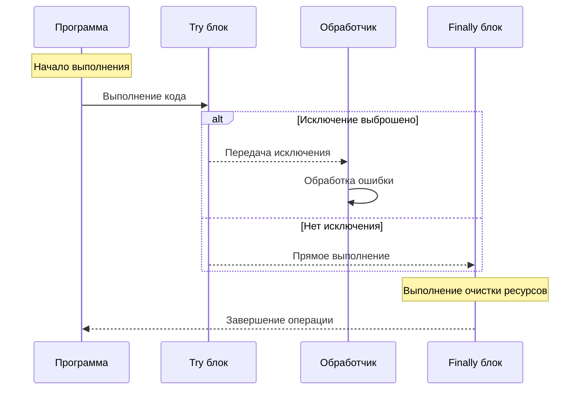

# Введение в исключения PHP

Исключения в PHP представляют собой механизм обработки неожиданных ситуаций во время выполнения программы. Они позволяют:

- Обрабатывать ошибки без прерывания работы программы
- Предоставлять информативные сообщения об ошибках
- Обеспечивать корректное освобождение ресурсов
- Улучшать контроль над поведением программы при возникновении ошибок
- Базовый синтаксис исключений
- Базовая структура обработки исключений включает три ключевых блока

```php
try {
    // Код, который может вызвать исключение
}
catch (ExceptionType $e) {
    // Обработка исключения
}
finally {
    // Код, который выполняется всегда
}
```

Давайте рассмотрим, как работает этот механизм на практике:



На диаграмме показан процесс выполнения кода с исключениями:

1. Программа начинает выполнение в блоке `try`
2. Если возникает исключение, оно передается в блок `catch` для обработки
3. Если исключений нет, код продолжает выполнение напрямую
4. Блок `finally` выполняется всегда, независимо от того, было ли исключение
5. После завершения всех операций программа продолжает работу

## Выполнение работы

Для работы с исключениями вам понадобится следующая структура проекта:

```
lab_exceptions/
├── exceptions/
│   ├── CustomException.php
│   └── DatabaseException.php
├── handlers/
│   └── ExceptionHandler.php
└── index.php
```

Создайте каждый файл и напишите в них следующий базовый код:

### `exceptions/CustomException.php`

```php
<?php

class CustomException extends Exception {
    public function __construct($message, $code = 0, Throwable $previous = null) {
        parent::__construct($message, $code, $previous);
    }
}
```

### `handlers/ExceptionHandler.php`

```php
<?php

class ExceptionHandler {
    public static function handle(Throwable $exception) {
        print("Произошла ошибка: {$exception -> getMessage()}<br>");
        print("Файл: {$exception -> getFile()}<br>");
        print("Строка: {$exception -> getLine()}<br>");
    }
}
```

### `index.php`

```php
<?php

require_once __DIR__ . '/exceptions/CustomException.php';
require_once __DIR__ . '/handlers/ExceptionHandler.php';

try {
    throw new CustomException('Тестовое исключение');
} catch (Throwable $e) {
    ExceptionHandler::handle($e);
} finally {
    print('Выполнение завершено');
}
```

## Самостоятельная работа

В папке `self_study` каждая работа должна быть выполнена в своём файле с именем `X.php`, где `X` - номер работы.

1. Создайте класс `ValidationException`, который будет выбрасывать исключение при неверном формате email-адреса. Реализуйте проверку на корректность email.
    *Для выполнения данной самостоятельной работы, обратитесть к главе [Проверка электронной почты и URL-адреса](./../../Theory/Forms/04.md).*
2. Разработайте систему обработки ошибок чтения файла. Создайте кастомное исключение `FileReadException` и реализуйте его использование в контексте чтения файла.
3. Напишите функцию деления чисел, которая бросает исключение при попытке деления на ноль. Добавьте обработку этого исключения.
4. Создайте класс `DatabaseConnectionException` для обработки ошибок подключения к базе данных. Симулируйте (или попробуйте реальные подключения к базе данных) различные случаи ошибок подключения.
5. Реализуйте систему логирования исключений. При возникновении исключения должно записываться сообщение об ошибке в файл в корне проекта с именем `error.log`.
6. Создайте иерархию исключений для онлайн-магазина:
   - Базовое исключение `ShopException`.
   - Дочерние исключения для различных случаев (недостаточно средств, товар отсутствует).
7. Разработайте механизм обработки множественных исключений в одном блоке `catch` (используя оператор `|` в PHP 8.*).
8. Создайте систему обработки исключений для валидации формы регистрации пользователя. Обработайте следующие случаи:
   - Короткий пароль
   - Неверный формат email
   - Пустые обязательные поля