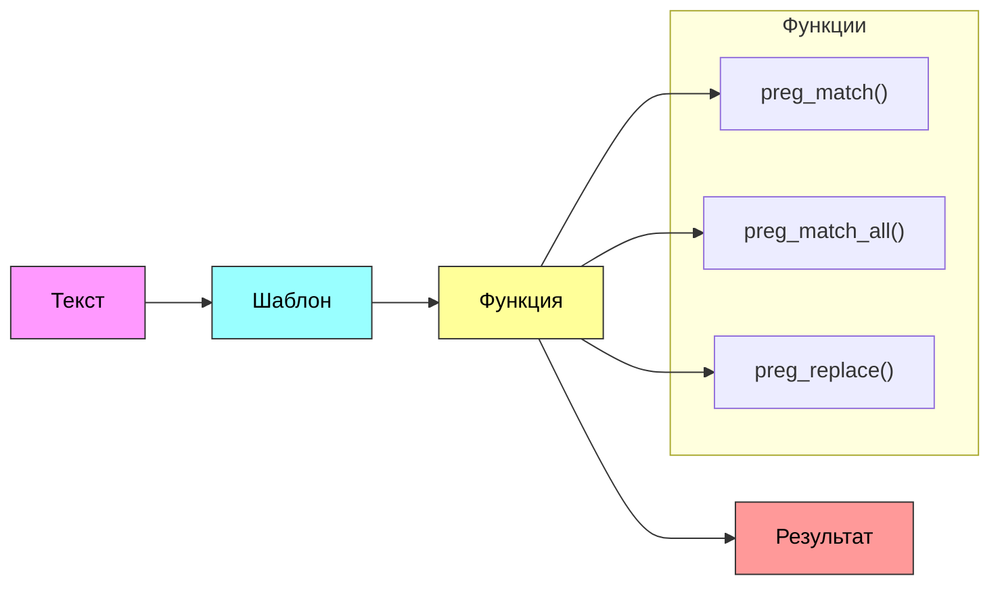

# Регулярные выражения

### Задачи работы:
- Изучить основные концепции регулярных выражений в PHP
- Освоить работу с функциями `preg_match()`, `preg_match_all()`, `preg_replace()`
- Научиться решать практические задачи с использованием регулярных выражений

### Введение

Регулярные выражения (regex) - это мощный инструмент для работы с текстом в PHP. Они позволяют искать, проверять и манипулировать текстовыми данными по определённым шаблонам. В этой лабораторной работе мы рассмотрим основные концепции и практическое применение регулярных выражений.

#### Процесс работы с регулярными выражениями



Диаграмма показывает основные этапы работы с регулярными выражениями:

1. Текст - это входные данные, которые мы хотим обработать
2. Шаблон - регулярное выражение, определяющее, что мы ищем
3. Функция - один из трёх основных инструментов PHP:
   - `preg_match()` - находит первое совпадение
   - `preg_match_all()` - находит все совпадения
   - `preg_replace()` - заменяет найденные совпадения
4. Результат - то, что мы получаем после обработки

### Пошаговые задания

#### Задание 1

```php
<?php

// 1. Создайте строку с текстом
$text = "Привет, мир!";

// 2. Найдите слово "мир" в тексте
$pattern = "/мир/";
$result = preg_match($pattern, $text);
print('Найдено: ' . ($result ? 'да' : 'нет') . '<br>');

// 3. Попробуйте найти слово "привет" в начале строки
$pattern = "/^привет/";
$result = preg_match($pattern, $text);
print('Найдено в начале: ' . ($result ? 'да' : 'нет') . '<br>');

// 4. Найдите слово "конец" в конце строки
$pattern = "/конец$/";
$result = preg_match($pattern, $text);
print('Найдено в конце: ' . ($result ? 'да' : 'нет') . '<br>');
```

#### Задание 2

```php
<?php

// 1. Создайте строку с текстом
$text = 'Телефон: +7(999)123-45-67<br>Email: test@example.com';

// 2. Найдите все цифры в тексте
$pattern = "/\d/";
$numbers = [];
preg_match_all($pattern, $text, $numbers);
print('Найдены цифры: ' . implode(', ', $numbers[0]) . '<br>');

// 3. Найдите все буквы
$pattern = "/[a-zA-Zа-яА-Я]/";
$letters = [];
preg_match_all($pattern, $text, $letters);
print('Найдены буквы: ' . implode(', ', $letters[0]) . '<br>');

// 4. Найдите все спецсимволы
$pattern = "/[^a-zA-Zа-яА-Я0-9\s]/";
$symbols = [];
preg_match_all($pattern, $text, $symbols);
print('Найдены спецсимволы: ' . implode(', ', $letters[0]) . '<br>');
```

#### Задание 3

```php
<?php

// 1. Создайте строку с текстом
$text = 'Пароль: P@ssw0rd<br>Email: test@example.com<br>Телефон: +7(999)123-45-67';

// 2. Проверьте пароль на соответствие требованиям
$pattern = "/^(?=.*[A-Z])(?=.*\d)(?=.*[@$!%*#?&])[A-Za-z\d@$!%*#?&]{8,}$/";
$password = "P@ssw0rd";
print('Пароль ' . ($password ? 'соответствует' : 'не соответствует') . ' требованиям<br>');

// 3. Найдите все email адреса
$pattern = "/[\w.-]+@[\w.-]+\.\w+/";
$emails = [];
preg_match_all($pattern, $text, $emails);
print('Найдены email: ' . implode(', ', $emails[0]) . '<br>');

// 4. Замените все телефоны на "Номер скрыт"
$pattern = "/\+7\(\d{3}\)\d{3}-\d{2}-\d{2}/";
$new_text = preg_replace($pattern, 'Номер скрыт', $text);
print('<br>Текст после замены телефонов:<br>');
print($new_text);
```

### Дополнительные задания

1. Напишите регулярное выражение для проверки корректности даты в формате ДД.ММ.ГГГГ
2. Создайте регулярное выражение для поиска HTML-тегов
3. Напишите регулярное выражение для проверки корректности номера кредитной карты