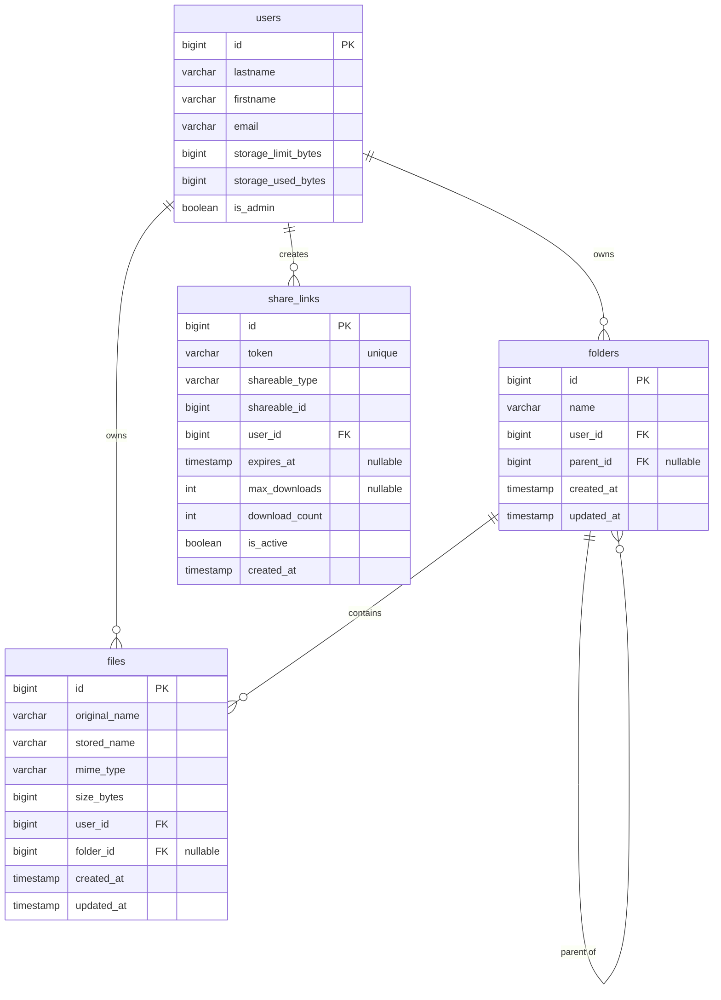

# Файловое хранилище

## Введение

В этой лабораторной работе мы создадим систему файлового хранилища —
аналог личного облака. Каждый пользователь получит квоту на объём
файлов, сможет организовывать файлы в папки, делиться ими по ссылкам
и управлять доступом. Администратор сможет настраивать квоты для
каждого пользователя индивидуально.

**Цели работы:**

- Освоить работу с файловой системой через `Storage`-фасад Laravel
- Реализовать полиморфные отношения для ссылок общего доступа
- Спроектировать слоистую архитектуру по принципам SOLID
- Реализовать систему квот и административную панель
- Создать современный интерфейс на TailwindCSS

---

## Часть 1. Архитектура и база данных



### Шаг 1.1. Проектирование схемы — обоснование

Перед написанием кода разберём, почему схема спроектирована именно так.

**Таблица `users` (расширение существующей):**

Добавляем два поля: `storage_limit_bytes` и `storage_used_bytes`.
Хранить использованный объём в отдельном поле, а не считать через
`SUM()` по таблице файлов — это осознанный компромисс:
- `SUM(size_bytes)` на каждый запрос к странице — дорогая операция
- Денормализация оправдана, когда счётчик меняется редко и
  критичен по скорости чтения
- При удалении/загрузке файла мы атомарно обновляем счётчик в
  транзакции — данные остаются согласованными

**Таблица `folders`:**

Самоссылающийся внешний ключ `parent_id` — классическая реализация
дерева через модель «смежных узлов» (Adjacency List). Простота в
обмен на рекурсивные запросы при построении дерева. Для небольших
файловых хранилищ (до 5–7 уровней вложенности) этого достаточно.

**Таблица `files`:**

- `original_name` — имя, которое видит пользователь
- `stored_name` — UUID-имя на диске (защита от коллизий и
  проблем с кодировкой)
- `folder_id` nullable — файл может лежать в «корне» пользователя
  без папки

**Таблица `share_links`:**

Полиморфная связь (`shareable_type` + `shareable_id`) позволяет
создавать ссылки как на файлы, так и на папки **через одну таблицу**.
Альтернатива — две отдельные таблицы (`file_share_links` и
`folder_share_links`) — нарушала бы принцип DRY и усложняла бы
сервис ссылок.

Поле `token` — случайная строка длиной 64 символа, уникальный индекс
гарантирует отсутствие коллизий. `expires_at`, `max_downloads` и
`download_count` дают гибкость: можно сделать одноразовую ссылку
или ссылку с истечением срока.

### Шаг 1.2. Применение SOLID к архитектуре

**S — Single Responsibility:**
- `StorageQuotaService` — только квоты
- `FileService` — только операции с файлами
- `FolderService` — только операции с папками
- `ShareLinkService` — только ссылки общего доступа

**O — Open/Closed:**
Вводим интерфейс `Shareable` — любая модель, реализующая его,
поддерживает создание ссылок без изменения `ShareLinkService`.

**D — Dependency Inversion:**
Все сервисы внедряются через конструктор. Контроллер зависит от
абстракции (интерфейса), а не от конкретного класса.

---

## Часть 2. Миграции

### Шаг 2.1. Расширение таблицы users

```bash
php artisan make:migration add_storage_fields_to_users_table
```

Откройте созданный файл:

```php
<?php

use Illuminate\Database\Migrations\Migration;
use Illuminate\Database\Schema\Blueprint;
use Illuminate\Support\Facades\Schema;

return new class extends Migration
{
    public function up(): void
    {
        Schema::table('users', function (Blueprint $table) {
            // Лимит квоты в байтах (по умолчанию 1 ГБ = 1 073 741 824 байта)
            $table->unsignedBigInteger('storage_limit_bytes')
                  ->default(1073741824)
                  ->after('remember_token');

            // Текущий использованный объём (денормализованный счётчик)
            $table->unsignedBigInteger('storage_used_bytes')
                  ->default(0)
                  ->after('storage_limit_bytes');

            // Флаг администратора для управления квотами других пользователей
            $table->boolean('is_admin')
                  ->default(false)
                  ->after('storage_used_bytes');
        });
    }

    public function down(): void
    {
        Schema::table('users', function (Blueprint $table) {
            $table->dropColumn([
                'storage_limit_bytes',
                'storage_used_bytes',
                'is_admin',
            ]);
        });
    }
};
```

### Шаг 2.2. Создание таблицы folders

```bash
php artisan make:migration create_folders_table
```

```php
<?php

use Illuminate\Database\Migrations\Migration;
use Illuminate\Database\Schema\Blueprint;
use Illuminate\Support\Facades\Schema;

return new class extends Migration
{
    public function up(): void
    {
        Schema::create('folders', function (Blueprint $table) {
            $table->id();

            $table->string('name', 255);

            // Владелец папки
            $table->foreignId('user_id')
                  ->constrained('users')
                  ->onDelete('cascade');

            // Родительская папка (null = корневая папка)
            $table->foreignId('parent_id')
                  ->nullable()
                  ->constrained('folders')
                  ->onDelete('cascade');

            $table->timestamps();

            // Индекс для быстрого получения содержимого папки
            $table->index(['user_id', 'parent_id'], 'idx_folder_user_parent');

            // Уникальность имени внутри одной родительской папки
            // одного пользователя
            $table->unique(
                ['user_id', 'parent_id', 'name'],
                'idx_unique_folder_name'
            );
        });
    }

    public function down(): void
    {
        Schema::dropIfExists('folders');
    }
};
```

**Почему уникальный индекс на `(user_id, parent_id, name)`:**
Нельзя иметь две папки с одинаковым именем в одном месте.
Трёхколоночный уникальный индекс корректно обрабатывает NULL в
`parent_id` — две корневые папки с одинаковым именем также запрещены.

### Шаг 2.3. Создание таблицы files

```bash
php artisan make:migration create_files_table
```

```php
<?php

use Illuminate\Database\Migrations\Migration;
use Illuminate\Database\Schema\Blueprint;
use Illuminate\Support\Facades\Schema;

return new class extends Migration
{
    public function up(): void
    {
        Schema::create('files', function (Blueprint $table) {
            $table->id();

            // Имя, которое видит пользователь
            $table->string('original_name', 255);

            // Имя файла на диске (UUID, безопасное для файловой системы)
            $table->string('stored_name', 36)->unique();

            // MIME-тип (image/jpeg, application/pdf, text/plain и т.д.)
            $table->string('mime_type', 127);

            // Размер в байтах
            $table->unsignedBigInteger('size_bytes');

            // Владелец
            $table->foreignId('user_id')
                  ->constrained('users')
                  ->onDelete('cascade');

            // Папка (null = корень пользователя)
            $table->foreignId('folder_id')
                  ->nullable()
                  ->constrained('folders')
                  ->onDelete('cascade');

            $table->timestamps();

            $table->index(['user_id', 'folder_id'], 'idx_file_user_folder');
        });
    }

    public function down(): void
    {
        Schema::dropIfExists('files');
    }
};
```

### Шаг 2.4. Создание таблицы share_links

```bash
php artisan make:migration create_share_links_table
```

```php
<?php

use Illuminate\Database\Migrations\Migration;
use Illuminate\Database\Schema\Blueprint;
use Illuminate\Support\Facades\Schema;

return new class extends Migration
{
    public function up(): void
    {
        Schema::create('share_links', function (Blueprint $table) {
            $table->id();

            // Уникальный токен доступа (64 символа)
            $table->string('token', 64)->unique();

            // Полиморфная связь: 'App\Models\File' или 'App\Models\Folder'
            $table->string('shareable_type', 60);
            $table->unsignedBigInteger('shareable_id');

            // Кто создал ссылку
            $table->foreignId('user_id')
                  ->constrained('users')
                  ->onDelete('cascade');

            // Когда истекает (null = никогда)
            $table->timestamp('expires_at')->nullable();

            // Максимум скачиваний (null = без ограничений)
            $table->unsignedInteger('max_downloads')->nullable();

            // Счётчик скачиваний
            $table->unsignedInteger('download_count')->default(0);

            // Активна ли ссылка
            $table->boolean('is_active')->default(true);

            // Нет updated_at: ссылки не редактируются
            $table->timestamp('created_at')->useCurrent();

            // Индекс для поиска всех ссылок конкретного объекта
            $table->index(
                ['shareable_type', 'shareable_id'],
                'idx_shareable'
            );
        });
    }

    public function down(): void
    {
        Schema::dropIfExists('share_links');
    }
};
```

### Шаг 2.5. Применение миграций

```bash
php artisan migrate
```

---

## Часть 3. Интерфейсы (принцип SOLID)

Прежде чем писать модели, создадим интерфейс. Именно он позволит
`ShareLinkService` работать с `File` и `Folder` одинаково, не
зная конкретного типа — это и есть принцип **инверсии зависимостей**.

Создайте директорию `app/Contracts/` и файл
`app/Contracts/Shareable.php`:

```php
<?php

namespace App\Contracts;

use Illuminate\Database\Eloquent\Relations\MorphMany;

/**
 * Контракт для объектов, которые можно открыть по ссылке общего доступа.
 *
 * Любая модель, реализующая этот интерфейс, может быть передана в
 * ShareLinkService без изменения самого сервиса — это принцип
 * открытости/закрытости (Open/Closed Principle).
 */
interface Shareable
{
    /**
     * Полиморфное отношение к ссылкам общего доступа.
     */
    public function shareLinks(): MorphMany;

    /**
     * Человекочитаемое имя объекта (для отображения в интерфейсе).
     */
    public function getDisplayName(): string;

    /**
     * Принадлежит ли объект указанному пользователю.
     */
    public function belongsToUser(int $userId): bool;
}
```

---

## Часть 4. Модели Eloquent

### Шаг 4.1. Модификация модели User

Откройте `app/Models/User.php` и добавьте новые отношения:

```php
<?php

namespace App\Models;

use Illuminate\Database\Eloquent\Relations\HasMany;
use Illuminate\Foundation\Auth\User as Authenticatable;
use Illuminate\Notifications\Notifiable;

class User extends Authenticatable
{
    use Notifiable;

    protected $fillable = [
        'lastname', 'firstname', 'patronymic',
        'email', 'password',
        'storage_limit_bytes', 'storage_used_bytes',
        'is_admin',
    ];

    protected $hidden = ['password', 'remember_token'];

    protected function casts(): array
    {
        return [
            'email_verified_at'    => 'datetime',
            'password'             => 'hashed',
            'is_admin'             => 'boolean',
            'storage_limit_bytes'  => 'integer',
            'storage_used_bytes'   => 'integer',
        ];
    }

    public function folders(): HasMany
    {
        return $this->hasMany(Folder::class);
    }

    public function files(): HasMany
    {
        return $this->hasMany(File::class);
    }

    public function shareLinks(): HasMany
    {
        return $this->hasMany(ShareLink::class);
    }

    /**
     * Полное имя пользователя.
     */
    public function getFullNameAttribute(): string
    {
        return trim("{$this->lastname} {$this->firstname} {$this->patronymic}");
    }

    /**
     * Процент заполненности квоты (0–100).
     */
    public function getStorageUsagePercentAttribute(): float
    {
        if ($this->storage_limit_bytes === 0) {
            return 100.0;
        }

        return round(($this->storage_used_bytes / $this->storage_limit_bytes) * 100, 1);
    }

    /**
     * Осталось места в байтах.
     */
    public function getStorageRemainingBytesAttribute(): int
    {
        return max(0, $this->storage_limit_bytes - $this->storage_used_bytes);
    }
}
```

### Шаг 4.2. Создание модели Folder

```bash
php artisan make:model Folder
```

```php
<?php

namespace App\Models;

use App\Contracts\Shareable;
use Illuminate\Database\Eloquent\Model;
use Illuminate\Database\Eloquent\Relations\BelongsTo;
use Illuminate\Database\Eloquent\Relations\HasMany;
use Illuminate\Database\Eloquent\Relations\MorphMany;

class Folder extends Model implements Shareable
{
    protected $fillable = ['name', 'user_id', 'parent_id'];

    /**
     * Папка принадлежит пользователю.
     */
    public function user(): BelongsTo
    {
        return $this->belongsTo(User::class);
    }

    /**
     * Родительская папка.
     */
    public function parent(): BelongsTo
    {
        return $this->belongsTo(Folder::class, 'parent_id');
    }

    /**
     * Дочерние папки.
     */
    public function children(): HasMany
    {
        return $this->hasMany(Folder::class, 'parent_id');
    }

    /**
     * Файлы непосредственно в этой папке.
     */
    public function files(): HasMany
    {
        return $this->hasMany(File::class);
    }

    /**
     * Ссылки общего доступа (реализация Shareable).
     */
    public function shareLinks(): MorphMany
    {
        return $this->morphMany(ShareLink::class, 'shareable');
    }

    /**
     * Реализация Shareable: имя для отображения.
     */
    public function getDisplayName(): string
    {
        return $this->name;
    }

    /**
     * Реализация Shareable: проверка владельца.
     */
    public function belongsToUser(int $userId): bool
    {
        return $this->user_id === $userId;
    }

    /**
     * Суммарный размер всех файлов в папке (рекурсивно).
     * Используется при удалении для возврата квоты.
     */
    public function getTotalSizeAttribute(): int
    {
        $direct = $this->files()->sum('size_bytes');

        // Рекурсивно считаем размер вложенных папок
        $nested = $this->children->sum(fn ($child) => $child->total_size);

        return $direct + $nested;
    }
}
```

### Шаг 4.3. Создание модели File

```bash
php artisan make:model File
```

```php
<?php

namespace App\Models;

use App\Contracts\Shareable;
use Illuminate\Database\Eloquent\Model;
use Illuminate\Database\Eloquent\Relations\BelongsTo;
use Illuminate\Database\Eloquent\Relations\MorphMany;

class File extends Model implements Shareable
{
    protected $fillable = [
        'original_name', 'stored_name',
        'mime_type', 'size_bytes',
        'user_id', 'folder_id',
    ];

    protected function casts(): array
    {
        return [
            'size_bytes' => 'integer',
        ];
    }

    public function user(): BelongsTo
    {
        return $this->belongsTo(User::class);
    }

    public function folder(): BelongsTo
    {
        return $this->belongsTo(Folder::class);
    }

    /**
     * Ссылки общего доступа (реализация Shareable).
     */
    public function shareLinks(): MorphMany
    {
        return $this->morphMany(ShareLink::class, 'shareable');
    }

    public function getDisplayName(): string
    {
        return $this->original_name;
    }

    public function belongsToUser(int $userId): bool
    {
        return $this->user_id === $userId;
    }

    /**
     * Аксессор: расширение файла.
     */
    public function getExtensionAttribute(): string
    {
        return pathinfo($this->original_name, PATHINFO_EXTENSION);
    }

    /**
     * Аксессор: иконка по MIME-типу (эмодзи для простоты, в проде — SVG).
     */
    public function getIconAttribute(): string
    {
        return match (true) {
            str_starts_with($this->mime_type, 'image/')       => '🖼️',
            str_starts_with($this->mime_type, 'video/')       => '🎬',
            str_starts_with($this->mime_type, 'audio/')       => '🎵',
            $this->mime_type === 'application/pdf'            => '📄',
            str_contains($this->mime_type, 'zip')
                || str_contains($this->mime_type, 'rar')      => '🗜️',
            str_starts_with($this->mime_type, 'text/')        => '📝',
            default                                            => '📎',
        };
    }

    /**
     * Путь к файлу на диске.
     * Структура: private/{user_id}/{stored_name}
     */
    public function getDiskPathAttribute(): string
    {
        return "private/{$this->user_id}/{$this->stored_name}";
    }
}
```

### Шаг 4.4. Создание модели ShareLink

```bash
php artisan make:model ShareLink
```

```php
<?php

namespace App\Models;

use Illuminate\Database\Eloquent\Model;
use Illuminate\Database\Eloquent\Relations\BelongsTo;
use Illuminate\Database\Eloquent\Relations\MorphTo;

class ShareLink extends Model
{
    // Нет updated_at
    public const UPDATED_AT = null;

    protected $fillable = [
        'token', 'shareable_type', 'shareable_id',
        'user_id', 'expires_at', 'max_downloads',
        'download_count', 'is_active',
    ];

    protected function casts(): array
    {
        return [
            'expires_at'     => 'datetime',
            'is_active'      => 'boolean',
            'max_downloads'  => 'integer',
            'download_count' => 'integer',
        ];
    }

    public function user(): BelongsTo
    {
        return $this->belongsTo(User::class);
    }

    /**
     * Полиморфное: возвращает File или Folder.
     */
    public function shareable(): MorphTo
    {
        return $this->morphTo();
    }

    /**
     * Проверка: истекла ли ссылка.
     */
    public function isExpired(): bool
    {
        return $this->expires_at !== null
            && $this->expires_at->isPast();
    }

    /**
     * Проверка: исчерпан ли лимит скачиваний.
     */
    public function isDownloadLimitReached(): bool
    {
        return $this->max_downloads !== null
            && $this->download_count >= $this->max_downloads;
    }

    /**
     * Ссылка работоспособна прямо сейчас.
     */
    public function isUsable(): bool
    {
        return $this->is_active
            && !$this->isExpired()
            && !$this->isDownloadLimitReached();
    }
}
```

---

## Часть 5. Form Requests

```bash
php artisan make:request UploadFileRequest
php artisan make:request CreateFolderRequest
php artisan make:request RenameItemRequest
php artisan make:request CreateShareLinkRequest
php artisan make:request UpdateStorageLimitRequest
```

### Шаг 5.1. UploadFileRequest

`app/Http/Requests/UploadFileRequest.php`:

```php
<?php

namespace App\Http\Requests;

use Illuminate\Foundation\Http\FormRequest;

class UploadFileRequest extends FormRequest
{
    public function authorize(): bool
    {
        return true; // auth middleware в маршруте
    }

    public function rules(): array
    {
        // Максимальный размер одного файла — 100 МБ
        return [
            'file'      => ['required', 'file', 'max:102400'],
            'folder_id' => ['nullable', 'integer', 'exists:folders,id'],
        ];
    }

    public function messages(): array
    {
        return [
            'file.required' => 'Файл не выбран',
            'file.max'      => 'Файл не должен превышать 100 МБ',
            'folder_id.exists' => 'Папка не найдена',
        ];
    }
}
```

### Шаг 5.2. CreateFolderRequest

`app/Http/Requests/CreateFolderRequest.php`:

```php
<?php

namespace App\Http\Requests;

use Illuminate\Foundation\Http\FormRequest;

class CreateFolderRequest extends FormRequest
{
    public function authorize(): bool
    {
        return true;
    }

    public function rules(): array
    {
        return [
            'name'      => [
                'required', 'string', 'max:255',
                // Запрещаем символы, опасные для файловой системы
                'regex:/^[^\\\/\:\*\?\"\<\>\|]+$/',
            ],
            'parent_id' => ['nullable', 'integer', 'exists:folders,id'],
        ];
    }

    public function messages(): array
    {
        return [
            'name.required' => 'Введите имя папки',
            'name.regex'    => 'Имя папки содержит недопустимые символы',
            'name.max'      => 'Имя папки не должно превышать 255 символов',
        ];
    }
}
```

### Шаг 5.3. RenameItemRequest

`app/Http/Requests/RenameItemRequest.php`:

```php
<?php

namespace App\Http\Requests;

use Illuminate\Foundation\Http\FormRequest;

class RenameItemRequest extends FormRequest
{
    public function authorize(): bool
    {
        return true;
    }

    public function rules(): array
    {
        return [
            'name' => [
                'required', 'string', 'max:255',
                'regex:/^[^\\\/\:\*\?\"\<\>\|]+$/',
            ],
        ];
    }

    public function messages(): array
    {
        return [
            'name.required' => 'Введите новое имя',
            'name.regex'    => 'Имя содержит недопустимые символы',
        ];
    }
}
```

### Шаг 5.4. CreateShareLinkRequest

`app/Http/Requests/CreateShareLinkRequest.php`:

```php
<?php

namespace App\Http\Requests;

use Illuminate\Foundation\Http\FormRequest;

class CreateShareLinkRequest extends FormRequest
{
    public function authorize(): bool
    {
        return true;
    }

    public function rules(): array
    {
        return [
            // expires_in: количество дней до истечения (null = бессрочно)
            'expires_in'    => ['nullable', 'integer', 'min:1', 'max:365'],
            'max_downloads' => ['nullable', 'integer', 'min:1', 'max:10000'],
        ];
    }

    public function messages(): array
    {
        return [
            'expires_in.max'    => 'Максимальный срок действия — 365 дней',
            'max_downloads.min' => 'Минимум 1 скачивание',
        ];
    }
}
```

### Шаг 5.5. UpdateStorageLimitRequest

`app/Http/Requests/UpdateStorageLimitRequest.php`:

```php
<?php

namespace App\Http\Requests;

use Illuminate\Foundation\Http\FormRequest;

class UpdateStorageLimitRequest extends FormRequest
{
    public function authorize(): bool
    {
        return true; // AdminMiddleware защитит маршрут
    }

    public function rules(): array
    {
        return [
            // Лимит в мегабайтах (от 10 МБ до 100 ГБ)
            'limit_mb' => ['required', 'integer', 'min:10', 'max:102400'],
        ];
    }

    public function messages(): array
    {
        return [
            'limit_mb.required' => 'Введите размер лимита',
            'limit_mb.min'      => 'Минимальный лимит — 10 МБ',
            'limit_mb.max'      => 'Максимальный лимит — 100 ГБ',
        ];
    }
}
```

---

## Часть 6. Сервисный слой

### Шаг 6.1. StorageQuotaService

`app/Services/StorageQuotaService.php`:

```php
<?php

namespace App\Services;

use App\Exceptions\QuotaExceededException;
use App\Models\User;
use Illuminate\Support\Facades\DB;

/**
 * Управление квотами хранилища.
 *
 * Single Responsibility: только квоты, никакой логики файлов.
 */
class StorageQuotaService
{
    /**
     * Проверить, можно ли загрузить файл указанного размера.
     *
     * @throws QuotaExceededException
     */
    public function ensureHasSpace(User $user, int $fileSizeBytes): void
    {
        if ($user->storage_used_bytes + $fileSizeBytes > $user->storage_limit_bytes) {
            $available = $this->formatBytes(
                $user->storage_limit_bytes - $user->storage_used_bytes
            );

            throw new QuotaExceededException(
                "Недостаточно места в хранилище. Доступно: {$available}."
            );
        }
    }

    /**
     * Увеличить счётчик использованного места.
     * Вызывается после успешной загрузки файла.
     */
    public function incrementUsed(User $user, int $bytes): void
    {
        DB::table('users')
          ->where('id', $user->id)
          ->increment('storage_used_bytes', $bytes);

        // Обновляем объект в памяти, чтобы не делать повторный SELECT
        $user->storage_used_bytes += $bytes;
    }

    /**
     * Уменьшить счётчик при удалении файла.
     */
    public function decrementUsed(User $user, int $bytes): void
    {
        DB::table('users')
          ->where('id', $user->id)
          ->decrement('storage_used_bytes', $bytes);

        $user->storage_used_bytes = max(0, $user->storage_used_bytes - $bytes);
    }

    /**
     * Пересчитать реальный используемый объём из таблицы files.
     * Используется для синхронизации при рассогласовании данных.
     */
    public function recalculateUsed(User $user): void
    {
        $realUsed = $user->files()->sum('size_bytes');

        $user->update(['storage_used_bytes' => $realUsed]);
    }

    /**
     * Установить новый лимит для пользователя.
     */
    public function setLimit(User $user, int $limitBytes): void
    {
        $user->update(['storage_limit_bytes' => $limitBytes]);
    }

    /**
     * Форматирование байт в человекочитаемый вид.
     */
    public function formatBytes(int $bytes): string
    {
        if ($bytes >= 1073741824) {
            return round($bytes / 1073741824, 2) . ' ГБ';
        }

        if ($bytes >= 1048576) {
            return round($bytes / 1048576, 2) . ' МБ';
        }

        if ($bytes >= 1024) {
            return round($bytes / 1024, 1) . ' КБ';
        }

        return $bytes . ' Б';
    }
}
```

### Шаг 6.2. Исключение QuotaExceededException

```bash
php artisan make:exception QuotaExceededException
```

`app/Exceptions/QuotaExceededException.php`:

```php
<?php

namespace App\Exceptions;

use Exception;
use Illuminate\Http\JsonResponse;
use Illuminate\Http\RedirectResponse;

class QuotaExceededException extends Exception
{
    /**
     * Возвращает ответ в зависимости от типа запроса.
     * Если это AJAX — JSON, иначе — редирект с ошибкой.
     */
    public function render(): JsonResponse|RedirectResponse
    {
        if (request()->expectsJson()) {
            return response()->json([
                'error' => $this->getMessage(),
            ], 413); // 413 Payload Too Large
        }

        return back()->withErrors(['file' => $this->getMessage()]);
    }
}
```

### Шаг 6.3. FileService

`app/Services/FileService.php`:

```php
<?php

namespace App\Services;

use App\Models\File;
use App\Models\Folder;
use App\Models\User;
use Illuminate\Http\UploadedFile;
use Illuminate\Support\Facades\DB;
use Illuminate\Support\Facades\Storage;
use Illuminate\Support\Str;

class FileService
{
    public function __construct(
        private StorageQuotaService $quotaService
    ) {}

    /**
     * Загрузить новый файл в хранилище.
     *
     * Порядок действий:
     * 1. Проверяем квоту (до сохранения на диск)
     * 2. Генерируем уникальное имя
     * 3. Сохраняем на диск
     * 4. Создаём запись в БД (в транзакции)
     * 5. Обновляем счётчик квоты
     */
    public function upload(
        UploadedFile $uploadedFile,
        User $user,
        ?Folder $folder = null
    ): File {
        $sizeBytes = $uploadedFile->getSize();

        // Шаг 1: проверяем квоту ДО записи на диск
        $this->quotaService->ensureHasSpace($user, $sizeBytes);

        // Шаг 2: генерируем UUID для имени файла на диске
        $storedName = Str::uuid()->toString();
        $diskPath   = "private/{$user->id}/{$storedName}";

        // Шаг 3: сохраняем файл
        Storage::put($diskPath, $uploadedFile->getContent());

        try {
            // Шаг 4 + 5: транзакция — запись в БД и обновление квоты
            return DB::transaction(function () use (
                $uploadedFile, $user, $folder,
                $storedName, $sizeBytes
            ) {
                $file = File::create([
                    'original_name' => $uploadedFile->getClientOriginalName(),
                    'stored_name'   => $storedName,
                    'mime_type'     => $uploadedFile->getMimeType(),
                    'size_bytes'    => $sizeBytes,
                    'user_id'       => $user->id,
                    'folder_id'     => $folder?->id,
                ]);

                $this->quotaService->incrementUsed($user, $sizeBytes);

                return $file;
            });
        } catch (\Throwable $e) {
            // Если БД-транзакция упала — удаляем файл с диска
            Storage::delete($diskPath);
            throw $e;
        }
    }

    /**
     * Переименовать файл (меняется только original_name в БД).
     * Файл на диске не перемещается — имя на диске всегда UUID.
     */
    public function rename(File $file, string $newName): File
    {
        $file->update(['original_name' => $newName]);

        return $file->fresh();
    }

    /**
     * Переместить файл в другую папку.
     */
    public function move(File $file, ?int $targetFolderId): File
    {
        $file->update(['folder_id' => $targetFolderId]);

        return $file->fresh();
    }

    /**
     * Удалить файл: из БД и с диска.
     */
    public function delete(File $file, User $user): void
    {
        DB::transaction(function () use ($file, $user) {
            $sizeBytes = $file->size_bytes;

            // Удаляем запись из БД
            $file->delete();

            // Возвращаем место квоте
            $this->quotaService->decrementUsed($user, $sizeBytes);
        });

        // Удаляем с диска вне транзакции (Storage не откатывается)
        Storage::delete($file->disk_path);
    }

    /**
     * Получить содержимое файла для скачивания.
     * Возвращает путь к файлу на диске (для response()->download()).
     */
    public function getDiskPath(File $file): string
    {
        return Storage::path($file->disk_path);
    }

    /**
     * Получить содержимое папки пользователя.
     */
    public function getFolderContents(User $user, ?int $folderId = null): array
    {
        $folders = Folder::where('user_id', $user->id)
                         ->where('parent_id', $folderId)
                         ->orderBy('name')
                         ->get();

        $files = File::where('user_id', $user->id)
                     ->where('folder_id', $folderId)
                     ->orderBy('original_name')
                     ->get();

        return compact('folders', 'files');
    }
}
```

### Шаг 6.4. FolderService

`app/Services/FolderService.php`:

```php
<?php

namespace App\Services;

use App\Models\File;
use App\Models\Folder;
use App\Models\User;
use Illuminate\Support\Facades\DB;
use Illuminate\Support\Facades\Storage;

class FolderService
{
    public function __construct(
        private StorageQuotaService $quotaService
    ) {}

    /**
     * Создать новую папку.
     */
    public function create(
        User $user,
        string $name,
        ?int $parentId = null
    ): Folder {
        return Folder::create([
            'name'      => $name,
            'user_id'   => $user->id,
            'parent_id' => $parentId,
        ]);
    }

    /**
     * Переименовать папку.
     */
    public function rename(Folder $folder, string $newName): Folder
    {
        $folder->update(['name' => $newName]);

        return $folder->fresh();
    }

    /**
     * Удалить папку и всё её содержимое рекурсивно.
     * Размер всех вложенных файлов возвращается в квоту.
     */
    public function delete(Folder $folder, User $user): void
    {
        // Собираем все пути файлов до удаления из БД
        $diskPaths = $this->collectFilePaths($folder);

        // Суммарный размер для возврата квоты
        $totalSize = $folder->total_size;

        DB::transaction(function () use ($folder, $user, $totalSize) {
            // Каскадное удаление в БД (ON DELETE CASCADE)
            $folder->delete();

            // Возвращаем квоту
            if ($totalSize > 0) {
                $this->quotaService->decrementUsed($user, $totalSize);
            }
        });

        // Удаляем физические файлы с диска
        foreach ($diskPaths as $path) {
            Storage::delete($path);
        }
    }

    /**
     * Рекурсивно собрать пути всех файлов в папке.
     * Нужно для удаления файлов с диска после удаления из БД.
     */
    private function collectFilePaths(Folder $folder): array
    {
        $paths = $folder->files
            ->map(fn (File $file) => $file->disk_path)
            ->toArray();

        // Рекурсивно по дочерним папкам
        foreach ($folder->children()->with(['files', 'children'])->get() as $child) {
            $paths = array_merge($paths, $this->collectFilePaths($child));
        }

        return $paths;
    }

    /**
     * Получить «хлебные крошки» (breadcrumb) для папки.
     * Возвращает массив папок от корня до текущей.
     */
    public function getBreadcrumbs(Folder $folder): array
    {
        $breadcrumbs = [$folder];
        $current     = $folder;

        // Поднимаемся по дереву
        while ($current->parent_id !== null) {
            $current       = $current->parent;
            $breadcrumbs[] = $current;
        }

        return array_reverse($breadcrumbs);
    }
}
```

### Шаг 6.5. ShareLinkService

`app/Services/ShareLinkService.php`:

```php
<?php

namespace App\Services;

use App\Contracts\Shareable;
use App\Exceptions\ShareLinkException;
use App\Models\ShareLink;
use App\Models\User;
use Illuminate\Support\Str;

class ShareLinkService
{
    /**
     * Создать ссылку общего доступа.
     *
     * Принимает Shareable (интерфейс), а не конкретный File/Folder —
     * это принцип Open/Closed: добавляем новые типы без изменения сервиса.
     */
    public function create(
        Shareable $item,
        User $user,
        ?int $expiresInDays = null,
        ?int $maxDownloads = null
    ): ShareLink {
        // Убеждаемся, что пользователь владеет объектом
        if (!$item->belongsToUser($user->id)) {
            throw new ShareLinkException(
                'Вы не можете создать ссылку на чужой объект'
            );
        }

        return ShareLink::create([
            'token'          => Str::random(64),
            'shareable_type' => get_class($item),
            'shareable_id'   => $item->id,
            'user_id'        => $user->id,
            'expires_at'     => $expiresInDays
                ? now()->addDays($expiresInDays)
                : null,
            'max_downloads'  => $maxDownloads,
            'download_count' => 0,
            'is_active'      => true,
        ]);
    }

    /**
     * Деактивировать ссылку (закрыть доступ).
     */
    public function revoke(ShareLink $shareLink): void
    {
        $shareLink->update(['is_active' => false]);
    }

    /**
     * Повторно активировать ссылку.
     */
    public function activate(ShareLink $shareLink): void
    {
        $shareLink->update(['is_active' => true]);
    }

    /**
     * Получить объект по токену ссылки.
     * Проверяет активность, срок действия и лимит скачиваний.
     *
     * @throws ShareLinkException
     */
    public function resolveToken(string $token): array
    {
        $shareLink = ShareLink::where('token', $token)
                              ->with('shareable')
                              ->first();

        if (!$shareLink) {
            throw new ShareLinkException('Ссылка не найдена');
        }

        if (!$shareLink->isUsable()) {
            if (!$shareLink->is_active) {
                throw new ShareLinkException('Доступ по этой ссылке закрыт');
            }
            if ($shareLink->isExpired()) {
                throw new ShareLinkException('Срок действия ссылки истёк');
            }
            if ($shareLink->isDownloadLimitReached()) {
                throw new ShareLinkException('Лимит скачиваний исчерпан');
            }
        }

        return [
            'link'      => $shareLink,
            'shareable' => $shareLink->shareable,
        ];
    }

    /**
     * Зарегистрировать скачивание.
     */
    public function incrementDownload(ShareLink $shareLink): void
    {
        $shareLink->increment('download_count');
    }
}
```

### Шаг 6.6. Исключение ShareLinkException

```bash
php artisan make:exception ShareLinkException
```

`app/Exceptions/ShareLinkException.php`:

```php
<?php

namespace App\Exceptions;

use Exception;
use Illuminate\Http\RedirectResponse;

class ShareLinkException extends Exception
{
    public function render(): RedirectResponse
    {
        return redirect()->route('share.error')
                         ->with('error', $this->getMessage());
    }
}
```

---

## Часть 7. Middleware

### Шаг 7.1. Middleware для администратора

```bash
php artisan make:middleware EnsureUserIsAdmin
```

`app/Http/Middleware/EnsureUserIsAdmin.php`:

```php
<?php

namespace App\Http\Middleware;

use Closure;
use Illuminate\Http\Request;
use Symfony\Component\HttpFoundation\Response;

class EnsureUserIsAdmin
{
    public function handle(Request $request, Closure $next): Response
    {
        if (!auth()->check() || !auth()->user()->is_admin) {
            abort(403, 'Доступ только для администраторов');
        }

        return $next($request);
    }
}
```

Зарегистрируйте в `bootstrap/app.php`:

```php
->withMiddleware(function (Middleware $middleware) {
    $middleware->alias([
        'admin' => \App\Http\Middleware\EnsureUserIsAdmin::class,
    ]);
})
```

---

## Часть 8. Контроллеры

```bash
php artisan make:controller FileController
php artisan make:controller FolderController
php artisan make:controller ShareLinkController
php artisan make:controller Admin/StorageAdminController
php artisan make:controller ShareAccessController
```

### Шаг 8.1. FileController

`app/Http/Controllers/FileController.php`:

```php
<?php

namespace App\Http\Controllers;

use App\Http\Requests\RenameItemRequest;
use App\Http\Requests\UploadFileRequest;
use App\Models\File;
use App\Services\FileService;
use Illuminate\Http\RedirectResponse;
use Illuminate\Http\Response as HttpResponse;
use Illuminate\View\View;

class FileController extends Controller
{
    public function __construct(
        private FileService $fileService
    ) {}

    /**
     * Главная страница хранилища (корень пользователя).
     */
    public function index(): View
    {
        $user     = auth()->user();
        $contents = $this->fileService->getFolderContents($user);

        return view('storage.index', [
            'folders'    => $contents['folders'],
            'files'      => $contents['files'],
            'folder'     => null,
            'breadcrumbs' => [],
            'user'       => $user,
        ]);
    }

    /**
     * Загрузка файла.
     */
    public function store(UploadFileRequest $request): RedirectResponse
    {
        $folder = null;
        if ($request->folder_id) {
            $folder = auth()->user()
                            ->folders()
                            ->findOrFail($request->folder_id);
        }

        $this->fileService->upload(
            $request->file('file'),
            auth()->user(),
            $folder
        );

        return back()->with('success', 'Файл успешно загружен!');
    }

    /**
     * Скачать файл.
     */
    public function download(File $file): HttpResponse
    {
        // Только владелец или публичная ссылка
        if ($file->user_id !== auth()->id()) {
            abort(403);
        }

        $path = $this->fileService->getDiskPath($file);

        return response()->download($path, $file->original_name);
    }

    /**
     * Переименовать файл.
     */
    public function rename(RenameItemRequest $request, File $file): RedirectResponse
    {
        if ($file->user_id !== auth()->id()) {
            abort(403);
        }

        $this->fileService->rename($file, $request->validated('name'));

        return back()->with('success', 'Файл переименован!');
    }

    /**
     * Удалить файл.
     */
    public function destroy(File $file): RedirectResponse
    {
        if ($file->user_id !== auth()->id()) {
            abort(403);
        }

        $folderId = $file->folder_id;
        $this->fileService->delete($file, auth()->user());

        return redirect()
            ->route($folderId ? 'folders.show' : 'storage.index', array_filter(['folder' => $folderId]))
            ->with('success', 'Файл удалён!');
    }
}
```

### Шаг 8.2. FolderController

`app/Http/Controllers/FolderController.php`:

```php
<?php

namespace App\Http\Controllers;

use App\Http\Requests\CreateFolderRequest;
use App\Http\Requests\RenameItemRequest;
use App\Models\Folder;
use App\Services\FileService;
use App\Services\FolderService;
use Illuminate\Http\RedirectResponse;
use Illuminate\View\View;

class FolderController extends Controller
{
    public function __construct(
        private FolderService $folderService,
        private FileService $fileService
    ) {}

    /**
     * Показать содержимое папки.
     */
    public function show(Folder $folder): View
    {
        if ($folder->user_id !== auth()->id()) {
            abort(403);
        }

        $contents    = $this->fileService->getFolderContents(auth()->user(), $folder->id);
        $breadcrumbs = $this->folderService->getBreadcrumbs($folder);

        return view('storage.index', [
            'folders'    => $contents['folders'],
            'files'      => $contents['files'],
            'folder'     => $folder,
            'breadcrumbs' => $breadcrumbs,
            'user'       => auth()->user(),
        ]);
    }

    /**
     * Создать папку.
     */
    public function store(CreateFolderRequest $request): RedirectResponse
    {
        $this->folderService->create(
            auth()->user(),
            $request->validated('name'),
            $request->validated('parent_id')
        );

        return back()->with('success', 'Папка создана!');
    }

    /**
     * Переименовать папку.
     */
    public function rename(RenameItemRequest $request, Folder $folder): RedirectResponse
    {
        if ($folder->user_id !== auth()->id()) {
            abort(403);
        }

        $this->folderService->rename($folder, $request->validated('name'));

        return back()->with('success', 'Папка переименована!');
    }

    /**
     * Удалить папку и всё содержимое.
     */
    public function destroy(Folder $folder): RedirectResponse
    {
        if ($folder->user_id !== auth()->id()) {
            abort(403);
        }

        $parentId = $folder->parent_id;
        $this->folderService->delete($folder, auth()->user());

        return redirect()
            ->route($parentId ? 'folders.show' : 'storage.index', array_filter(['folder' => $parentId]))
            ->with('success', 'Папка удалена!');
    }
}
```

### Шаг 8.3. ShareLinkController

`app/Http/Controllers/ShareLinkController.php`:

```php
<?php

namespace App\Http\Controllers;

use App\Http\Requests\CreateShareLinkRequest;
use App\Models\File;
use App\Models\Folder;
use App\Models\ShareLink;
use App\Services\ShareLinkService;
use Illuminate\Http\JsonResponse;
use Illuminate\Http\RedirectResponse;
use Illuminate\View\View;

class ShareLinkController extends Controller
{
    public function __construct(
        private ShareLinkService $shareLinkService
    ) {}

    /**
     * Страница управления ссылками для файла.
     */
    public function indexFile(File $file): View
    {
        if ($file->user_id !== auth()->id()) {
            abort(403);
        }

        return view('storage.share', [
            'item'   => $file,
            'links'  => $file->shareLinks()->latest()->get(),
            'type'   => 'file',
        ]);
    }

    /**
     * Страница управления ссылками для папки.
     */
    public function indexFolder(Folder $folder): View
    {
        if ($folder->user_id !== auth()->id()) {
            abort(403);
        }

        return view('storage.share', [
            'item'   => $folder,
            'links'  => $folder->shareLinks()->latest()->get(),
            'type'   => 'folder',
        ]);
    }

    /**
     * Создать ссылку общего доступа.
     * Тип объекта определяется из URL: /share/file/{id} или /share/folder/{id}.
     */
    public function storeForFile(
        CreateShareLinkRequest $request,
        File $file
    ): RedirectResponse {
        if ($file->user_id !== auth()->id()) {
            abort(403);
        }

        $this->shareLinkService->create(
            $file,
            auth()->user(),
            $request->validated('expires_in'),
            $request->validated('max_downloads')
        );

        return back()->with('success', 'Ссылка создана!');
    }

    public function storeForFolder(
        CreateShareLinkRequest $request,
        Folder $folder
    ): RedirectResponse {
        if ($folder->user_id !== auth()->id()) {
            abort(403);
        }

        $this->shareLinkService->create(
            $folder,
            auth()->user(),
            $request->validated('expires_in'),
            $request->validated('max_downloads')
        );

        return back()->with('success', 'Ссылка создана!');
    }

    /**
     * Деактивировать ссылку (закрыть доступ).
     */
    public function revoke(ShareLink $shareLink): RedirectResponse
    {
        if ($shareLink->user_id !== auth()->id()) {
            abort(403);
        }

        $this->shareLinkService->revoke($shareLink);

        return back()->with('success', 'Доступ закрыт!');
    }

    /**
     * Повторно открыть доступ.
     */
    public function activate(ShareLink $shareLink): RedirectResponse
    {
        if ($shareLink->user_id !== auth()->id()) {
            abort(403);
        }

        $this->shareLinkService->activate($shareLink);

        return back()->with('success', 'Доступ открыт!');
    }

    /**
     * Удалить ссылку.
     */
    public function destroy(ShareLink $shareLink): RedirectResponse
    {
        if ($shareLink->user_id !== auth()->id()) {
            abort(403);
        }

        $shareLink->delete();

        return back()->with('success', 'Ссылка удалена!');
    }
}
```

### Шаг 8.4. ShareAccessController (доступ по ссылке)

`app/Http/Controllers/ShareAccessController.php`:

```php
<?php

namespace App\Http\Controllers;

use App\Models\File;
use App\Models\Folder;
use App\Services\FileService;
use App\Services\ShareLinkService;
use Illuminate\Http\Response;
use Illuminate\View\View;

class ShareAccessController extends Controller
{
    public function __construct(
        private ShareLinkService $shareLinkService,
        private FileService $fileService
    ) {}

    /**
     * Страница предпросмотра по ссылке.
     */
    public function show(string $token): View
    {
        ['link' => $link, 'shareable' => $item] =
            $this->shareLinkService->resolveToken($token);

        return view('share.preview', compact('link', 'item', 'token'));
    }

    /**
     * Скачать файл по ссылке общего доступа.
     */
    public function download(string $token): Response
    {
        ['link' => $link, 'shareable' => $item] =
            $this->shareLinkService->resolveToken($token);

        if (!$item instanceof File) {
            abort(400, 'Скачивание папок не поддерживается по прямой ссылке');
        }

        $this->shareLinkService->incrementDownload($link);

        $path = $this->fileService->getDiskPath($item);

        return response()->download($path, $item->original_name);
    }

    /**
     * Страница ошибки доступа.
     */
    public function error(): View
    {
        return view('share.error');
    }
}
```

### Шаг 8.5. Административный контроллер

`app/Http/Controllers/Admin/StorageAdminController.php`:

```php
<?php

namespace App\Http\Controllers\Admin;

use App\Http\Controllers\Controller;
use App\Http\Requests\UpdateStorageLimitRequest;
use App\Models\User;
use App\Services\StorageQuotaService;
use Illuminate\Http\RedirectResponse;
use Illuminate\View\View;

class StorageAdminController extends Controller
{
    public function __construct(
        private StorageQuotaService $quotaService
    ) {}

    /**
     * Список пользователей с информацией о квотах.
     */
    public function index(): View
    {
        $users = User::orderBy('lastname')
                     ->withCount('files')
                     ->paginate(20);

        return view('admin.storage.index', compact('users'));
    }

    /**
     * Обновить квоту пользователя.
     */
    public function updateLimit(
        UpdateStorageLimitRequest $request,
        User $user
    ): RedirectResponse {
        // Переводим МБ в байты
        $limitBytes = $request->validated('limit_mb') * 1048576;

        $this->quotaService->setLimit($user, $limitBytes);

        return back()->with(
            'success',
            "Квота для {$user->full_name} обновлена!"
        );
    }

    /**
     * Пересчитать реальный объём пользователя (инструмент синхронизации).
     */
    public function recalculate(User $user): RedirectResponse
    {
        $this->quotaService->recalculateUsed($user);

        return back()->with('success', 'Квота пересчитана!');
    }
}
```

---

## Часть 9. Маршруты

`routes/web.php`:

```php
<?php

use App\Http\Controllers\FileController;
use App\Http\Controllers\FolderController;
use App\Http\Controllers\ShareLinkController;
use App\Http\Controllers\ShareAccessController;
use App\Http\Controllers\Admin\StorageAdminController;
use Illuminate\Support\Facades\Route;

/*
|--------------------------------------------------------------------------
| Публичные маршруты: доступ по ссылке (без авторизации)
|--------------------------------------------------------------------------
*/

Route::get('/share/{token}', [ShareAccessController::class, 'show'])
     ->name('share.show');

Route::get('/share/{token}/download', [ShareAccessController::class, 'download'])
     ->name('share.download');

Route::get('/share-error', [ShareAccessController::class, 'error'])
     ->name('share.error');

/*
|--------------------------------------------------------------------------
| Защищённые маршруты: личное хранилище
|--------------------------------------------------------------------------
*/

Route::middleware('auth')->group(function () {

    // Корень хранилища
    Route::get('/storage', [FileController::class, 'index'])
         ->name('storage.index');

    // Файлы
    Route::post('/storage/files', [FileController::class, 'store'])
         ->name('files.store');

    Route::get('/storage/files/{file}/download', [FileController::class, 'download'])
         ->name('files.download');

    Route::patch('/storage/files/{file}/rename', [FileController::class, 'rename'])
         ->name('files.rename');

    Route::delete('/storage/files/{file}', [FileController::class, 'destroy'])
         ->name('files.destroy');

    // Папки
    Route::get('/storage/folders/{folder}', [FolderController::class, 'show'])
         ->name('folders.show');

    Route::post('/storage/folders', [FolderController::class, 'store'])
         ->name('folders.store');

    Route::patch('/storage/folders/{folder}/rename', [FolderController::class, 'rename'])
         ->name('folders.rename');

    Route::delete('/storage/folders/{folder}', [FolderController::class, 'destroy'])
         ->name('folders.destroy');

    // Ссылки общего доступа
    Route::get('/storage/files/{file}/share', [ShareLinkController::class, 'indexFile'])
         ->name('share-links.file.index');

    Route::get('/storage/folders/{folder}/share', [ShareLinkController::class, 'indexFolder'])
         ->name('share-links.folder.index');

    Route::post('/storage/files/{file}/share', [ShareLinkController::class, 'storeForFile'])
         ->name('share-links.file.store');

    Route::post('/storage/folders/{folder}/share', [ShareLinkController::class, 'storeForFolder'])
         ->name('share-links.folder.store');

    Route::patch('/storage/share-links/{shareLink}/revoke', [ShareLinkController::class, 'revoke'])
         ->name('share-links.revoke');

    Route::patch('/storage/share-links/{shareLink}/activate', [ShareLinkController::class, 'activate'])
         ->name('share-links.activate');

    Route::delete('/storage/share-links/{shareLink}', [ShareLinkController::class, 'destroy'])
         ->name('share-links.destroy');
});

/*
|--------------------------------------------------------------------------
| Административные маршруты
|--------------------------------------------------------------------------
*/

Route::middleware(['auth', 'admin'])->prefix('admin')->name('admin.')->group(function () {

    Route::get('/storage', [StorageAdminController::class, 'index'])
         ->name('storage.index');

    Route::patch('/storage/users/{user}/limit', [StorageAdminController::class, 'updateLimit'])
         ->name('storage.update-limit');

    Route::post('/storage/users/{user}/recalculate', [StorageAdminController::class, 'recalculate'])
         ->name('storage.recalculate');
});
```

**Объяснение структуры маршрутов:**

- Публичный доступ (`/share/{token}`) — вне группы `auth`, потому что
  ссылку может открыть любой пользователь интернета
- `PATCH` для переименования и деактивации — семантически правильно:
  это частичное обновление ресурса, не полная замена (`PUT`)
- Административные маршруты вынесены в префикс `admin` с двойным
  middleware — и `auth`, и `admin`

---

## Часть 10. Настройка файловой системы

### Шаг 10.1. Конфигурация диска

Откройте `config/filesystems.php` и убедитесь, что диск `local`
(который мы используем через `Storage::put('private/...')`) настроен
на директорию `storage/app/`:

```php
'disks' => [
    'local' => [
        'driver' => 'local',
        'root'   => storage_path('app'),
        'throw'  => false,
    ],
    // ...
],
```

Файлы будут лежать в `storage/app/private/{user_id}/{uuid}`.

> **Почему не `public/`?** Директория `public` в Laravel — это
> алиас для файлов, доступных напрямую через HTTP без авторизации.
> Личные файлы пользователей должны быть доступны только через
> контроллер, который проверяет права. Поэтому используем `local`-диск
> (директория `storage/app/`), полностью скрытый от веб-сервера.

### Шаг 10.2. Настройка лимита загрузки в PHP

В файле `php.ini` (или в `.env` через `APP_MAX_UPLOAD_SIZE`) убедитесь,
что лимиты позволяют загружать крупные файлы:

```ini
upload_max_filesize = 100M
post_max_size = 105M
```

---

## Часть 11. Blade-шаблоны

### Шаг 11.1. Вспомогательный Blade-компонент: индикатор квоты

Создайте компонент `php artisan make:component StorageQuotaBar`

`app/View/Components/StorageQuotaBar.php`:

```php
<?php

namespace App\View\Components;

use App\Models\User;
use App\Services\StorageQuotaService;
use Illuminate\View\Component;

class StorageQuotaBar extends Component
{
    public string $used;
    public string $limit;
    public float  $percent;
    public string $color;

    public function __construct(
        User $user,
        StorageQuotaService $quotaService
    ) {
        $this->used    = $quotaService->formatBytes($user->storage_used_bytes);
        $this->limit   = $quotaService->formatBytes($user->storage_limit_bytes);
        $this->percent = $user->storage_usage_percent;

        // Цвет полосы прогресса: зелёный → жёлтый → красный
        $this->color = match (true) {
            $this->percent >= 90 => 'bg-red-500',
            $this->percent >= 70 => 'bg-yellow-400',
            default              => 'bg-blue-500',
        };
    }

    public function render()
    {
        return view('components.storage-quota-bar');
    }
}
```

`resources/views/components/storage-quota-bar.blade.php`:

```blade
<div class="bg-white rounded-lg border border-gray-200 p-4">
    <div class="flex justify-between text-sm text-gray-600 mb-2">
        <span>Хранилище</span>
        <span>{{ $used }} / {{ $limit }}</span>
    </div>
    <div class="w-full bg-gray-200 rounded-full h-2.5">
        <div class="{{ $color }} h-2.5 rounded-full transition-all duration-300"
             style="width: {{ min($percent, 100) }}%"></div>
    </div>
    <p class="text-xs text-gray-400 mt-1 text-right">{{ $percent }}% использовано</p>
</div>
```

### Шаг 11.2. Главная страница хранилища

Создайте директорию `resources/views/storage/` и файл
`resources/views/storage/index.blade.php`:

```blade
@extends('layouts.app')

@section('title', $folder ? $folder->name : 'Моё хранилище')

@section('content')

{{-- Шапка с квотой --}}
<div class="mb-6 flex flex-col sm:flex-row sm:items-center sm:justify-between gap-4">
    <div>
        <h1 class="text-2xl font-medium text-gray-900">
            @if($folder)
                {{ $folder->name }}
            @else
                Моё хранилище
            @endif
        </h1>

        {{-- Хлебные крошки --}}
        @if(count($breadcrumbs) > 0)
            <nav class="flex items-center gap-1 mt-1 text-sm text-gray-500">
                <a href="{{ route('storage.index') }}"
                   class="hover:text-blue-600">Хранилище</a>
                @foreach($breadcrumbs as $crumb)
                    <span>/</span>
                    @if(!$loop->last)
                        <a href="{{ route('folders.show', $crumb) }}"
                           class="hover:text-blue-600">{{ $crumb->name }}</a>
                    @else
                        <span class="text-gray-700">{{ $crumb->name }}</span>
                    @endif
                @endforeach
            </nav>
        @endif
    </div>

    {{-- Индикатор квоты --}}
    <div class="w-full sm:w-72">
        <x-storage-quota-bar :user="$user" />
    </div>
</div>

{{-- Панель действий --}}
<div class="flex flex-wrap gap-2 mb-6">
    {{-- Кнопка «Загрузить файл» --}}
    <button onclick="document.getElementById('upload-modal').classList.remove('hidden')"
            class="flex items-center gap-2 bg-blue-600 text-white px-4 py-2
                   rounded-lg text-sm font-medium hover:bg-blue-700 transition-colors">
        <svg class="w-4 h-4" fill="none" stroke="currentColor" viewBox="0 0 24 24">
            <path stroke-linecap="round" stroke-linejoin="round" stroke-width="2"
                  d="M4 16v1a3 3 0 003 3h10a3 3 0 003-3v-1m-4-8l-4-4m0 0L8 8m4-4v12"/>
        </svg>
        Загрузить файл
    </button>

    {{-- Кнопка «Новая папка» --}}
    <button onclick="document.getElementById('folder-modal').classList.remove('hidden')"
            class="flex items-center gap-2 bg-white text-gray-700 border border-gray-300
                   px-4 py-2 rounded-lg text-sm font-medium hover:bg-gray-50 transition-colors">
        <svg class="w-4 h-4" fill="none" stroke="currentColor" viewBox="0 0 24 24">
            <path stroke-linecap="round" stroke-linejoin="round" stroke-width="2"
                  d="M9 13h6m-3-3v6m-9 1V7a2 2 0 012-2h6l2 2h6a2 2 0 012 2v8a2 2 0 01-2 2H5a2 2 0 01-2-2z"/>
        </svg>
        Новая папка
    </button>
</div>

{{-- Сообщения об ошибках и успехе --}}
@if(session('success'))
    <div class="mb-4 bg-green-50 border border-green-200 text-green-800 rounded-lg p-3 text-sm">
        {{ session('success') }}
    </div>
@endif
@if($errors->any())
    <div class="mb-4 bg-red-50 border border-red-200 text-red-800 rounded-lg p-3 text-sm">
        @foreach($errors->all() as $error)
            <p>{{ $error }}</p>
        @endforeach
    </div>
@endif

{{-- Содержимое: папки + файлы --}}
<div class="bg-white rounded-xl border border-gray-200 overflow-hidden">

    {{-- Заголовок таблицы --}}
    <div class="grid grid-cols-12 gap-4 px-4 py-2 bg-gray-50
                border-b border-gray-200 text-xs font-medium text-gray-500 uppercase">
        <div class="col-span-6">Название</div>
        <div class="col-span-2 hidden sm:block">Тип</div>
        <div class="col-span-2 hidden sm:block">Размер</div>
        <div class="col-span-2">Действия</div>
    </div>

    {{-- Папки --}}
    @forelse($folders as $folder)
        <div class="grid grid-cols-12 gap-4 px-4 py-3 border-b border-gray-100
                    hover:bg-gray-50 transition-colors items-center group">
            <div class="col-span-6 flex items-center gap-3">
                <span class="text-yellow-400 text-xl">📁</span>
                <a href="{{ route('folders.show', $folder) }}"
                   class="font-medium text-gray-800 hover:text-blue-600 truncate">
                    {{ $folder->name }}
                </a>
            </div>
            <div class="col-span-2 hidden sm:block text-sm text-gray-500">Папка</div>
            <div class="col-span-2 hidden sm:block text-sm text-gray-500">—</div>
            <div class="col-span-2 flex items-center gap-1">
                @include('storage.partials.folder-actions', ['folder' => $folder])
            </div>
        </div>
    @empty
    @endforelse

    {{-- Файлы --}}
    @forelse($files as $file)
        <div class="grid grid-cols-12 gap-4 px-4 py-3 border-b border-gray-100
                    hover:bg-gray-50 transition-colors items-center group"
             id="file-{{ $file->id }}">
            <div class="col-span-6 flex items-center gap-3">
                <span class="text-xl">{{ $file->icon }}</span>
                <span class="font-medium text-gray-800 truncate text-sm">
                    {{ $file->original_name }}
                </span>
            </div>
            <div class="col-span-2 hidden sm:block text-sm text-gray-500 uppercase">
                {{ $file->extension ?: '—' }}
            </div>
            <div class="col-span-2 hidden sm:block text-sm text-gray-500">
                {{ app(\App\Services\StorageQuotaService::class)->formatBytes($file->size_bytes) }}
            </div>
            <div class="col-span-2 flex items-center gap-1">
                @include('storage.partials.file-actions', ['file' => $file])
            </div>
        </div>
    @empty
        @if($folders->isEmpty())
            <div class="py-16 text-center text-gray-400">
                <p class="text-4xl mb-3">📂</p>
                <p class="font-medium">Папка пуста</p>
                <p class="text-sm mt-1">Загрузите файл или создайте папку</p>
            </div>
        @endif
    @endforelse
</div>

{{-- Модальное окно: загрузка файла --}}
<div id="upload-modal"
     class="hidden fixed inset-0 bg-black bg-opacity-40 flex items-center justify-center z-50"
     onclick="if(event.target===this)this.classList.add('hidden')">
    <div class="bg-white rounded-xl shadow-xl p-6 w-full max-w-md mx-4">
        <h2 class="text-lg font-medium mb-4">Загрузить файл</h2>
        <form method="POST" action="{{ route('files.store') }}"
              enctype="multipart/form-data">
            @csrf
            <input type="hidden" name="folder_id"
                   value="{{ request()->route('folder')?->id }}">

            <div class="border-2 border-dashed border-gray-300 rounded-lg p-6 text-center
                        hover:border-blue-400 transition-colors mb-4">
                <input type="file" name="file" id="file-input"
                       class="absolute opacity-0 pointer-events-none"
                       onchange="updateFileName(this)">
                <label for="file-input" class="cursor-pointer">
                    <p class="text-gray-500 text-sm">
                        Нажмите для выбора или перетащите файл
                    </p>
                    <p id="file-name" class="text-blue-600 text-sm mt-1 font-medium"></p>
                </label>
            </div>

            @error('file')
                <p class="text-red-600 text-sm mb-3">{{ $message }}</p>
            @enderror

            <div class="flex gap-2 justify-end">
                <button type="button"
                        onclick="document.getElementById('upload-modal').classList.add('hidden')"
                        class="px-4 py-2 text-sm text-gray-600 hover:text-gray-800">
                    Отмена
                </button>
                <button type="submit"
                        class="px-4 py-2 bg-blue-600 text-white text-sm rounded-lg
                               hover:bg-blue-700 transition-colors">
                    Загрузить
                </button>
            </div>
        </form>
    </div>
</div>

{{-- Модальное окно: создание папки --}}
<div id="folder-modal"
     class="hidden fixed inset-0 bg-black bg-opacity-40 flex items-center justify-center z-50"
     onclick="if(event.target===this)this.classList.add('hidden')">
    <div class="bg-white rounded-xl shadow-xl p-6 w-full max-w-sm mx-4">
        <h2 class="text-lg font-medium mb-4">Новая папка</h2>
        <form method="POST" action="{{ route('folders.store') }}">
            @csrf
            <input type="hidden" name="parent_id"
                   value="{{ request()->route('folder')?->id }}">
            <input type="text" name="name" placeholder="Имя папки"
                   class="w-full border border-gray-300 rounded-lg px-3 py-2 text-sm
                          focus:outline-none focus:ring-2 focus:ring-blue-500 mb-4"
                   autofocus>
            @error('name')
                <p class="text-red-600 text-sm mb-3">{{ $message }}</p>
            @enderror
            <div class="flex gap-2 justify-end">
                <button type="button"
                        onclick="document.getElementById('folder-modal').classList.add('hidden')"
                        class="px-4 py-2 text-sm text-gray-600">Отмена</button>
                <button type="submit"
                        class="px-4 py-2 bg-blue-600 text-white text-sm rounded-lg
                               hover:bg-blue-700">Создать</button>
            </div>
        </form>
    </div>
</div>

@endsection

@push('scripts')
<script>
function updateFileName(input) {
    const label = document.getElementById('file-name');
    label.textContent = input.files[0]?.name || '';
}
</script>
@endpush
```

### Шаг 11.3. Partial: действия с файлом

Создайте `resources/views/storage/partials/file-actions.blade.php`:

```blade
{{-- Скачать --}}
<a href="{{ route('files.download', $file) }}"
   class="p-1.5 text-gray-400 hover:text-blue-600 rounded transition-colors"
   title="Скачать">
    <svg class="w-4 h-4" fill="none" stroke="currentColor" viewBox="0 0 24 24">
        <path stroke-linecap="round" stroke-linejoin="round" stroke-width="2"
              d="M4 16v1a3 3 0 003 3h10a3 3 0 003-3v-1m-4-4l-4 4m0 0l-4-4m4 4V4"/>
    </svg>
</a>

{{-- Поделиться --}}
<a href="{{ route('share-links.file.index', $file) }}"
   class="p-1.5 text-gray-400 hover:text-green-600 rounded transition-colors"
   title="Поделиться">
    <svg class="w-4 h-4" fill="none" stroke="currentColor" viewBox="0 0 24 24">
        <path stroke-linecap="round" stroke-linejoin="round" stroke-width="2"
              d="M8.684 13.342C8.886 12.938 9 12.482 9 12c0-.482-.114-.938-.316-1.342m0 2.684a3 3 0 110-2.684m0 2.684l6.632 3.316m-6.632-6l6.632-3.316m0 0a3 3 0 105.367-2.684 3 3 0 00-5.367 2.684zm0 9.316a3 3 0 105.368 2.684 3 3 0 00-5.368-2.684z"/>
    </svg>
</a>

{{-- Переименовать --}}
<button onclick="openRenameModal('file', {{ $file->id }}, '{{ addslashes($file->original_name) }}')"
        class="p-1.5 text-gray-400 hover:text-yellow-600 rounded transition-colors"
        title="Переименовать">
    <svg class="w-4 h-4" fill="none" stroke="currentColor" viewBox="0 0 24 24">
        <path stroke-linecap="round" stroke-linejoin="round" stroke-width="2"
              d="M11 5H6a2 2 0 00-2 2v11a2 2 0 002 2h11a2 2 0 002-2v-5m-1.414-9.414a2 2 0 112.828 2.828L11.828 15H9v-2.828l8.586-8.586z"/>
    </svg>
</button>

{{-- Удалить --}}
<form method="POST" action="{{ route('files.destroy', $file) }}" class="inline"
      onsubmit="return confirm('Удалить «{{ addslashes($file->original_name) }}»?')">
    @csrf
    @method('DELETE')
    <button type="submit"
            class="p-1.5 text-gray-400 hover:text-red-600 rounded transition-colors"
            title="Удалить">
        <svg class="w-4 h-4" fill="none" stroke="currentColor" viewBox="0 0 24 24">
            <path stroke-linecap="round" stroke-linejoin="round" stroke-width="2"
                  d="M19 7l-.867 12.142A2 2 0 0116.138 21H7.862a2 2 0 01-1.995-1.858L5 7m5 4v6m4-6v6m1-10V4a1 1 0 00-1-1h-4a1 1 0 00-1 1v3M4 7h16"/>
        </svg>
    </button>
</form>
```

### Шаг 11.4. Страница управления ссылками

`resources/views/storage/share.blade.php`:

```blade
@extends('layouts.app')

@section('title', 'Ссылки доступа')

@section('content')
<div class="max-w-2xl mx-auto">
    <div class="mb-6">
        <a href="{{ route('storage.index') }}"
           class="text-sm text-gray-500 hover:text-blue-600">← Назад к хранилищу</a>
        <h1 class="text-2xl font-medium mt-2">
            Ссылки доступа: {{ $item->getDisplayName() }}
        </h1>
    </div>

    @if(session('success'))
        <div class="mb-4 bg-green-50 border border-green-200 text-green-700
                    rounded-lg p-3 text-sm">{{ session('success') }}</div>
    @endif

    {{-- Создание новой ссылки --}}
    <div class="bg-white rounded-xl border border-gray-200 p-5 mb-6">
        <h2 class="font-medium mb-4">Создать ссылку</h2>

        <form method="POST"
              action="{{ $type === 'file'
                  ? route('share-links.file.store', $item)
                  : route('share-links.folder.store', $item) }}">
            @csrf

            <div class="grid grid-cols-2 gap-4 mb-4">
                <div>
                    <label class="block text-sm text-gray-600 mb-1">
                        Срок действия (дней)
                    </label>
                    <input type="number" name="expires_in"
                           placeholder="Бессрочно" min="1" max="365"
                           class="w-full border border-gray-300 rounded-lg px-3 py-2
                                  text-sm focus:outline-none focus:ring-2 focus:ring-blue-500">
                </div>
                <div>
                    <label class="block text-sm text-gray-600 mb-1">
                        Лимит скачиваний
                    </label>
                    <input type="number" name="max_downloads"
                           placeholder="Без лимита" min="1"
                           class="w-full border border-gray-300 rounded-lg px-3 py-2
                                  text-sm focus:outline-none focus:ring-2 focus:ring-blue-500">
                </div>
            </div>

            <button type="submit"
                    class="bg-blue-600 text-white px-4 py-2 rounded-lg text-sm
                           hover:bg-blue-700 transition-colors">
                Создать ссылку
            </button>
        </form>
    </div>

    {{-- Список ссылок --}}
    <div class="space-y-3">
        @forelse($links as $link)
            <div class="bg-white rounded-xl border border-gray-200 p-4">
                <div class="flex items-start justify-between gap-3">
                    <div class="flex-1 min-w-0">
                        {{-- URL ссылки --}}
                        <div class="flex items-center gap-2 mb-2">
                            <span class="inline-flex items-center px-2 py-0.5 rounded text-xs
                                         {{ $link->isUsable() ? 'bg-green-100 text-green-700' : 'bg-gray-100 text-gray-500' }}">
                                {{ $link->isUsable() ? 'Активна' : 'Неактивна' }}
                            </span>
                            @if($link->expires_at)
                                <span class="text-xs text-gray-400">
                                    до {{ $link->expires_at->format('d.m.Y') }}
                                </span>
                            @endif
                            @if($link->max_downloads)
                                <span class="text-xs text-gray-400">
                                    {{ $link->download_count }} / {{ $link->max_downloads }} скач.
                                </span>
                            @endif
                        </div>

                        <div class="flex items-center gap-2">
                            <input type="text" readonly
                                   value="{{ url('/share/' . $link->token) }}"
                                   class="flex-1 bg-gray-50 border border-gray-200 rounded
                                          px-2 py-1 text-xs text-gray-600 font-mono"
                                   onclick="this.select()">
                            <button onclick="navigator.clipboard.writeText(this.dataset.url)"
                                    data-url="{{ url('/share/' . $link->token) }}"
                                    class="text-xs text-blue-600 hover:text-blue-800 whitespace-nowrap">
                                Копировать
                            </button>
                        </div>
                    </div>

                    {{-- Действия --}}
                    <div class="flex items-center gap-1 flex-shrink-0">
                        @if($link->is_active)
                            <form method="POST"
                                  action="{{ route('share-links.revoke', $link) }}">
                                @csrf @method('PATCH')
                                <button type="submit"
                                        class="text-xs text-orange-600 hover:text-orange-800 px-2 py-1">
                                    Закрыть
                                </button>
                            </form>
                        @else
                            <form method="POST"
                                  action="{{ route('share-links.activate', $link) }}">
                                @csrf @method('PATCH')
                                <button type="submit"
                                        class="text-xs text-green-600 hover:text-green-800 px-2 py-1">
                                    Открыть
                                </button>
                            </form>
                        @endif

                        <form method="POST"
                              action="{{ route('share-links.destroy', $link) }}"
                              onsubmit="return confirm('Удалить ссылку?')">
                            @csrf @method('DELETE')
                            <button type="submit"
                                    class="text-xs text-red-500 hover:text-red-700 px-2 py-1">
                                Удалить
                            </button>
                        </form>
                    </div>
                </div>
            </div>
        @empty
            <div class="text-center py-8 text-gray-400 text-sm">
                Ссылок пока нет. Создайте первую выше.
            </div>
        @endforelse
    </div>
</div>
@endsection
```

### Шаг 11.5. Страница предпросмотра по ссылке

`resources/views/share/preview.blade.php`:

```blade
<!DOCTYPE html>
<html lang="ru">
<head>
    <meta charset="UTF-8">
    <meta name="viewport" content="width=device-width, initial-scale=1.0">
    <title>Общий доступ — {{ $item->getDisplayName() }}</title>
    @vite(['resources/css/app.css'])
</head>
<body class="bg-gray-100 min-h-screen flex items-center justify-center p-4">

<div class="bg-white rounded-2xl shadow-lg p-8 max-w-sm w-full text-center">
    <div class="text-5xl mb-4">
        @if($item instanceof \App\Models\File)
            {{ $item->icon }}
        @else
            📁
        @endif
    </div>

    <h1 class="text-xl font-medium text-gray-900 mb-1 break-words">
        {{ $item->getDisplayName() }}
    </h1>

    @if($item instanceof \App\Models\File)
        <p class="text-sm text-gray-400 mb-6">
            {{ app(\App\Services\StorageQuotaService::class)->formatBytes($item->size_bytes) }}
            • {{ strtoupper($item->extension) }}
        </p>

        <a href="{{ route('share.download', $token) }}"
           class="inline-flex items-center gap-2 bg-blue-600 text-white
                  px-6 py-3 rounded-xl font-medium hover:bg-blue-700 transition-colors">
            Скачать файл
        </a>
    @else
        <p class="text-sm text-gray-400 mb-6">Папка с файлами</p>
        <p class="text-sm text-gray-500">
            Для просмотра содержимого папки войдите в аккаунт
        </p>
    @endif

    @if($link->expires_at)
        <p class="text-xs text-gray-400 mt-4">
            Ссылка действует до {{ $link->expires_at->format('d.m.Y H:i') }}
        </p>
    @endif
</div>

</body>
</html>
```

### Шаг 11.6. Страница ошибки доступа

`resources/views/share/error.blade.php`:

```blade
<!DOCTYPE html>
<html lang="ru">
<head>
    <meta charset="UTF-8">
    <title>Доступ недоступен</title>
    @vite(['resources/css/app.css'])
</head>
<body class="bg-gray-100 min-h-screen flex items-center justify-center p-4">

<div class="bg-white rounded-2xl shadow-lg p-8 max-w-sm w-full text-center">
    <div class="text-5xl mb-4">🔒</div>
    <h1 class="text-xl font-medium text-gray-900 mb-2">Доступ закрыт</h1>
    <p class="text-gray-500 text-sm mb-6">
        {{ session('error', 'Эта ссылка недействительна или срок её действия истёк.') }}
    </p>
    <a href="{{ route('home') }}"
       class="text-blue-600 hover:text-blue-800 text-sm">
        На главную
    </a>
</div>

</body>
</html>
```

### Шаг 11.7. Административная панель квот

`resources/views/admin/storage/index.blade.php`:

```blade
@extends('layouts.app')

@section('title', 'Управление квотами')

@section('content')
<h1 class="text-2xl font-medium mb-6">Управление квотами хранилища</h1>

@if(session('success'))
    <div class="mb-4 bg-green-50 border border-green-200 text-green-700
                rounded-lg p-3 text-sm">{{ session('success') }}</div>
@endif

<div class="bg-white rounded-xl border border-gray-200 overflow-hidden">
    <table class="w-full text-sm">
        <thead class="bg-gray-50 border-b border-gray-200">
            <tr>
                <th class="text-left px-4 py-3 font-medium text-gray-500">Пользователь</th>
                <th class="text-left px-4 py-3 font-medium text-gray-500">Использовано</th>
                <th class="text-left px-4 py-3 font-medium text-gray-500">Лимит</th>
                <th class="text-left px-4 py-3 font-medium text-gray-500">Файлов</th>
                <th class="text-left px-4 py-3 font-medium text-gray-500">Действия</th>
            </tr>
        </thead>
        <tbody>
            @foreach($users as $user)
                @php $quota = app(\App\Services\StorageQuotaService::class); @endphp
                <tr class="border-b border-gray-100 hover:bg-gray-50">
                    <td class="px-4 py-3">
                        <div class="font-medium text-gray-800">
                            {{ $user->full_name }}
                        </div>
                        <div class="text-xs text-gray-400">{{ $user->email }}</div>
                    </td>
                    <td class="px-4 py-3">
                        <div class="w-32">
                            <div class="flex justify-between text-xs text-gray-500 mb-1">
                                <span>{{ $quota->formatBytes($user->storage_used_bytes) }}</span>
                                <span>{{ $user->storage_usage_percent }}%</span>
                            </div>
                            <div class="w-full bg-gray-200 rounded-full h-1.5">
                                <div class="{{ $user->storage_usage_percent >= 90 ? 'bg-red-500' : 'bg-blue-500' }} h-1.5 rounded-full"
                                     style="width: {{ min($user->storage_usage_percent, 100) }}%"></div>
                            </div>
                        </div>
                    </td>
                    <td class="px-4 py-3 text-gray-600">
                        {{ $quota->formatBytes($user->storage_limit_bytes) }}
                    </td>
                    <td class="px-4 py-3 text-gray-600">
                        {{ $user->files_count }}
                    </td>
                    <td class="px-4 py-3">
                        <div class="flex items-center gap-2">
                            {{-- Форма изменения лимита --}}
                            <form method="POST"
                                  action="{{ route('admin.storage.update-limit', $user) }}"
                                  class="flex items-center gap-1">
                                @csrf
                                @method('PATCH')
                                <input type="number" name="limit_mb"
                                       value="{{ intval($user->storage_limit_bytes / 1048576) }}"
                                       min="10" max="102400"
                                       class="w-20 border border-gray-300 rounded px-2 py-1
                                              text-xs focus:outline-none focus:ring-1 focus:ring-blue-500">
                                <span class="text-xs text-gray-400">МБ</span>
                                <button type="submit"
                                        class="bg-blue-600 text-white px-2 py-1
                                               rounded text-xs hover:bg-blue-700">
                                    Сохранить
                                </button>
                            </form>

                            {{-- Пересчитать --}}
                            <form method="POST"
                                  action="{{ route('admin.storage.recalculate', $user) }}">
                                @csrf
                                <button type="submit"
                                        class="text-xs text-gray-500 hover:text-gray-700"
                                        title="Пересчитать реальный объём">
                                    ↻
                                </button>
                            </form>
                        </div>
                    </td>
                </tr>
            @endforeach
        </tbody>
    </table>
</div>

<div class="mt-4">
    {{ $users->links() }}
</div>
@endsection
```

---

## Часть 12. Artisan-команда: пересчёт квот

```bash
php artisan make:command RecalculateAllQuotas
```

`app/Console/Commands/RecalculateAllQuotas.php`:

```php
<?php

namespace App\Console\Commands;

use App\Models\User;
use App\Services\StorageQuotaService;
use Illuminate\Console\Command;

class RecalculateAllQuotas extends Command
{
    protected $signature   = 'storage:recalculate-quotas
                             {--user= : ID конкретного пользователя}';
    protected $description = 'Пересчитать использованный объём хранилища для всех пользователей';

    public function handle(StorageQuotaService $quotaService): int
    {
        $query = $this->option('user')
            ? User::where('id', $this->option('user'))
            : User::query();

        $users = $query->get();
        $bar   = $this->output->createProgressBar($users->count());
        $bar->start();

        foreach ($users as $user) {
            $quotaService->recalculateUsed($user);
            $bar->advance();
        }

        $bar->finish();
        $this->newLine();
        $this->info("✓ Квоты пересчитаны для {$users->count()} пользователей.");

        return Command::SUCCESS;
    }
}
```

Запуск:

```bash
# Для всех пользователей
php artisan storage:recalculate-quotas

# Для конкретного
php artisan storage:recalculate-quotas --user=5
```

---

## Итоговый чек-лист

### Шаг 13.1. Финальная подготовка

```bash
php artisan migrate
php artisan route:clear
php artisan config:clear
```

Чтобы назначить первого администратора, выполните в Tinker:

```bash
php artisan tinker
```

```php
\App\Models\User::where('email', 'ваш@email.ru')
    ->update(['is_admin' => true]);
```

### Шаг 13.2. Проверочный чек-лист

- [ ] Страница `/storage` открывается после входа
- [ ] Загрузка файла работает, файл появляется в списке
- [ ] При превышении квоты показывается ошибка
- [ ] Создание папки работает
- [ ] Переименование файла и папки работает
- [ ] Удаление файла возвращает место в квоте (проверьте в `/admin/storage`)
- [ ] Удаление папки удаляет все вложенные файлы
- [ ] Создание ссылки доступа работает
- [ ] Ссылка открывается в браузере без авторизации
- [ ] Кнопка «Закрыть доступ» деактивирует ссылку
- [ ] Деактивированная ссылка показывает страницу ошибки
- [ ] Административная панель `/admin/storage` видна только администратору
- [ ] Изменение квоты из панели администратора сохраняется
- [ ] Команда `php artisan storage:recalculate-quotas` выполняется без ошибок

---

## Заключение

В этой лабораторной работе мы построили файловое хранилище, применив:

1. **SOLID на практике** — каждый сервис с одной ответственностью,
   контракт `Shareable` позволяет расширять типы объектов без
   изменения `ShareLinkService`
2. **Полиморфные отношения** — одна таблица `share_links` для файлов
   и папок через `shareable_type` / `shareable_id`
3. **Транзакционность** — загрузка файла, обновление квоты и запись
   в БД атомарны; при ошибке физический файл откатывается
4. **Денормализацию** — хранение `storage_used_bytes` на модели
   пользователя вместо дорогого `SUM()` при каждом запросе
5. **Защиту файлов** — хранение за пределами `public/`,
   раздача через контроллер
6. **TailwindCSS** — адаптивный интерфейс без единой строки CSS

**Идеи для самостоятельного развития:**

- Добавить предпросмотр изображений прямо в списке файлов
- Реализовать перемещение файлов между папками (drag & drop)
- Добавить поиск по имени файла через `LIKE` или полнотекстовый поиск
- Ограничить типы загружаемых файлов (только документы или только медиа)
- Добавить историю загрузок и удалений

**Полезные ресурсы:**

- Файловая система Laravel: https://laravel.com/docs/filesystem
- Загрузка файлов: https://laravel.com/docs/validation#rule-file
