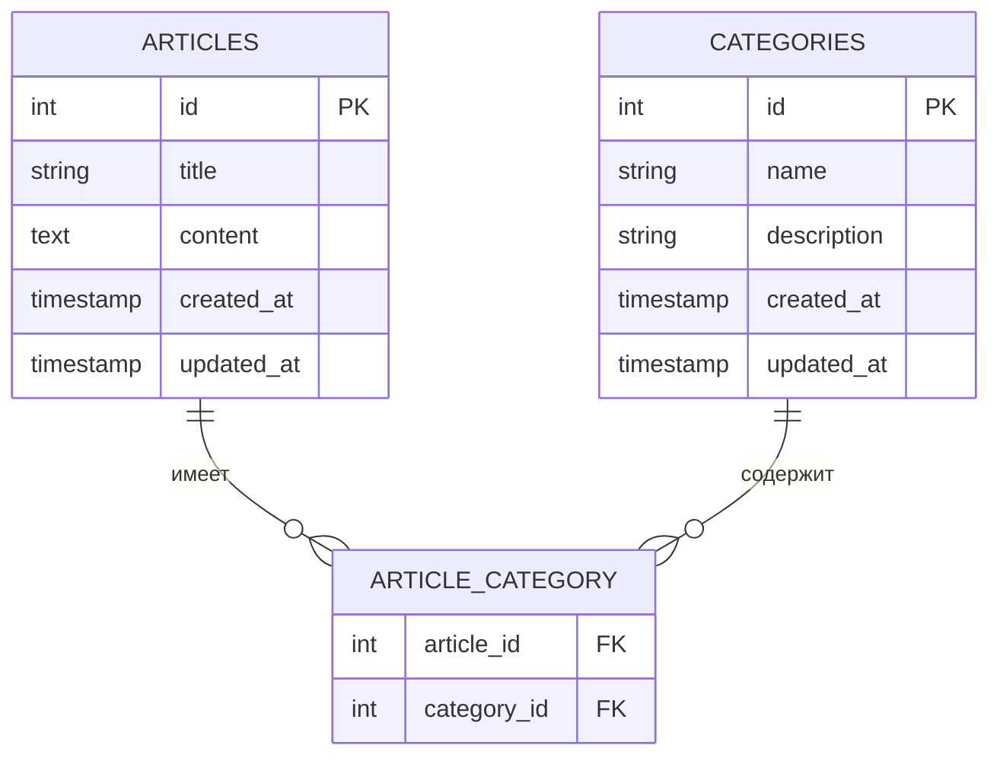

# Выполнение задания по брифу

Вам дан бриф в виде интервью, вам необходимо проанализировать бриф, создать ER-диаграмму, а также необходимо создать проект на Laravel, который удовлетворяет потребности заказчика.

При создании представлений вы можете использовать: Bootstrap, TailwindCSS или ванильный CSS (ограничений по фреймворкам нет).

## Бриф

**Заказчик:** Добрый день! Я хотел бы заказать разработку веб-приложения на Laravel для управления статьями и категориями.
**Разработчик:** Здравствуйте! Давайте обсудим все детали вашего проекта.

## Основные требования

**Вопрос 1:** Какова основная цель разработки этого приложения?
**Ответ:** Нужна система для управления статьями и их категориями с возможностью CRUD операций.

**Вопрос 2:** Сколько пользователей будет одновременно работать с системой?
**Ответ:** Ожидается около 50 активных пользователей.

**Вопрос 3:** Какие основные функции должны быть реализованы?
**Ответ:** Создание, просмотр, редактирование и удаление статей, а также управление категориями.

## Структура данных

**Вопрос 4:** Какие сущности будут использоваться в системе?
**Ответ:** Две основные сущности - статьи (`Articles`) и категории (`Categories`), связанные между собой через сводную таблицу `Article_Category`.

**Вопрос 5:** Какие поля должны быть в структуре статьи?
**Ответ:** Заголовок, содержимое, дата создания и обновления.

**Вопрос 6:** Какие поля необходимы для категории?
**Ответ:** Название, описание, даты создания и обновления.

**Вопрос 7:** Как должна работать связь между статьями и категориями?
**Ответ:** Одна статья может принадлежать нескольким категориям, и одна категория может содержать несколько статей.

## Функциональные требования

**Вопрос 8:** Какие операции должны быть доступны для статей?
**Ответ:** Создание, просмотр списка, детальный просмотр, редактирование и удаление.

**Вопрос 9:** Аналогичные операции для категорий?
**Ответ:** Да, те же самые операции CRUD.

**Вопрос 10:** Нужна ли фильтрация статей по категориям?
**Ответ:** Да, должна быть возможность отфильтровать статьи по категориям.

**Вопрос 11:** Требуется ли поиск по статьям?
**Ответ:** Да, нужно реализовать поиск по заголовку и содержимому.

**Вопрос 12:** Какой должен быть формат вывода списка статей?
**Ответ:** Список карточек со скользящим содержимым, с пагинацией по 10 элементов на страницу.

## Безопасность и авторизация

**Вопрос 13:** Требуется ли система авторизации?
**Ответ:** Да, только авторизованные пользователи могут создавать и редактировать контент.

**Вопрос 14:** Какие роли пользователей необходимо реализовать?
**Ответ:** Администратор и обычный пользователь.

**Вопрос 15:** Что может делать администратор?
**Ответ:** Управлять всеми статьями и категориями, включая удаление.

**Вопрос 16:** Что может делать обычный пользователь?
**Ответ:** Создавать и редактировать только свои статьи.

## Интерфейс и пользовательский опыт

**Вопрос 17:** Какие требования к дизайну интерфейса?
**Ответ:** Адаптивный дизайн, чистый и современный внешний вид, интуитивно понятное управление.

**Вопрос 18:** Нужны ли уведомления об ошибках?
**Ответ:** Да, должны быть понятные сообщения об ошибках и успешных действиях.

**Вопрос 19:** Требуется ли валидация форм?
**Ответ:** Да, клиентская и серверная валидация всех полей формы.

**Вопрос 20:** Как должна работать навигация по разделам?
**Ответ:** Должен быть удобный меню с основными разделами и быстрым доступом к часто используемым функциям.

## Технические требования

**Вопрос 21:** Какой стек технологий предпочтителен?
**Ответ:** Laravel Framework последней стабильной версии, MySQL или PostgreSQL (при разработке вы можете использовать SQLite).

**Вопрос 22:** Требуется ли кэширование данных?
**Ответ:** Да, нужно реализовать кэширование списка статей и категорий.

**Вопрос 23:** Какие требования к производительности?
**Ответ:** Система должна обрабатывать до 50 одновременных пользователей с минимальными задержками.

**Вопрос 24:** Нужна ли поддержка разных языков?
**Ответ:** На начальном этапе только русский язык, но должна быть возможность расширения на другие языки.

## Дополнительные вопросы

**Вопрос 28:** Нужны ли статистика или отчеты?
**Ответ:** На начальном этапе нет, но должна быть возможность их добавления в будущем.

**Вопрос 29:** Требуется ли интеграция с другими сервисами?
**Ответ:** Нет, автономная работа системы.

**Вопрос 30:** Какой срок поддержки после запуска?
**Ответ:** 3 месяца после завершения работ.

## Заключение

**Заказчик:** Спасибо за подробную проработку всех аспектов проекта. Я готов предоставить дополнительную информацию при необходимости.
***Разработчик:** Благодарю за детальное обсуждение. Мы подготовили техническое задание согласно нашему разговору. Приступаем к работе над проектом.*
