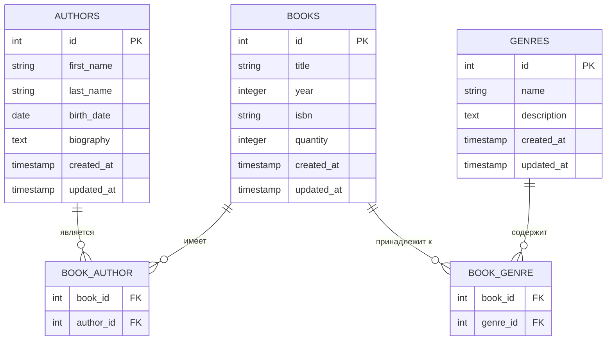

# Выполнение задания по брифу

Вам дан бриф в виде интервью, вам необходимо проанализировать бриф, создать ER-диаграмму, а также необходимо создать проект на Laravel, который удовлетворяет потребности заказчика.

При создании представлений вы можете использовать: Bootstrap, TailwindCSS или ванильный CSS (ограничений по фреймворкам нет).

## Бриф

### Структура данных

| Разработчик | Заказчик |
| -- | -- |
| - | Добрый день! Я хотел бы заказать разработку системы управления библиотекой на платформе Laravel. Система должна позволять управлять книгами, авторами и жанрами. |
| Какие основные сущности будут использоваться в системе? | Три основных сущности - книги (Books), авторы (Authors) и жанры (Genres). Между ними будут следующие связи: одна книга может иметь нескольких авторов, и принадлежать нескольким жанрам. |
| Какие поля должны быть у книги? | Заголовок, год издания, ISBN, количество экземпляров, дата создания и обновления. |
| Какие данные нужно хранить об авторах? | Имя, фамилия, дата рождения, биография, даты создания и обновления. |
| Что должно содержать описание жанра? | Название, описание, даты создания и обновления. |

### Функциональные требования

| Разработчик | Заказчик |
| -- | -- |
| Какие операции должны быть доступны для каждой сущности? | Для всех сущностей необходимо реализовать полный набор CRUD операций (создание, чтение, обновление, удаление). |
| Как должна работать система связей между книгами и авторами? | Одна книга может иметь несколько авторов, и один автор может быть указан во многих книгах. При удалении автора его связи с книгами должны сохраниться. |
| Аналогично вопрос про жанры? | Да, та же логика - многие ко многим, с сохранением связей при удалении. |
| Нужны ли дополнительные функции? | Да, требуется возможность поиска книг по различным параметрам (название, автор, жанр) и фильтрация списка книг по жанрам. |

### Безопасность и авторизация

| Разработчик | Заказчик |
| -- | -- |
| Требуется ли система авторизации? | Да, только авторизованные пользователи могут создавать и редактировать контент. |
| Какие роли пользователей необходимо реализовать? | Администратор (полный доступ), библиотекарь (может управлять книгами и их статусом), читатель (только просмотр). |
| Какие ограничения должны быть у читателя? | Может только просматривать информацию о книгах, авторах и жанрах, без возможности редактирования. |

### Интерфейс и пользовательский опыт

| Разработчик | Заказчик |
| -- | -- |
| Как должен выглядеть интерфейс системы? | Адаптивный дизайн, чистый и современный внешний вид, интуитивно понятное управление. |
| Требуются ли уведомления об ошибках? | Да, должны быть понятные сообщения об ошибках и успешных действиях. |
| Как должна работать навигация по разделам? | Должно быть удобное меню с основными разделами и быстрым доступом к часто используемым функциям. |
