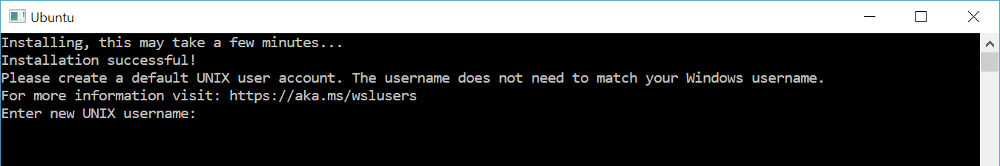

# Учебник по PHP

Данный учебник предназначен для начинающих программистов, которые хотят изучить язык программирования PHP. В учебнике рассматриваются основные концепции языка PHP, а также примеры кода и задачи для самостоятельного решения. Учебник будет полезен как для студентов, так и для широкого круга лиц, желающих изучить PHP.

Для тех, кто хочет продолжить обучение, в учебнике рассмотренны базовые концепции для работы с фреймворком [Laravel](https://laravel.com) и пакетом для создания back-office веб-приложений [Orchid Software](https://orchid.software).

## Перед началом изучения

Перед началом изучения, необходимо настроить среду разработки, а также рабочее окружение. Для этого необходимо произвести настройку вашей операционной системы, а также установить необходимые программы и пакеты.

Для установки среды разработки PHP, ваши устройства должны поддерживать следующие характеристики:

1. Паравиртуализация в BIOS
2. Актуальные версии ОС (Windows 10, Windows 11, Ubuntu 22.*, Debian и т.п.)

### Настройка операционной системы Windows

**Важно!!!** Настройка Windows возможна только на Windows 10 или Windows 11 с обновлениями не ниже 2021 года.

Для настройки Windows, необходимо установить и настроить WSL2 (Windows subsystem for Linux 2). Следуйте следующим шагам:

1. Открыть терминал от имени администратора;
2. Ввести команду:
    ```shell
    wsl --install
    ```
3. У вас откроется окно установки WSL2, следуйте инструкциям;
4. После установки WSL2, у вас установится Ubuntu 22.04 LTS. Вам будет предложено создать пользователя и пароль. **Пароль необходимо запомнить, так как он потребуется для установки программ!** При вводе пароля, символы не отображаются, но они вводятся;
    

Далее настройки идентичны настройке в [Linux](#настройка-операционной-системы-linux).

### Настройка операционной системы Linux

Настройка пакетов будет происходить через менеджер пакетов `apt`. Для начала установим необходимые пакеты, а именно:

1. PHP 8.* и все необходимые модули;
2. Базы данных MySQL и SQLite 3;
3. Composer;
4. Git;
5. Node.js и npm.

Для установки пакетов, вам необходимо выполнить следующую команду в терминале:

```bash
$ sudo add-apt-repository ppa:ondrej/php && \
  sudo apt update && sudo apt upgrade -y && \
  sudo apt install -y openssl git curl unzip mysql-server sqlite3 php8.3-{common,cli,bcmath,curl,mbstring,mysql,tokenizer,xml,zip,sqlite3} && \
  curl -sS https://getcomposer.org/installer -o /tmp/composer-setup.php && \
  sudo php /tmp/composer-setup.php --install-dir=/usr/local/bin --filename=composer && \
  curl -fsSL https://deb.nodesource.com/setup_20.x | sudo -E bash - && \
  sudo apt install -y nodejs
```

### Установка среды разработки

Для проведения разработки будет использоваться Visual Studio Code. Для установки, вам необходимо перейти на [официальный сайт](https://code.visualstudio.com) и скачать установщик для вашей ОС.

Для дальнейшей работы с PHP, Laravel, а также проведения тестирования и отладки кода, необходимо установить следующие расширения:

1.  [HTML CSS Support](https://marketplace.visualstudio.com/items?itemName=ecmel.vscode-html-css)
2.  [IntelliCode API Usage Examples](https://marketplace.visualstudio.com/items?itemName=VisualStudioExptTeam.intellicode-api-usage-examples)
3.  [Laravel Artisan](https://marketplace.visualstudio.com/items?itemName=ryannaddy.laravel-artisan)
4.  [Laravel Blade formatter](https://marketplace.visualstudio.com/items?itemName=shufo.vscode-blade-formatter)
5.  [Laravel Blade Snippets](https://marketplace.visualstudio.com/items?itemName=onecentlin.laravel-blade)
6.  [Laravel Blade Spacer](https://marketplace.visualstudio.com/items?itemName=austenc.laravel-blade-spacer)
7.  [Laravel Blade Wrapper](https://marketplace.visualstudio.com/items?itemName=IHunte.laravel-blade-wrapper)
8.  [Laravel Extension Pack](https://marketplace.visualstudio.com/items?itemName=onecentlin.laravel-extension-pack)
9.  [Laravel Extra Intellisense](https://marketplace.visualstudio.com/items?itemName=amiralizadeh9480.laravel-extra-intellisense)
10.  [Laravel goto view](https://marketplace.visualstudio.com/items?itemName=codingyu.laravel-goto-view)
11.  [laravel-goto-components](https://marketplace.visualstudio.com/items?itemName=naoray.laravel-goto-components)
12.  [laravel-jump-controller](https://marketplace.visualstudio.com/items?itemName=pgl.laravel-jump-controller)
13.  [PHP](https://marketplace.visualstudio.com/items?itemName=DEVSENSE.phptools-vscode)
14.  [PHP Debug](https://marketplace.visualstudio.com/items?itemName=xdebug.php-debug)
15.  [PHP Extension Pack](https://marketplace.visualstudio.com/items?itemName=xdebug.php-pack)
16.  [PHP Intelephense](https://marketplace.visualstudio.com/items?itemName=bmewburn.vscode-intelephense-client)
17.  [PHP IntelliSense](https://marketplace.visualstudio.com/items?itemName=zobo.php-intellisense)
18.  [PHP Profiler](https://marketplace.visualstudio.com/items?itemName=DEVSENSE.profiler-php-vscode)

Для более простой установки, вы можете произвести установку через установку пакетного файла. Для этого, [скачайте данный файл](./assets/files/ntcte-extensions-pack-0.0.1.vsix), а потом произведите установку через команду в терминале (Windows или Linux):

```shell
$ code --install-extension <путь к файлу ntcte-extensions-pack-0.0.1.vsix>
```

После выполнения данной команды, все должно быть установлено.

### Настройка базы данных и установка системы управления базами данных

Для настройки базы данных необходимо произвести следующие настройки:

1.Открыть установленную Ubuntu 22.* в режиме терминала;
2. Ввести поочередно следующие команды:
```bash
$ sudo mysql
$ CREATE USER 'student'@'%' IDENTIFIED BY 'student';
$ CREATE DATABASE st;
$ GRANT ALL PRIVILEGES ON st.* TO 'student'@'%';
$ FLUSH PRIVILEGES;
$ exit
```
3. Вышеприведенной командой был создан пользователь БД с логином `student` и паролем `student`; была создана база данных с именем `st`; пользователю `student` были выданы полные права на работу с БД `st`.
4. Установите систему управления базами данных DBeaver. Для этого, перейдите на [официальный сайт](https://dbeaver.io/download) и скачайте установщик для вашей ОС.

### Настройка системы управления версиями Git

Для настройки системы управления версиями Git, вам необходимо произвести следующие настройки:

1. Откройте терминал;
2. Введите следующие команды:
```shell
$ git config --global user.name "Ваше имя"
$ git config --global user.email "Ваша почта"
```

## Содержание

1. [Теоретическая часть](./Theory/)
   1. [Введение в PHP](./Theory/Basic/01.md)
   2. [Синтаксис PHP](./Theory/Basic/02.md)
   3. Комментирование исходного кода
      1. [Комментарии в PHP](./Theory/Basic/03.md)
      2. [Многострочные комментарии в PHP](./Theory/Basic/04.md)
   4. Переменные и работа с ними
      1. [Переменные в PHP](./Theory/Basic/05.md)
      2. [Область видимости переменных](./Theory/Basic/06.md)
      3. [Кастинг](./Theory/Basic/15.md)
      4. [Константы](./Theory/Basic/17.md)
      5. [Магические константа](./Theory/Basic/18.md)
      6. [Массивы](./Theory/Basic/23.md)
      7. [Суперглобальные переменные](./Theory/Basic/24.md)
   5. [Оператор `echo` и функция `print()`](./Theory/Basic/07.md)
   6. [Типы данных в PHP](./Theory/Basic/08.md)
   7. Строки
      1. [Строки](./Theory/Basic/09.md)
      2. [Модификация строк](./Theory/Basic/10.md)
      3. [Конкатенация строк](./Theory/Basic/11.md)
      4. [Нарезка строк](./Theory/Basic/12.md)
      5. [Экранируемые символы](./Theory/Basic/13.md)
   8. Математические операции
      1. [Числа](./Theory/Basic/14.md)
      2. [Математика](./Theory/Basic/16.md)
   9. Императивное программирование
      1. [Операторы](./Theory/Basic/19.md)
      2. [Условные операторы](./Theory/Basic/20.md)
      3. [Циклы](./Theory/Basic/21.md)
      4. [Функции](./Theory/Basic/22.md)
   10. [Регулярные выражения](./Theory/Basic/25.md)
   11. HTML формы и их обработка в PHP
       1.  [Обработка форм](./Theory/Forms/01.md)
       2.  [Валидация форм](./Theory/Forms/02.md)
       3.  [Обязательные поля](./Theory/Forms/03.md)
       4.  [Проверка электронной почты и URL-адреса](./Theory/Forms/04.md)
       5.  [Пример заполненной формы](./Theory/Forms/05.md)
   12. Расширенная часть
       1.  [Дата и время](./Theory/Advanced/01.md)
       2.  Работа с файлами
           1.  [Подключение файлов](./Theory/Advanced/02.md)
           2.  [Обработка файлов](./Theory/Advanced/03.md)
           3.  [Загрузка файлов](./Theory/Advanced/04.md)
       3. [Куки](./Theory/Advanced/05.md)
       4. [Сессии](./Theory/Advanced/06.md)
       5. [Фильтры](./Theory/Advanced/07.md)
       6. [Расширенная фильтрация](./Theory/Advanced/08.md)
       7. [Функции обратного вызова](./Theory/Advanced/09.md)
       8. [PHP и JSON](./Theory/Advanced/10.md)
       9. [Исключения](./Theory/Advanced/11.md)
    13. Объектно-ориентированное программирование
        1.  [Что такое ООП?](./Theory/OOP/01.md)
        2.  [Классы и объекты](./Theory/OOP/02.md)
        3.  [Конструктор](./Theory/OOP/03.md)
        4.  [Деструктор](./Theory/OOP/04.md)
        5.  [Модификаторы доступа](./Theory/OOP/05.md)
        6.  [Наследование](./Theory/OOP/06.md)
        7.  [Константы класса](./Theory/OOP/07.md)
        8.  [Абстрактные классы](./Theory/OOP/08.md)
        9.  [Интерфейсы](./Theory/OOP/09.md)
        10. [Трейты](./Theory/OOP/10.md)
        11. [Статические методы](./Theory/OOP/11.md)
        12. [Статические свойства](./Theory/OOP/12.md)
        13. [Пространства имен](./Theory/OOP/13.md)
        14. [Итерируемость](./Theory/OOP/14.md)
    14. Базы данных
        1.  База данных MySQL
            1.  [Введение в MySQL](./Theory/Databases/MySQL/01.md)
            2.  [Подключение PHP к MySQL](./Theory/Databases/MySQL/02.md)
            3.  [Создание базы данных](./Theory/Databases/MySQL/03.md)
            4.  [Создание таблиц](./Theory/Databases/MySQL/04.md)
            5.  [Вставка данных](./Theory/Databases/MySQL/05.md)
            6.  [Получение последнего вставленного идентификатора](./Theory/Databases/MySQL/06.md)
            7.  [Множественная вставка записей](./Theory/Databases/MySQL/07.md)
            8.  [Подготовленные запросы](./Theory/Databases/MySQL/08.md)
            9.  [Выборка данных](./Theory/Databases/MySQL/09.md)
            10. [Использование выражения `WHERE`](./Theory/Databases/MySQL/10.md)
            11. [Использование выражения `ORDER BY`](./Theory/Databases/MySQL/11.md)
            12. [Удаление данных](./Theory/Databases/MySQL/12.md)
            13. [Обновление данных](./Theory/Databases/MySQL/13.md)
            14. [Ограничение выбора данных](./Theory/Databases/MySQL/14.md)
2. [Практическая часть](./Practics/)
   1. [Лабораторные работы](./Practics/Laboratory/)
      1. [Введение в PHP](./Practics/Laboratory/01.md)
      2. [Условные конструкции и циклы](./Practics/Laboratory/02.md)
      3. [Работа с массивами](./Practics/Laboratory/03.md)
      4. [Функции](./Practics/Laboratory/04.md)
      5. [Работа с формами и данными пользователей](./Practics/Laboratory/05.md)
      6. [Работа с файлами](./Practics/Laboratory/06.md)
      7. [Сессии и куки](./Practics/Laboratory/07.md)
      8. [Объектно-ориентированное программирование](./Practics/Laboratory/08.md)
      9. [Введение в базы данных MySQL](./Practics/Laboratory/09.md)
   2. [Практические задания](./Practics/Tasks/)


## Используемые материалы

1. [PHP: Hypertext Preprocessor](https://www.php.net/)
2. [PHP Manual](https://www.php.net/manual/ru/index.php)
3. [PHP Tutorial](https://www.w3schools.com/php/default.asp)
4. [Laravel](https://laravel.com)
5. [Orchid Software](https://orchid.software)
