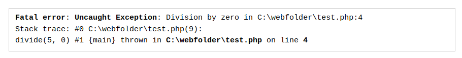

# Исключения

### Что такое исключение?

Исключение - это объект, описывающий ошибку или неожиданное поведение PHP-скрипта. Исключения выбрасываются многими функциями и классами PHP. Определенные пользователем функции и классы также могут создавать исключения.

Исключения - это хороший способ остановить функцию, когда она сталкивается с данными, которые не может использовать.

### Выбрасывание исключения

Оператор `throw` позволяет функции или методу, определенному пользователем, бросить исключение. Когда исключение выброшено, код, следующий за ним, не будет выполнен. Если исключение не поймано, произойдет фатальная ошибка с сообщением «`Uncaught Exception`».

Попробуем бросить исключение, не поймав его:

```php
<?php

function divide($dividend, $divisor) {
  if($divisor == 0) {
    throw new Exception('Division by zero');
  }

  return $dividend / $divisor;
}

print(divide(5, 0));
```

Результат будет выглядеть примерно так:



### Конструкция `try...catch`

Чтобы избежать ошибки из приведенного выше примера, мы можем использовать оператор `try...catch` для перехвата исключений и продолжения процесса.

#### Синтаксис

```php
try {
  // код, который может выбрасывать исключения
} catch(Exception $e) {
  // код, который запускается при возникновении исключения
}
```

```php
<?php

function divide($dividend, $divisor) {
  if($divisor == 0) {
    throw new Exception('Division by zero');
  }
  return $dividend / $divisor;
}

try {
  print(divide(5, 0));
} catch(Exception $e) {
  print('Unable to divide.');
}
```

Блок `catch` указывает, какой тип исключения должен быть пойман, и имя переменной, которая может быть использована для доступа к исключению. В приведенном выше примере тип исключения -- `Exception`, а имя переменной -- `$e`.

### Конструкция `try...catch...finally`

Оператор `try...catch...finally` может использоваться для отлова исключений. Код в блоке `finally` будет выполняться всегда, независимо от того, было ли поймано исключение. Если присутствует `finally`, блок `catch` необязателен.

#### Синтаксис

```php
try {
  // код, который может выбрасывать исключения
} catch(Exception $e) {
  // код, который запускается при возникновении исключения
} finally {
  // код, который выполняется всегда, независимо от того, было ли поймано исключение
}
```

#### Пример 1

```php
<?php

function divide($dividend, $divisor) {
  if($divisor == 0) {
    throw new Exception('Division by zero');
  }
  return $dividend / $divisor;
}

try {
  print(divide(5, 0));
} catch(Exception $e) {
  print('Unable to divide. ');
} finally {
  print('Process complete.');
}
```

####  Пример 2

```php
<?php

function divide($dividend, $divisor) {
  if($divisor == 0) {
    throw new Exception('Division by zero');
  }
  return $dividend / $divisor;
}

try {
  print(divide(5, 0));
} finally {
  print('Process complete.');
}
```

### Объект-исключение

Объект `Exception` содержит информацию об ошибке или неожиданном поведении, с которым столкнулась функция.

#### Синтаксис

```php
new Exception(message, code, previous)
```

#### Значения параметров

| Параметр | Описание |
| -- | -- |
| `message` | Необязательный. Строка, описывающая причину возникновения исключения |
| `code` | Необязательный параметр. Целое число, которое можно использовать, чтобы легко отличить это исключение от других исключений того же типа |
| `previous` | Необязательно. Если данное исключение было выброшено в блоке перехвата другого исключения, рекомендуется передать это исключение в этот параметр |

#### Методы

В следующей таблице показаны некоторые методы, которые можно использовать для получения информации об исключении:

| Метод | Описание |
| -- | -- |
| `getMessage()` | Возвращает строку, описывающую причину возникновения исключения |
| `getPrevious()` | Если данное исключение было вызвано другим исключением, этот метод возвращает предыдущее исключение. Если нет, то возвращается `null` |
| `getCode()` | Возвращает код исключения |
| `getFile()` | Возвращает полный путь к файлу, в котором возникло исключение |
| `getLine()` | Возвращает номер строки кода, в которой возникло исключение |

####  Пример

```php
<?php

function divide($dividend, $divisor) {
  if ($divisor == 0) {
    throw new Exception('Division by zero', 1);
  }
  return $dividend / $divisor;
}

try {
  print(divide(5, 0));
} catch(Exception $e) {
  $code = $e -> getCode();
  $message = $e -> getMessage();
  $file = $e -> getFile();
  $line = $e -> getLine();
  
  print("Exception thrown in {$file} on line {$line}: [Code {$code}]<br>{$message}");
}
```