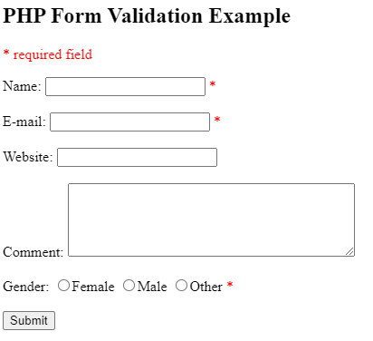

# Валидация формы

В этой и следующих параграфах рассказывается о том, как использовать PHP для проверки данных формы.

> **Думайте о БЕЗОПАСНОСТИ при обработке PHP-форм!**

На этих страницах вы узнаете, как обрабатывать PHP-формы с учетом требований безопасности. Правильная валидация данных формы важна для защиты вашей формы от хакеров и спамеров! HTML-форма, с которой мы будем работать в этих главах, содержит различные поля ввода: обязательные и необязательные текстовые поля, радиокнопки и кнопку отправки:



Правила проверки для приведенной выше формы выглядят следующим образом:

| Поле | Правило проверки |
| --- | --- |
| Имя | Обязательное поле. Должно содержать только буквы и пробелы. |
| Email | Обязательное поле. Должно содержать только допустимый адрес электронной почты. |
| Возраст | Необязательное поле. Должно быть целым числом. |
| Веб-сайт | Необязательное поле. Должно содержать допустимый URL. |
| Комментарий | Необязательное поле. Может содержать любой текст. |
| Пол | Обязательное поле. Должно быть выбрано. |

## Текстовые поля

Поля имени, электронной почты и веб-сайта представляют собой элементы ввода текста, а поле комментария - `<textarea></textarea>`. HTML-код выглядит следующим образом:

```html
Имя: <input type="text" name="name"><br>
Email: <input type="text" name="email"><br>
Сайт: <input type="text" name="website"><br>
Комментарий: <textarea name="comment" rows="5" cols="40"></textarea><br>
```

## Радиокнопки

Поля пола представляют собой радиокнопки, а HTML-код выглядит следующим образом:

```html
Пол:
<input type="radio" name="sex" value="female"> Женский
<input type="radio" name="sex" value="male"> Мужской
```

## Элемент формы

HTML-код формы выглядит следующим образом:

```php
<form method="POST" action="<?php print(htmlspecialchars($_SERVER['PHP_SELF'])); ?>">
```

Когда форма отправляется, данные формы передаются с `method="POST"`.

> **Что такое переменная `$_SERVER['PHP_SELF']`?**
> `$_SERVER['PHP_SELF']` - это суперглобальная переменная, которая возвращает имя файла текущего выполняющегося скрипта.

Таким образом, `$_SERVER['PHP_SELF']` отправляет данные отправленной формы на саму страницу, а не переходит на другую страницу. Таким образом, пользователь будет получать сообщения об ошибках на той же странице, что и форма.

> **Что такое функция `htmlspecialchars()`?**
> Функция `htmlspecialchars()` преобразует специальные символы в сущности HTML. Это означает, что она заменяет такие HTML-символы, как `<` и `>`, на `&lt;` и `&gt;` соответственно. Это не позволяет злоумышленникам эксплуатировать код, внедряя в формы HTML или Javascript-код (атаки межсайтового скриптинга (*Cross-site Scripting*)).

## Внимание!

Переменная `$_SERVER['PHP_SELF']` может быть использована хакерами! Если на вашей странице используется `PHP_SELF`, то пользователь может ввести слэш (`/`) и затем выполнить некоторые команды межсайтового скриптинга (XSS).

> **Межсайтовый скриптинг (XSS)** - это тип уязвимости компьютерной безопасности, обычно встречающийся в веб-приложениях. XSS позволяет злоумышленникам внедрять сценарии на стороне клиента в веб-страницы, просматриваемые другими пользователями.

Предположим, что у нас есть следующая форма на странице с именем "`test_form.php`":

```php
<form method="POST" action="<?php print($_SERVER['PHP_SELF']); ?>">
```

Теперь, если пользователь введет в адресную строку обычный URL, например "`http://www.example.com/test_form.php`", приведенный выше код будет переведен как:

```php
<form method="POST" action="test_form.php">
```

Пока все хорошо... однако предположим, что пользователь вводит в адресную строку следующий URL:

```
http://www.example.com/test_form.php/%22%3E%3Cscript%3Ealert('hacked')%3C/script%3E
```

Теперь код будет переведен как:

```php
<form method="POST" action="test_form.php/"><script>alert('hacked')</script>
```

Этот код добавляет тег `<script>` и команду `alert()`. И когда страница загрузится, код JavaScript будет выполнен (пользователь увидит окно предупреждения). Это всего лишь простой и безобидный пример того, как можно использовать переменную `PHP_SELF`.

Помните, что **внутри тега `<script>` можно добавить любой JavaScript-код!** Хакер может перенаправить пользователя в файл на другом сервере, и этот файл может содержать вредоносный код, который может изменить глобальные переменные или, например, отправить форму по другому адресу для сохранения данных пользователя.

## Как избежать эксплойтов `$_SERVER['PHP_SELF']`?

Эксплойтов `$_SERVER['PHP_SELF']` можно избежать, используя функцию `htmlspecialchars()`. Код формы должен выглядеть следующим образом:

```php
<form method="POST" action="<?php print(htmlspecialchars($_SERVER['PHP_SELF'])); ?>">
```

Функция `htmlspecialchars()` преобразует специальные символы в HTML-сущности. Теперь, если пользователь попытается использовать переменную `PHP_SELF`, это приведет к следующему результату:

```php
<form method="POST" action="test_form.php/%22%3E%3Cscript%3Ealert('hacked')%3C/script%3E">
```

Теперь все в порядке! Пользователь увидит введенный им текст, а не выполнение JavaScript-кода.

## Проверка данных формы с помощью PHP

Первое, что мы сделаем, это передадим все переменные через функцию PHP `htmlspecialchars()`. Если мы используем функцию `htmlspecialchars()`, то если пользователь попытается отправить в текстовое поле следующее:

```
<script>alert('hacked')</script>
```

То это будет преобразовано в:

```
&lt;script&gt;alert('hacked')&lt;/script&gt;
```

Теперь код можно безопасно отображать на странице или внутри письма. Мы также сделаем еще две вещи, когда пользователь отправит форму:

1. Удалим ненужные символы (лишний пробел, табуляция, новая строка) из вводимых пользователем данных (с помощью функции PHP `trim()`);
2. Удаление обратных слешей `\` из данных, вводимых пользователем (с помощью функции PHP `stripslashes()`).

Следующим шагом будет создание функции, которая будет выполнять все проверки за нас (что гораздо удобнее, чем писать один и тот же код снова и снова).

Мы назовем эту функцию `test_input()`. Теперь мы можем проверять каждую переменную `$_POST` с помощью функции `test_input()`, и скрипт будет выглядеть следующим образом:

```php
// Определяем функцию test_input()
function test_input($data) {
  $data = trim($data); // Удаляем лишние пробелы, табуляцию и переносы строк
  $data = stripslashes($data); // Удаляем обратные слеши
  $data = htmlspecialchars($data); // Преобразуем специальные символы в HTML-сущности
  return $data;
}

// Определяем переменные и устанавливаем значения по умолчанию
$name = $email = $gender = $comment = $website = '';

// Проверяем, была ли отправлена форма
if ($_SERVER['REQUEST_METHOD'] == 'POST') {
  $name = test_input($_POST['name']);
  $email = test_input($_POST['email']);
  $website = test_input($_POST['website']);
  $comment = test_input($_POST['comment']);
}
```

Обратите внимание, что в начале скрипта мы проверяем, была ли отправлена форма, используя `$_SERVER['REQUEST_METHOD']`. Если `REQUEST_METHOD` - `POST`, то форма была отправлена - и ее следует проверить. Если она не была отправлена, пропустите проверку и отобразите пустую форму.

Однако в приведенном выше примере все поля ввода являются необязательными. Сценарий работает нормально, даже если пользователь не вводит никаких данных.

Следующий шаг - сделать поля ввода обязательными и при необходимости создать сообщения об ошибках.

