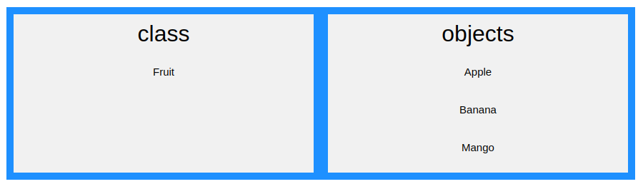
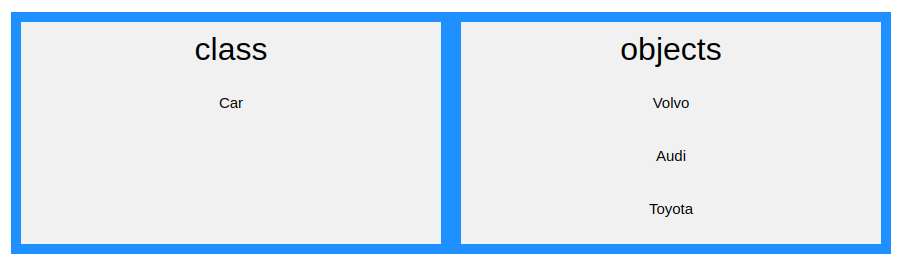

# Что такое ООП?

Начиная с PHP5, вы также можете писать PHP-код в объектно-ориентированном стиле. Объектно-ориентированное программирование быстрее и проще в исполнении.

### Что такое ООП?

ООП расшифровывается как объектно-ориентированное программирование. Процедурное программирование заключается в написании процедур или функций, которые выполняют операции над данными, в то время как объектно-ориентированное программирование заключается в создании объектов, которые содержат как данные, так и функции.

Объектно-ориентированное программирование имеет ряд преимуществ перед процедурным программированием:

- ООП быстрее и проще в исполнении
- ООП обеспечивает четкую структуру программ
- ООП помогает поддерживать PHP-код в состоянии DRY «Don't Repeat Yourself», и делает код более легким для поддержки, модификации и отладки
- ООП позволяет создавать полноценные многократно используемые приложения с меньшим количеством кода и меньшим временем разработки

Совет: Принцип «*Не повторяй себя*» (*DRY*) заключается в уменьшении количества повторений кода. Вы должны выделить код, который является общим для приложения, поместить его в одно место и использовать повторно, а не повторять его.

### Что такое классы и объекты?

Классы и объекты -- это два основных аспекта объектно-ориентированного программирования. Посмотрите на следующую иллюстрацию, чтобы увидеть разницу между классами и объектами:

Таким образом, класс -- это шаблон для объектов, а объект - это экземпляр класса. Когда создаются отдельные объекты, они наследуют все свойства и поведение от класса, но у каждого объекта будут свои значения для свойств.